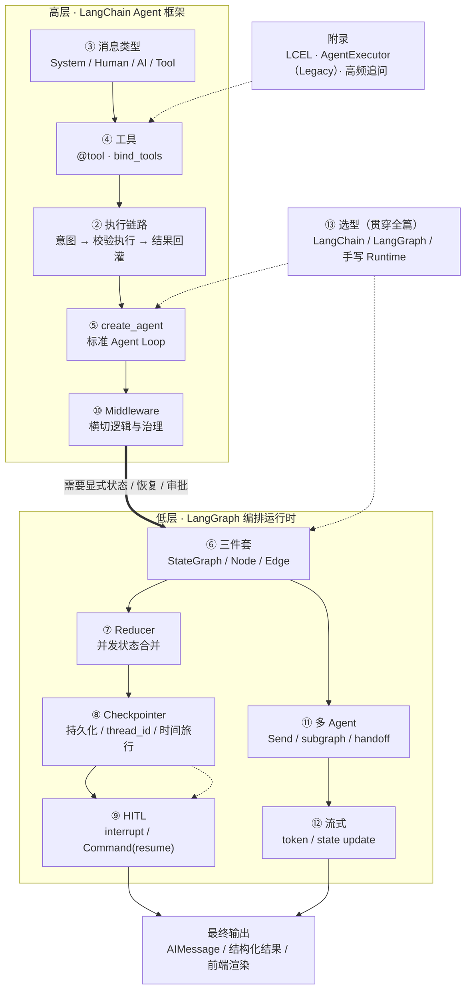

# LangChain 与 LangGraph

> 定位：Framework / Implementation——《01 Agent Runtime 与架构》讲 Runtime 为什么需要 State / Checkpoint / HITL / Policy，本篇讲 LangChain / LangGraph 怎么把这些能力落到框架实现上。
> 边界：Agent 是什么、为什么用、怎么选型见《00 Agent 基础概念》；Runtime 原理见《01》；Memory 与上下文工程见《03》；RAG 见《05》；MCP 协议见《06》。
> 参考：[create_agent 与 Middleware](https://www.langchain.com/blog/how-middleware-lets-you-customize-your-agent-harness)、[LangChain v1 迁移指南](https://langchain-5e9cc07a.mintlify.app/oss/javascript/migrate/langchain-v1)、[LangGraph v1 迁移指南](https://docs.langchain.com/oss/python/migrate/langgraph-v1)。
> 高频题给"能背的结论 + 最小代码 + 追问下钻点"；LCEL 与 AgentExecutor 属基础与 legacy 知识，放在附录。

## 导学：一图看懂全篇（整体链路）

这份文档的 13 道题 + 5 个附录，其实是**同一条链路在不同深度上的切片**：上层是 LangChain 的高层 Agent 抽象，下层是 LangGraph 的状态化编排与运行时。先建立这张图，后面每一题都能在图里找到位置：



### 这条链路怎么读

1. **上层（LangChain）**：请求进来先被组织成消息，工具用 Schema 描述，`create_agent` 把模型与工具组装成标准 Agent Loop，Middleware 在循环的固定挂点上做治理。**第 2~5、10 题**讲的就是这一段。
2. **转折点**：标准循环不够用时——需要显式状态流、断点恢复、人工审批、精确路由——就下沉到 LangGraph 显式画图。这不是"谁取代谁"，而是分层：LangChain 提供高层抽象，LangGraph 提供底层运行时（第 1 题）。
3. **下层（LangGraph）**：状态怎么合并（Reducer）-> 怎么持久化与恢复（Checkpointer）-> 怎么人工介入（HITL）-> 怎么扩展多 Agent（Send / subgraph / handoff）-> 怎么交付前端（流式）。**第 6~9、11、12 题**是这条深挖路径。
4. **贯穿全篇**：第 13 题的选型不是独立知识点，而是"什么时候该用哪一段"的总结；LCEL 与 AgentExecutor 属于基础机制与 legacy 路线，放在附录。

### 问题定位表

| 层次 | 主题 | 本篇位置 |
| --- | --- | --- |
| 高层框架 | 整体定位、执行链路、消息、工具与执行边界 | 1~4 |
| 高层框架 | 当前推荐入口、中间件 | 5、10 |
| 编排运行时 | State / Node / Edge、Reducer、Checkpoint、HITL | 6~9 |
| 编排运行时 | 多 Agent、流式交付 | 11、12 |
| 贯穿 | 框架选型 | 13 |
| 附录 | LCEL / Runnable、AgentExecutor（Legacy）、高频追问、常见 API 坑、最小项目骨架 | 附录 A~E |

## 1. LangChain 和 LangGraph 到底是什么？

- **LangChain**：高层 Agent 开发框架。提供 Model / Tool / Prompt / Middleware / Agent 等抽象，当前创建 Agent 的标准入口是 `create_agent`
- **LangGraph**：低层 Agent Runtime 与编排库。提供 State / Node / Edge / Reducer / Checkpointer / interrupt 等状态化执行能力
- 两者不是替代关系：`create_agent` 生成的 Agent 底层就跑在 LangGraph 的运行时上；LangGraph 也可以脱离 LangChain 单独使用
- 面试结论一句话：**LangChain 更偏高层 Agent 开发框架，LangGraph 更偏底层状态化 Agent 编排与 Runtime；LangChain 的 Agent 可以建立在 LangGraph 之上**
- 边界：本篇只讲框架怎么实现；State / Checkpoint / 长任务为什么需要，见《01 Agent Runtime 与架构》

```text
LangChain（高层 Agent Framework）
  -> Model · Tool · Prompt · Middleware · create_agent
        ↓ 构建在……之上（实现层依赖，不是替代）
LangGraph（低层 Agent Runtime / Orchestration）
  -> State · Node · Edge · Reducer · Checkpointer · interrupt
```

| 维度 | LangChain | LangGraph |
| --- | --- | --- |
| 定位 | 高层 Agent Framework | 低层 Agent Runtime / Orchestration |
| 抽象层级 | 高 | 低 |
| 核心入口 | `create_agent` | `StateGraph` 及各图 API |
| 核心能力 | Model / Tool / Agent / Middleware | State / Node / Edge / Reducer |
| 适合 | 标准 Agent、快速开发 | 复杂状态流、长任务、HITL、精确控制 |
| 控制力 | 中 | 高 |
| 持久化 | 复用底层 LangGraph 能力 | Checkpointer |
| 是否必须一起用 | 不必须 | 不必须 |

- 本篇主线：**1 定位 -> 2 执行链路 -> 3 消息 -> 4 工具边界 -> 5 create_agent -> 6~9 图与状态（State/Reducer/Checkpoint/HITL）-> 10 中间件 -> 11 多 Agent -> 12 流式 -> 13 选型**；LCEL 与 AgentExecutor 放在附录，属于基础与 legacy 知识

**面试追问**

1. **"LangGraph 是不是取代了 LangChain？"** 不是。两者是分层关系：LangGraph 提供低层状态化执行能力，LangChain 在其上提供高层 Agent 抽象；`create_agent` 的产物就跑在 LangGraph 运行时上。
2. **"只用 LangGraph 不用 LangChain 行不行？"** 行，直接画图、自己组织提示词与工具；代价是模型接入、工具抽象、中间件这些要自己搭。
3. **"LangGraph 只能做多 Agent 吗？"** 不是。单 Agent 的循环、分支、重试、HITL、持久化都用它，多 Agent 只是其中一种用法。
4. **"那 LangChain 的价值是什么？"** 统一的模型与工具抽象、标准 Agent 循环、中间件机制，以及生产向的可复用能力（重试、摘要、脱敏等）；把常见工程问题做成组件，而不是让每个项目重造。

**权衡**：先看任务需不需要"状态化执行"。标准 Agent 用 LangChain 起步最快；一旦要精确控制分支、断点恢复、人工审批，就应该下沉到 LangGraph；框架的抽象成为阻碍时（非图模型的调度、特殊存储或协议要求），才考虑手写 Runtime。

**面试版回答**：我会把两者讲成分层关系而不是替代关系。LangChain 是高层 Agent 开发框架，把模型、工具、提示词、中间件这些抽象统一起来，当前建 Agent 的标准入口是 `create_agent`；LangGraph 是更低层的状态化编排与运行时，提供 State、Node、Edge、Reducer、Checkpointer、interrupt 这些能力。`create_agent` 造出来的 Agent 底层就跑在 LangGraph 上，所以它不是被取代，而是分工：上层负责开发体验，下层负责执行、持久化和恢复。选型上我一般先用 LangChain 的标准 Agent 起步，需要精确控制状态流、长任务或人工审批时下沉到 LangGraph 显式画图。

## 2. LangChain 的 Agent 是怎么跑起来的？

- 一句话：**Tool 定义能力 -> `bind_tools` 把工具交给模型 -> `create_agent` 组装标准循环 -> 模型产出 tool call 意图 -> 运行时校验并执行 -> 结果回灌 -> 继续决策，直到不再调工具**
- 这条链路和《01》里"一次 Agent Run"是同一件事，区别在于：这里的 Runtime 由框架提供（图、状态、持久化），不用自己造

```text
Tool 定义（名称 + 描述 + 参数 Schema）
   ↓ bind_tools
Model：决定要不要调、调哪个、传什么参数
   ↓ tool_calls（调用意图）
Runtime（ToolNode / 自定义节点）：校验 -> 权限 -> 执行 -> 回灌 ToolMessage
   ↓
Model：结合工具结果继续决策
   ↓ 不再产生 tool_calls
最终 AIMessage
```

- 三个关键认知：
  1. 循环的驱动力是 **AIMessage 里有没有 `tool_calls`**，而不是模型嘴上说"我要调工具"
  2. 工具由框架或应用侧的执行器真正调用，模型只有"提议权"，没有副作用执行权（见第 4 题）
  3. 循环必须有程序侧边界：模型不再调工具是正常退出，递归/步数上限、超时是兜底退出
- 和手写 `while` 的区别：循环语义一样，差别在框架把状态、持久化、流式、工具路由、中间件做成了一等公民；代价是多一层抽象，排查时要理解图的执行模型

**面试追问**

1. **"这套循环和 01 的 Runtime 是什么关系？"** 01 讲为什么需要这些机制（为什么要有状态、要能恢复、要能中断），这里讲框架把它们实现在哪：图负责控制流，Reducer 负责状态合并，Checkpointer 负责持久化与恢复。
2. **"循环次数谁控制？"** 模型决定要不要继续，程序负责上限。LangGraph 有递归上限，业务侧还会自己计数；只靠模型会死循环。
3. **"工具执行失败会怎样？"** 失败信息作为 `ToolMessage` 回灌，让模型改参数或换工具；连续失败到阈值必须终止，不能让循环一直烧 Token。
4. **"模型一次返回多个 tool call 怎么处理？"** 互不依赖的可以并行执行，各自校验、各自落状态，结果一起回灌；有依赖的按依赖序执行。

**权衡**：用框架的循环省掉大量基础设施代码，但要接受它的执行模型与抽象成本；如果流程本身很短、工具很少、也不要求恢复与审批，直接手写调用可能更直观、更好压测。

**面试版回答**：LangChain 里一个 Agent 跑起来是这么一条链路：先定义工具，工具的描述和参数 Schema 决定模型能不能选对；再用 `bind_tools` 把工具交给模型；然后用 `create_agent` 把模型、工具、提示词组装成标准循环。循环里模型先决策，如果它输出了 `tool_calls`，就说明它想调工具——注意这只是调用意图，真正执行的是运行时里的工具节点，执行完把结果作为 `ToolMessage` 回灌，模型再基于结果决定下一步，直到不再产生工具调用，输出最终 AIMessage。整个过程和 Runtime 篇讲的一次 Run 是同一件事，只是状态、持久化这些能力由框架提供，不用自己造。

## 3. Message / AIMessage / ToolMessage 怎么理解？

一个 LLM 应用的最小单位是「消息」。四个角色必须背熟：

| 类型 | 谁产生 | 作用 |
| --- | --- | --- |
| `SystemMessage` | 开发者 | 角色与约束，通常放首条 |
| `HumanMessage` | 用户/上游 | 任务输入 |
| `AIMessage` | 模型 | 文本回答，或带 `tool_calls` |
| `ToolMessage` | 工具执行器 | 携带 `tool_call_id` 和工具执行结果 |

**面试版回答**：「我按角色分四类消息：System 是开发者写死的角色约束，Human 是用户输入，AI 是模型输出、可能带 tool_calls 结构，Tool 是工具执行结果、必须带 tool_call_id 才能和对应的 tool_call 对上号。LangGraph 里存消息用 `add_messages` reducer，它按消息 ID 合并、能正确处理对同一条消息的覆盖更新。」

**容易答错**：把 `AIMessage` 只说成「模型说的话」——漏掉 `tool_calls` 才是 Agent 场景的关键，因为循环就是靠「AI 消息里的 tool_calls」驱动的。

## 4. Tool / bind_tools 是什么？到底谁执行 Tool？

- Tool 是 Agent 与外部世界的**契约**：名称、描述、参数 Schema 决定模型能否选对工具、填对参数
- `bind_tools` 只做一件事：把工具 Schema 交给模型，让它能产出结构化的**调用意图**（`tool_calls`）
- 核心结论：**模型负责"判断要不要调、调哪个、传什么参数"；参数校验、权限、执行、超时、重试、幂等、审计全部由运行时负责。模型不应该直接拥有副作用执行权。**

```python
from langchain_core.tools import tool

@tool
def search_docs(query: str, top_k: int = 3) -> str:
    """在内部知识库检索文档。query 为自然语言问题，top_k 为返回条数。"""
    return f"mock hits for: {query}"

llm_with_tools = ChatOpenAI(model="gpt-4o-mini").bind_tools([search_docs])
```

```text
LLM
 ↓ Tool Call Intent（tool_calls：名称 + 参数）
Runtime
 ↓ Schema Validation
 ↓ Permission / Policy
 ↓ Human Approval?（高风险工具）
 ↓ Tool Execution（超时 / 重试 / 幂等键 / 沙箱）
 ↓ Tool Result
 ↓
LLM（回灌后继续决策）
```

- 三个必考点：
  1. **描述比函数名重要**：docstring 要写清"何时调用、输入含义、失败时返回什么"，这是提升选工具准确率最便宜的手段
  2. **错误即 Observation**：工具抛错要捕获后返回可读字符串，让模型改参数重试，而不是让整个循环崩掉
  3. **执行边界要留在程序侧**：参数校验、权限、审批、幂等、审计不能寄希望于 Prompt，这一点和《01》第 5 题完全一致
- 与 MCP 的关系：MCP 标准化的是工具/资源的**连接与发现**，权限、执行、超时、重试仍然属于 Agent Runtime / Host，MCP 本身不提供权限模型（协议细节见《06 MCP 面经》）

**面试追问**

1. **"Function Calling 和 MCP 谁执行工具？"** 都不执行。前者是模型输出调用意图的格式，后者是工具连接与发现的协议；真正执行并治理的是应用侧运行时。
2. **"bind_tools 之后模型一定会调工具吗？"** 不一定，是否调用由模型判断；这也是为什么"什么时候用这个工具"要写进描述里。
3. **"多个工具描述很像怎么办？"** 收紧描述边界、合并同义工具、按域拆分工具集，必要时用工具选择中间件先筛一轮（见第 10 题）。
4. **"工具里有副作用怎么办？"** 走审批闸门 + 幂等键，并在执行前落盘"待执行"记录；参考《01》第 2、5 题的 Run 链路。

**权衡**：工具粒度粗（一个工具干很多事）实现简单，但参数校验与权限难做细，模型也更容易填错；粒度细（一个动作一个工具）权限清晰、可审计，但工具数量上升会拉低选择准确率，需要分组、筛选或子 Agent 隔离。

**面试版回答**：`bind_tools` 的作用只是把工具 Schema 交给模型，让模型能输出结构化的调用意图，也就是 `tool_calls`，里面是工具名和参数。真正执行工具的不是模型，而是运行时：先校验参数、再看权限和策略、高风险工具挂起等人工审批、执行时带超时重试和幂等键，最后把结果作为 `ToolMessage` 回灌给模型。所以边界很清楚——模型负责判断该不该调、调哪个、传什么参数；程序负责能不能调、怎么调、失败了怎么办。MCP 也是同一个分工：它标准化工具的连接与发现，权限和执行仍然在 Runtime 或 Host 手里。

## 5. create_agent 做了什么？

- 结论：`create_agent` 是当前 LangChain 创建 Agent 的标准入口。它把"模型 + 工具 + 提示词 + 中间件"组装成一个**标准 Agent Loop**，底层用 LangGraph 的图与运行时承载
- 它替你做的事：
  1. **绑定模型与工具**：把 tools 以 Schema 形式交给模型（等价于显式 `bind_tools`）
  2. **建标准循环**：模型节点 -> 判断有没有 `tool_calls` -> 工具节点 -> 回到模型，直到没有工具调用
  3. **挂运行时能力**：状态持久化（Checkpointer）、流式输出、中间件钩子
  4. **留扩展点**：系统提示词、中间件、结构化输出、模型与工具的选择策略
- 关键认知：它**不是**"调一次模型 + 调一次工具"，而是把多轮循环、工具路由和停止条件封装成一个可复用的 Agent

```python
from langchain.agents import create_agent

agent = create_agent(
    model="openai:gpt-4o-mini",          # 也可以传已初始化的 chat model
    tools=[search_docs, query_orders],
    system_prompt="你是企业内部助手，回答必须基于工具结果。",
)

result = agent.invoke({"messages": [{"role": "user", "content": "上月华东销售额多少？"}]})
```

- 什么时候不该只用它：需要自定义节点、并行分支、子图、特殊路由、非图调度时，直接用 LangGraph 的 `StateGraph` 显式画图；`create_agent` 相当于"预设好的标准图"，两者可以混用（把它当子图嵌进更大的图）
- 和旧路线的关系：早期 LangChain 常见 `AgentExecutor`（黑盒 while，无持久化、无 HITL），LangGraph 侧也曾用预置的 ReAct 构图函数；当前主线统一到 `create_agent`，旧 API 属于 legacy，面试问到见附录 B

**面试追问**

1. **"create_agent 和 StateGraph 怎么选？"** 标准循环、快速起步用 `create_agent`；需要精确控制节点、分支、并行与恢复细节时用 `StateGraph`；两者可以组合。
2. **"它能加人工审批吗？"** 能，用中间件在模型返回后拦截，或在图上加中断点走 `interrupt`（见第 9、10 题）。
3. **"工具特别多怎么办？"** 先做工具选择（中间件按请求筛相关工具再绑定），或按域拆成子 Agent，避免把几十个 Schema 全塞给主模型。
4. **"它为什么是建立在 LangGraph 上？"** 因为循环、状态合并、持久化、流式本来就是图与运行时的能力；LangChain 在这层之上提供更薄的开发接口。

**权衡**：`create_agent` 起步快、约定好、升级路径平滑，但控制力有限；`StateGraph` 控制力强，代价是要自己设计状态、节点与路由；手写 Runtime 控制权最大，但恢复、并发、幂等、可观测都要自己造（见第 13 题）。

**面试版回答**：`create_agent` 是现在 LangChain 建 Agent 的标准入口，它做的事是把模型、工具、提示词和中间件组装成一个标准循环：模型节点决策，如果产生 `tool_calls` 就交给工具节点执行，结果回灌后再回到模型，直到没有工具调用为止。所以它不是"调一次模型加一次工具"，而是把多轮循环、工具路由和停止条件封装起来。它底层用的是 LangGraph 的图与运行时，所以状态持久化、流式输出、中断这些能力可以直接复用。实际选型上我会先用它起步；如果要精细控制分支、并行、子图，就直接用 StateGraph 显式画图，也可以把 create_agent 的结果当成子图嵌到更大的图里。

## 6. LangGraph 为什么需要 State / Node / Edge？

LangGraph 把流程建模成**有向图**：节点是纯函数 `(state) -> 部分状态更新`，边决定下一步，共享 State 由框架负责合并。

```python
from typing import Annotated, TypedDict
from langgraph.graph import StateGraph, START, END
from langgraph.graph.message import add_messages
from langchain_core.messages import HumanMessage

class State(TypedDict):
    messages: Annotated[list, add_messages]

def call_model(state: State):
    resp = llm.invoke(state["messages"])
    return {"messages": [resp]}

def should_continue(state: State) -> str:
    last = state["messages"][-1]
    return "tools" if getattr(last, "tool_calls", None) else END

graph = StateGraph(State)
graph.add_node("agent", call_model)
graph.add_node("tools", ToolNode(tools))
graph.add_edge(START, "agent")
graph.add_conditional_edges("agent", should_continue, {"tools": "tools", END: END})
graph.add_edge("tools", "agent")
app = graph.compile()
```

**术语速记（必背）**：

| 术语 | 作用 |
| --- | --- |
| `State` | 全流程共享；`add_messages` 让消息追加而非覆盖 |
| `Node` | 纯函数 `(state) -> partial_state` |
| `add_edge` | 固定下一跳 |
| `add_conditional_edges` | 根据 state 动态选路（ReAct 的「是否再调工具」） |
| `compile()` | 生成可 `invoke/stream` 的 CompiledGraph |
| `START`/`END` | 哨兵节点，表示入口/终点 |
| subgraph | 把多 Agent 团队封装成单节点，对外仍是一个 State 更新 |

**必踩的坑（面试手写代码常考）**：`should_continue` 返回的字符串必须和 `add_conditional_edges` 第三参数字典的**键**一致，漏写映射表会运行时路由报错。

**高频题：State 为什么用 `Annotated[list, add_messages]`？**

因为 `Annotated` 的第二个参数是 **reducer**，定义了「多次更新如何合并」。`add_messages` 让新消息**追加**而非覆盖，并按下消息 ID 正确覆盖同一条消息的更新——否则多节点写同一个 messages 字段会丢历史。
- State 不是普通全局变量：它是每个节点的输入输出契约，字段由 reducer 定义合并策略，并且会随 checkpoint 持久化、按 `thread_id` 隔离；当成全局变量用，并发写和恢复都会出问题

## 7. Reducer 是什么？为什么 State 需要它？

State 每个字段都关联一个 Reducer，决定多次更新如何合并：

```python
from typing import TypedDict, Annotated
from operator import add

class State(TypedDict):
    messages: Annotated[list, add]      # 追加合并
    current_step: str                   # 默认：直接覆盖（后写覆盖先写）
    max_score: Annotated[float, max]    # 自定义：取最大
```

**为什么需要 Reducer？** 因为 LangGraph 支持**节点并发执行**：两个节点并发返回 `{"results": [...]}` 时，没有 Reducer 框架不知道是覆盖还是合并。`Annotated[list, add]` 明确说「追加」。一句话：**节点是纯函数 + 显式合并策略 = 可并行 + 可重放**。

**容易踩坑**：列表字段忘了加 reducer，并发时只剩一个节点的结果（默认覆盖）。还有一个易错点：合并型 reducer 返回空值**不会清空**字段（空更新被合并掉），要清空得用 `Overwrite` 包装。

## 8. Checkpoint 如何实现暂停、恢复和时间旅行？

**高频题：Checkpointer 怎么实现「暂停/恢复/时间旅行」？存的是什么？**

每个「super-step」（一轮并发节点全部执行完）结束后，框架把**完整 State 快照 + 元数据**序列化写入存储后端，读取时反序列化重建。

```python
from langgraph.checkpoint.memory import MemorySaver   # 调试用
from langgraph.checkpoint.sqlite import SqliteSaver  # 生产用
from langgraph.checkpoint.postgres import PostgresSaver

checkpointer = MemorySaver()
app = graph.compile(checkpointer=checkpointer)

config = {"configurable": {"thread_id": "user-42"}}   # 会话隔离
app.invoke({"messages": [HumanMessage("查部署文档")]}, config)

# 崩溃/中断后，同一 thread_id 继续（input=None 表示从 checkpoint 恢复）
app.invoke(None, config)

# 时间旅行：列出历史 checkpoint，跳回任意一步分叉
history = list(app.get_state_history(config))
```

**三个能力（必背）**：

1. **暂停/恢复**：长任务崩溃后从最近 checkpoint 续跑，不用从头来。
2. **时间旅行**：`get_state_history` 列历史 + 指定 `checkpoint_id` 分叉，给 Agent 加「撤销」和 A/B。
3. **HITL 的地基**：`interrupt()` 就是靠持久化层「无限期暂停直到 resume」。

**追问下钻点**：

- **性能瓶颈**：瓶颈在 State 大小——把整个文档塞进 State，每步序列化几 MB 会拖慢执行。
- **优化大 State**：① State 只存引用/索引，大对象存 S3/Redis；② 增量 checkpoint 只写 diff；③ 合并轻量节点减少 checkpoint 频率。
- **高并发**：并发写入量上来后，Postgres 写会成为瓶颈。方案：RedisSaver 做热点 + 定期同步 Postgres；按 thread_id 分库分表；接受异步写。
- **`thread_id` 要纳入多租户设计**：同一用户多设备、客服转接都依赖 thread 隔离。

**容易答错**：生产还用 `MemorySaver`——进程重启数据全丢。生产用 Sqlite/Postgres/Redis。
- 别把 Checkpoint 和 State 混为一谈：State 回答“当前是什么”，Checkpoint 是它在某个超级步之后的快照加上元数据（版本、序号、待确认调用），恢复靠后者

## 9. HITL：interrupt 和 Command 怎么工作？

**高频题：HITL 在 LangGraph 怎么做？和直接在循环里 `input()` 有什么不同？**

`interrupt()` 把节点挂起并持久化状态，进程可以**完全退出**，用户隔天用同一 `thread_id` 调用 `Command(resume=...)` 从挂起点继续。这是真正的「异步审批」，不是 `time.sleep()` 或阻塞 `input()`。

```python
from langgraph.types import interrupt, Command

def approval_node(state: State):
    # 挂起，等待人工输入
    decision = interrupt({"question": "确认执行此操作？", "preview": state["plan"]})
    return {"approved": decision == "approve"}

# 第一次调用：在 approval_node 挂起
result = app.invoke({...}, config=config)
print(result["__interrupt__"])   # 展示需要用户决策的内容

# 几小时后用户审批，同一 thread_id 恢复
result = app.invoke(Command(resume="approve"), config=config)
```

**必考点**：

- **HITL 是图级中断，不是 Prompt 里写「请人类确认」**——后者模型可能「自己编一个确认」。
- **`Command` 四参数**：`update`（更新状态）、`goto`（跳转节点）、`graph`（跨子图导航）、`resume`（恢复中断）。
- **`interrupt()` 之前的副作用必须幂等**：恢复时节点会从头重跑，之前插过一行数据库再插一次就重复了，要用幂等键/upsert。
- **两种中断**：静态 `interrupt_before=["sensitive_tool"]`（编译时指定）和动态 `interrupt()`（按 state 触发）。

> 这块和面经 X02#6（用户长期不输入/再次输入时 graph 状态如何变化）、X09#1-4（长任务恢复）直接对应，展开在 [01-Agent Runtime与架构](./01-agent-runtime-architecture) 第 8、9、12 节。

## 10. Middleware 解决什么问题？

- 结论：Middleware 是在 Agent 执行链路的固定挂点上插入**横切逻辑**的机制。它让"每次都必须执行、且不能交给模型自觉遵守"的规则有一个确定的落点
- 为什么需要：Agent 循环里很多逻辑既不属于某个业务节点，也不该写进提示词——脱敏与合规审核、工具权限、动态上下文裁剪、模型重试与降级、人工确认、日志与成本统计
- 常用挂点（LangChain 的 `AgentMiddleware`）：
  1. `before_agent`：整个调用开始时执行一次，适合加载记忆、校验初始输入、初始化资源
  2. `before_model`：每次模型调用前，适合裁剪历史、脱敏、注入动态上下文
  3. `wrap_model_call`：包住模型调用，缓存、重试、动态换模型或换工具集
  4. `wrap_tool_call`：包住工具执行，注入上下文、拦截结果、控制哪些工具真的能跑
  5. `after_model`：模型返回之后、工具执行之前，最适合放人工确认
  6. `after_agent`：结束时保存结果、发通知、清理资源

```text
Agent
 ↓
Middleware（before_model：裁剪 / 脱敏 / 注入）
 ↓
Model
 ↓
Middleware（after_model：校验 / 拦截 / 审批）
 ↓
Middleware（wrap_tool_call：权限 / 超时 / 结果处理）
 ↓
Tool
 ↓ 结果回灌
Agent
```

- 核心认知：**Middleware 不是"给 Agent 加日志"，而是参与循环本身**；它的价值是把确定性策略从提示词里挪回代码里
- 和《01》的关系：01 讲 Runtime 为什么需要 Policy / Governance，Middleware 是框架层承载这些治理逻辑的方式；官方也提供了一批内置中间件（摘要压缩、模型重试、PII 脱敏、工具选择等）

**面试追问**

1. **"Middleware 和 Prompt 的区别？"** Prompt 是概率性引导，Middleware 是确定性执行；合规、脱敏、权限这类要求不能靠提示词保证。
2. **"它和工具内部的校验重复吗？"** 工具内校验是最后一道防线；中间件在框架层统一施加策略，避免每个工具重复实现，也便于全局审计和开关。
3. **"人工审批放哪个挂点？"** 检查模型输出再决定是否继续，用 `after_model`；需要真正挂起等异步审批，用 `interrupt`（见第 9 题）。
4. **"Middleware 会不会拖慢延迟？"** 会引入额外步骤（例如多一次小模型调用做工具筛选），要按需启用并观测 P95 与 Token 成本。

**权衡**：用 Middleware 统一策略——好处是可组合、可复用、业务逻辑与核心循环解耦；代价是多一层抽象，链路更长、调试更绕。逻辑写得少且只影响一个节点时，直接写在节点里更直观。

**面试版回答**：Middleware 我理解成在 Agent 循环的固定挂点上插横切逻辑。它的动机是：循环里有一堆规则既不属于业务节点，也不能写进提示词——比如 PII 脱敏、内容审核、工具权限、上下文裁剪、模型重试、人工确认、成本统计，这些必须每次稳定执行。LangChain 的 AgentMiddleware 提供了几个挂点：调用开始时的 before_agent，每次模型调用前的 before_model，包住模型调用的 wrap_model_call，包住工具执行的 wrap_tool_call，模型返回后的 after_model，以及结束时的 after_agent。所以它不是日志中间件，而是参与循环、把确定性策略从 Prompt 挪回代码里的机制。它和 Runtime 篇讲的分工是一致的：一致性和治理属于程序，模型负责推理和选择。

## 11. Multi-Agent 在 LangGraph 里怎么实现？

- 前提：什么是 Multi-Agent、什么时候该拆，见《00》与《01》。这里只回答"框架怎么实现编排"
- 四种实现手段：
  1. **Supervisor + 路由**：主管节点根据 State 决定下一个交给谁，用 `add_conditional_edges` 或 `Command(goto=...)` 表达
  2. **Subgraph**：把每个子 Agent 封装成子图，对外仍是一个节点、一次 State 更新；子图可以有独立 State 与 reducer
  3. **Handoff（交接）**：子图内用 `Command(goto=..., graph=Command.PARENT)` 把控制权交回父图或交给兄弟 Agent
  4. **Send（map-reduce）**：运行时才知道要拆几个子任务时 fan-out，每个子任务拿到独立 State，结果靠 reducer 合并回主图

```text
        Supervisor
             ↓ Route
   ┌─────────┼─────────┐
   ↓         ↓         ↓
Agent A   Agent B   Agent C
   └─────────┼─────────┘
             ↓ Result
        Supervisor（汇总 / 裁决）
```

- 关键工程点：
  1. 子 Agent 之间传**结构化消息与结果契约**（任务描述 + 约束 + 输入 / 产出 + 置信度 + 错误码），不共享完整上下文
  2. 共享 State 要分 namespace 或设单一写者，否则并发写互相覆盖；并发正确性由程序保证，不靠 Prompt（原理见《01》第 9、13 题）
  3. 编排器只负责拆解、路由、汇聚，不要把领域逻辑塞进主管节点
- 常见坑：把子 Agent 做成"一次大 prompt 调用"（失去了上下文隔离的意义）；子图 State 字段与父图冲突；handoff 之后没有明确的终止条件

**面试追问**

1. **"Send 和 conditional_edges 有什么区别？"** `conditional_edges` 是编译时已知的静态分支；`Send` 是运行时才知道数量的动态 fan-out。
2. **"子 Agent 失败了怎么办？"** 子图内部先重试/降级，失败以结构化错误回给 supervisor，由它决定重派、换 Agent 还是终止。
3. **"子 Agent 的产出怎么合并？"** 消息字段用带 reducer 的字段（如 `add_messages`）合并；非消息的全局字段交给单一写者更新。
4. **"什么时候不用 Supervisor？"** 流程固定、角色串行清晰时，用静态图或子图流水线更简单、更好调试。

**权衡**：Supervisor 灵活但多一跳通信与一次路由决策；静态图/流水线确定性强、延迟低，但扩展新角色要改图。子图隔离上下文效果好，代价是父子状态映射和调试复杂度上升。

**面试版回答**：LangGraph 里做 Multi-Agent 我一般用 Supervisor 加路由：主管节点读 State 决定把任务交给哪个子 Agent，用条件边或者 `Command(goto=...)` 表达；每个子 Agent 用 subgraph 封装成独立子图，有自己的 State 和工具，对外看起来还是一个节点、一次状态更新。如果运行时才知道要拆几个子任务，就用 `Send` 做 fan-out，各自带独立状态跑，结果用 reducer 合并回来；跨图交接用 `Command(goto=..., graph=Command.PARENT)`。工程上我会保证三点：子 Agent 之间传结构化消息和结果契约而不是共享完整上下文、共享状态分 namespace 或单一写者、编排器只做拆解路由汇聚。

## 12. LangGraph 如何做 Streaming？

- 结论：LangGraph 的流式有**两个层次**——token 级（模型逐字输出）和 state/update 级（节点执行进度）。两者用途不同，不能混为一谈
- 两个层次：
  1. **token streaming**：在节点内部对模型做 `astream`，把增量文本推给前端，用户看到"打字机效果"
  2. **state / update streaming**：`stream_mode="updates"` 给出每个节点完成后的 State 增量（适合推"执行到哪一步"）；`"values"` 给出完整状态快照

```python
# 后端：按节点完成粒度产出事件，前端转成 SSE
async for chunk in app.astream(inputs, config, stream_mode="updates"):
    # chunk = {node_name: state_update}
    yield f"data: {json.dumps(chunk)}\n\n"
```

- 前端交付：`updates` 事件映射成 SSE 事件（步骤条 / 进度），token 事件单独走一路（正文逐字输出）；事件带序号，重连时先用同一 `thread_id` 查当前状态补齐，再续订
- 边界说明：断线重连、Last-Event-ID、事件幂等与消息重建，本质属于前后端架构与 Runtime，展开见《01》第 2、10、12 题，本篇只讲 LangGraph 提供了哪几种流
- 常见坑：用 token 事件驱动"步骤条"，或用 state 事件驱动逐字输出；只推 token 不推状态，用户看不到进度与阶段

**面试追问**

1. **"怎么同时推 token 和进度？"** 两层并存：节点内 token 流负责正文，节点级 update 事件负责进度，前端按事件类型分流处理。
2. **"用户刷新页面后怎么恢复？"** 用同一 `thread_id` 读取最新状态或 checkpoint 补齐进度，再续订流；不要依赖前端内存里的进度。
3. **"流式会影响 Checkpoint 吗？"** 不会。持久化发生在节点/超级步粒度，和是否流式输出无关。
4. **"为什么不用 WebSocket？"** SSE 更简单、天然支持断线重连语义，单向推送足够；需要双向交互（用户插话）时再考虑 WebSocket。

**权衡**：只推 token 实现最省，但用户不知道任务走到哪；只推状态最省 Token（不推正文），但体验差；生产上通常两者都推，代价是事件数量与前端状态管理复杂度上升。

**面试版回答**：LangGraph 的流式我会分两层讲。第一层是 token streaming，在节点内部对模型做 `astream`，把增量文本推给前端，负责正文的打字机效果；第二层是 state / update streaming，用 `stream_mode="updates"` 拿到每个节点完成后的状态增量，用来推"执行到哪一步"的进度。这两层不是一回事，不能混着用。后端一般把 update 事件转成 SSE 推给前端，同时把 token 事件单独走一路；前端断线重连时，先用同一个 thread_id 查一下当前状态补齐进度再续订，而不是依赖内存里的进度。至于事件幂等和重连细节，那属于前后端架构和 Runtime 的问题，Runtime 篇讲得更细。

## 13. LangChain / LangGraph / 手写 Runtime 怎么选？

- 决策顺序：**先用 LangChain 的标准 Agent 起步 -> 需要精确控制状态流、长任务、HITL 就下沉到 LangGraph 显式画图 -> 只有当框架抽象成为阻碍时才手写 Runtime**
- 判断依据不是"哪个更高级"，而是：流程需不需要显式状态与分支、要不要持久化与恢复、要不要人工介入、团队能不能承担自研的恢复与并发成本

| 场景 | 选择 |
| --- | --- |
| 标准 Agent：单循环 + 少量工具 + 快速起步 | LangChain `create_agent` |
| 需要自定义节点、并行分支、子图、精确路由 | LangGraph `StateGraph` |
| 长任务、崩溃恢复、跨请求续跑 | LangGraph + Checkpointer |
| 审批、合规闸门、人工确认 | LangGraph `interrupt` / 中间件 |
| 只是固定管道或单次调用 | LCEL 链或直接调用模型，不必上图 |
| 非图模型调度、特殊存储/协议、极致性能与可观测要求 | 手写 Runtime |

- 手写 Runtime 的代价要说清楚：恢复、并发、幂等、超时、可观测都要自己造，且没有现成的 Checkpoint 与图可视化；换来的是完全可控
- 和 CrewAI / AutoGen 的差别：LangChain / LangGraph 偏**可编程编排与细粒度控制**，CrewAI 偏角色剧本式协作，AutoGen 偏对话式多 Agent；选型看团队要不要细粒度控制图与持久化

**面试追问**

1. **"什么时候不该用框架？"** 调用路径很短、没有状态与恢复需求，或团队已有成熟调度系统且框架的抽象与它冲突时。
2. **"LangGraph 能嵌进已有服务吗？"** 能，它是库不是平台，作为编排层嵌入现有服务，持久化可以接自己的存储。
3. **"自研 Runtime 最容易漏掉什么？"** 幂等与恢复（工具重放导致重复副作用）、并发写状态、审计与回放；这些恰恰是框架已经做好的部分。
4. **"框架版本升级风险怎么控？"** 把图、提示词、工具 Schema 版本化，评测集回归，升级前先跑通核心用例，避免把框架细节泄漏到业务层。

**权衡**：框架省的是基础设施与约定成本，付出的是抽象与升级依赖；自研省的是框架约束，付出的是长期维护与正确性风险。业务核心链路上，我倾向"框架承担通用能力、自研只做框架确实覆盖不了的部分"。

**面试版回答**：我的选型顺序是先用 LangChain 的 `create_agent` 起步，因为标准循环、工具路由、停止条件它都替你做好了；一旦需要精确控制状态流、并行分支、子图，或者需要长任务恢复、人工审批，就下沉到 LangGraph 显式画图，用 State、Reducer、Checkpointer、interrupt 这些原语自己组织；只有当框架的抽象真的挡住需求——比如非图模型的调度、要接自己的存储协议、或者对性能与可观测有特殊要求——才考虑手写 Runtime。因为手写意味着恢复、并发、幂等、审计都要自己造，成本比看起来高得多。所以我的原则是：框架承担通用能力，自研只补它覆盖不了的部分。

## 附录 A：LCEL / Runnable（基础机制）

**高频题：LCEL 解决了什么问题？它和直接写 Python 拼 prompt 有什么区别？**

**30 秒版本**：LCEL（LangChain Expression Language）用 `|` 把任意组件串成链，底层是统一的 `Runnable` 协议。任何 Runnable 自动获得 6 种调用方式（`invoke`/`batch`/`stream` + async 三件套），换模型只改链中一段，LangSmith 能自动 trace 每一步。

```python
from langchain_core.prompts import ChatPromptTemplate
from langchain_core.output_parsers import StrOutputParser
from langchain_core.runnables import RunnableParallel, RunnablePassthrough

prompt = ChatPromptTemplate.from_messages([
    ("system", "你是简洁的技术助手。"),
    ("human", "{question}"),
])

# 最简链
chain = prompt | ChatOpenAI(model="gpt-4o-mini") | StrOutputParser()
chain.invoke({"question": "什么是 LCEL？"})

# RAG 标准写法：并行检索 + 透传问题
parallel = RunnableParallel({"context": retriever, "question": RunnablePassthrough()})
rag = parallel | prompt | llm | StrOutputParser()
```

**追问下钻点（都要能答）**：

- **声明式 vs 命令式**：简单场景命令式更直观；但当同一个 chain 要跑 batch/stream/async 时，命令式写 3 套代码，LCEL 写 1 套。这是声明式的杠杆。
- **性能开销**：`|` 就是函数组合，单次开销可忽略；元数据追踪（callback hooks）会带来额外开销，高 QPS 场景要有取舍。
- **降级**：`with_fallbacks([primary, backup])` 做模型降级。
- **RunnableConfig**：`callbacks`、`tags` 做链路追踪，`configurable_fields` 运行时换模型。

**容易答错**：说 LCEL 是「又一种 DSL/炫技」——它的价值是**组合性 + 可观测性**，不是语法糖。

## 附录 B：AgentExecutor（Legacy）

> AgentExecutor 是 LangChain 早期的 Agent 执行器，属于 legacy / classic 路线（旧版 Agent API 现由兼容包 `langchain-classic` 提供）。当前推荐入口是 `create_agent`；它的价值在于面试里仍可能被问到"早期 Agent 怎么跑、为什么现在不推荐"。

经典 ReAct：`Thought → Action（tool+args）→ Observation → 循环`，直到模型不再发起 tool call 或达到 `max_iterations`。

```python
from langchain.agents import create_tool_calling_agent, AgentExecutor

prompt = ChatPromptTemplate.from_messages([
    ("system", "你有 search_docs。无法回答时说明原因。"),
    ("placeholder", "{chat_history}"),
    ("human", "{input}"),
    ("placeholder", "{agent_scratchpad}"),   # 本轮已发生的 tool 调用与结果
])
agent = create_tool_calling_agent(llm, tools, prompt)
executor = AgentExecutor(agent=agent, tools=tools, max_iterations=5)
executor.invoke({"input": "...", "chat_history": []})
```

**必背的三个参数**：

| 参数 | 含义 |
| --- | --- |
| `agent_scratchpad` | 存放本轮已发生的 tool 调用与结果，供模型继续推理 |
| `max_iterations` | 防死循环；生产必须设 |
| `handle_parsing_errors` | 模型输出非法 tool JSON 时的降级策略 |

**高频题：AgentExecutor 为什么不再是推荐方案？**

四个生产级硬伤，背下来：

1. **黑盒循环**：状态藏在 while 里，外部无法观测、无法回放、无法中途干预。
2. **无持久化**：第 15 步崩了，重启从第 1 步来，中间状态全丢。
3. **无 HITL**：加「人工审批」只能让循环一口气跑完，插不进暂停点。
4. **单 Agent**：多 Agent 协作要自己造消息传递。

**一句话**：AgentExecutor 把状态机藏进了 while 循环；现在的主线是用 `create_agent` 或 LangGraph 图，把每步拆成显式节点——可控、可恢复、可组合，这和“LangChain 被 LangGraph 取代”是两回事。

## 附录 C：高频追问速记

1. **LangChain 和 LangGraph 什么关系？** 高层 Agent 框架 vs 低层状态化编排与 Runtime；`create_agent` 的产物建立在 LangGraph 之上，不是替代关系。
2. **`create_agent` 做了什么？** 绑定模型与工具、建标准 Agent 循环、挂持久化与流式、留出提示词/中间件等扩展点。
3. **它和 `StateGraph` 怎么选？** 标准循环用 `create_agent`；要自定义节点、分支、并行、子图时用 `StateGraph`，两者可组合。
4. **`bind_tools` 之后谁执行工具？** 模型只产出 `tool_calls` 意图，运行时负责校验、权限、执行、超时重试与结果回灌。
5. **State 为什么用 `Annotated[list, add_messages]`？** 第二个参数是 reducer，定义多次更新如何合并，让消息追加而不是覆盖。
6. **Reducer 解决什么问题？** 并发节点写同一字段时的合并策略；默认覆盖，列表类字段不加 reducer 会丢结果。
7. **Checkpoint 和 State 的区别？** State 是当前状态，Checkpoint 是它的持久化快照（含元数据与序号），用于恢复与时间旅行。
8. **`interrupt` 和 `sleep` / 阻塞 `input()` 的区别？** 它把状态持久化并真正挂起，进程可以退出，之后用同一 `thread_id` 恢复。
9. **Middleware 解决什么问题？** 在循环挂点上放确定性策略（脱敏、权限、重试、审批、上下文裁剪），不靠提示词自觉。
10. **Multi-Agent 在 LangGraph 怎么落地？** Supervisor + 路由、Subgraph 隔离、`Send` 动态 fan-out、`Command` handoff。
11. **怎么测试 Agent？** 条件路由函数单测 + 节点逻辑单测 + golden thread 集成测试；模型用 mock，避免用例 flaky。

## 附录 D：常见 API 坑

| 现象 | 原因 | 处理 |
| --- | --- | --- |
| 无限调同一工具 | 描述含糊 / Observation 为空 | 收紧 docstring；限制 max_iterations |
| 丢历史 | State 字段没加 reducer | 用 add_messages 等 Annotated reducer |
| HITL 无法续跑 | thread_id 不一致 | 客户端持久化 configurable.thread_id |
| Token 爆炸 | scratchpad 无裁剪 | 摘要节点 / 只保留最近 N 条 ToolMessage |
| 重启丢 checkpoint | 用了 MemorySaver 上生产 | 换 SqliteSaver/PostgresSaver |
| 路由报错 | 条件函数返回值与映射表键不一致 | 检查 add_conditional_edges 第三参数字典 |

## 附录 E：最小项目骨架

> 标准 Agent 先这样起步，需要审批与持久化时再下沉到 LangGraph：
>
> ```python
> from langchain.agents import create_agent
>
> agent = create_agent(model="openai:gpt-4o-mini", tools=[db_query], system_prompt="问数助手")
> agent.invoke({"messages": [{"role": "user", "content": "上月华东销售额多少？"}]})
> ```
>
> 下面这段 LangGraph 骨架是同一件事的"显式版"，覆盖 State/reducer、条件路由、Checkpointer、interrupt 与工具失败回灌。

> 仅作把前面 13 题串起来的练习，不做为重点。真跑通它，你对 Checkpoint/HITL/SSE 的理解会从「背」变成「会」。

```python
# 问数 Agent：parse_intent → generate_sql →(危险? interrupt)→ execute → answer
from typing import Annotated, TypedDict
from langgraph.graph import StateGraph, START, END
from langgraph.graph.message import add_messages
from langgraph.checkpoint.sqlite import SqliteSaver
from langgraph.types import interrupt, Command

class State(TypedDict):
    messages: Annotated[list, add_messages]
    sql: str
    approved: bool

def generate(state: State) -> dict:
    resp = llm.bind_tools([db_query]).invoke(state["messages"])
    return {"messages": [resp], "sql": extract_sql(resp)}

def guard(state: State) -> str:
    return "approve" if is_dangerous(state["sql"]) else "execute"

def approve(state: State) -> dict:
    ok = interrupt({"sql": state["sql"], "q": "允许执行？"})
    return {"approved": ok == "yes"}

def execute(state: State) -> dict:
    rows = db_query(state["sql"])          # 失败时把报错回灌成 ToolMessage
    return {"messages": [ToolMessage(rows, tool_call_id=...)]}

g = StateGraph(State)
g.add_node("generate", generate)
g.add_node("approve", approve)
g.add_node("execute", execute)
g.add_edge(START, "generate")
g.add_conditional_edges("generate", guard, {"approve": "approve", "execute": "execute"})
g.add_edge("approve", "execute")
g.add_edge("execute", END)
app = g.compile(checkpointer=SqliteSaver.from_conn_string("ckpt.db"))
```

这一小段覆盖了：State/reducer、conditional_edges、Checkpointer、interrupt/Command、工具失败回灌——即第 5、6、7、8、9 题的全部核心。
