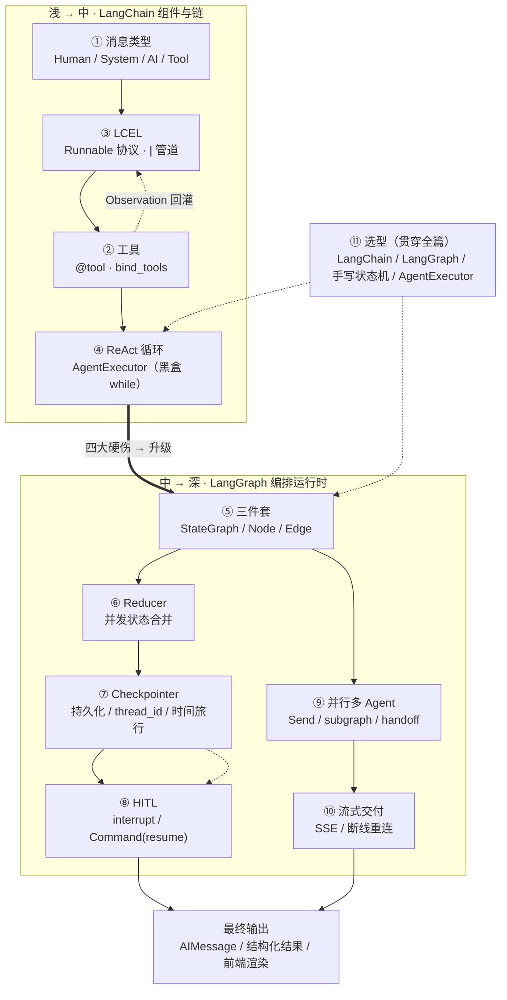

# LangChain 与 LangGraph

> 定位：本文件只讲 **LangChain / LangGraph 框架本身的面试题**，按「由浅入深」组织，每题都配「能背的结论 + 能写的最小代码 + 容易被追问的下钻点」。
> 与其它文件的边界：Agent 的**概念题**（什么是 Agent、ReAct 范式、Memory 分层）在 [00-Agent基础概念](./00-agent-basics)；Loop 终止、死循环、长任务、State/Checkpoint 的**架构级设计**在 [01-Agent Runtime与架构](./01-agent-runtime-architecture)。本文件聚焦「框架 API 与机制」，和 01 的 State/Checkpoint 有交叠，但这里落到 **API 与实现细节**，01 落到**系统设计**。

---

## 导学：一图看懂全篇（整体链路）

这份文档表面上是 11 层、几十道题，但**它们其实是同一条链路在不同深度上的切片**。先建立下面这张图，后面每一层都能在图里找到自己的位置：



### 这条链路怎么读

1. **主线（浅 → 中）**：一个请求进来，先被切成「消息」，用 LCEL 串成链，模型通过 `bind_tools` 提议调工具，执行后把结果回灌，形成 ReAct 循环。**第 1~4 层**讲的都是这条线。
2. **转折点（④ → ⑤）**：AgentExecutor 这条线在生产有四大硬伤（黑盒、无持久化、无 HITL、单 Agent），于是升级到 LangGraph 的显式图——这是「LangChain vs LangGraph」这道必考题的根源。
3. **深化（中 → 深）**：进了 LangGraph 后，按「状态怎么合并（Reducer）→ 怎么持久化（Checkpointer）→ 怎么人工介入（HITL）→ 怎么并行扩展（多 Agent）→ 怎么交付前端（SSE）」一路深挖。**第 5~10 层**就是这条深挖路径。
4. **贯穿始终**：第 11 层「选型」不是一道独立题，而是对整条链路的「什么时候该用哪一段」的总结。

### 问题定位表（哪道题属于哪一层）

| 层 | 一句话主题 | 你面经里的原题 |
| --- | --- | --- |
| ① 消息 | 四类消息角色 | 几乎每场必问 |
| ② 工具 | bind_tools / 谁执行工具 | X19#7、X26#7 |
| ③ LCEL | Runnable 协议 / 声明式 | 「LCEL 解决什么」 |
| ④ ReAct | AgentExecutor / 黑盒循环 | 「为什么被取代」 |
| ⑤ 三件套 | StateGraph / Node / Edge | X20#2、X19#4 |
| ⑥ Reducer | 并发状态合并 | 「State 为什么用 Annotated」 |
| ⑦ Checkpoint | 持久化 / 恢复 / 时间旅行 | X01#4、N7、N34#2 |
| ⑧ HITL | interrupt / resume | X02#6、X09#1-4 |
| ⑨ 多 Agent | Send / subgraph / handoff | X31、N22 |
| ⑩ 流式 | SSE / 断线重连 | X04#12 |
| ⑪ 选型 | 四大框架取舍 | X02#11、X04#13、X14#1、N14#6、N20#3 |

### 建议的阅读顺序

- **第一遍**：只背图 + 问题定位表，建立「哪道题在哪」的地图。
- **第二遍**：按 ①→⑪ 逐层背「结论 + 最小代码」，重点攻第 5~8 层（最高频的 State / Checkpoint / HITL 都挤在这里）。
- **第三遍**：做第 11 层选型题 + 附录 A 速记清单，把散点重新串回这张图。

---

## 0. 面试官到底在考什么（先建立地图）

### 0.1 岗位 JD 视角（调研结论）

2026 校招「Agent/大模型应用开发」JD 的高频措辞：

> 构建 Agent-based 智能系统，围绕 **Agent 架构、Context Engineering、多工具协同调用** 方向；参与核心系统设计与实现，**不仅是调用 API 或写 Demo**。

拆成面试官的三层考察：

| 层 | 考什么 | 对应的八股 |
| --- | --- | --- |
| 会用 | 能不能写出最小 Agent | LCEL、bind_tools、StateGraph 三件套 |
| 懂机制 | 为什么这样设计 | Runnable 协议、Reducer、Checkpoint、interrupt |
| 会取舍 | 什么时候用什么 | LangChain vs LangGraph vs 手写状态机 vs AgentExecutor |

### 0.2 30 秒心智模型（先背这张图）

```
用户输入 → LCEL 链（可选 RAG）→ Agent：LLM + bind_tools
              ↓ 多轮 tool call
   AgentExecutor（黑盒循环）  或  LangGraph（显式图 + Checkpoint）
              ↓
         最终 AIMessage / 结构化输出
```

顺着这条线，面试官必追问：**消息类型有哪些、谁执行工具、状态存哪、怎么防死循环**。下面九层就是按这条线展开的。

---

## 1. 第一层（浅）：消息类型 —— 必背，几乎每场必问

一个 LLM 应用的最小单位是「消息」。四个角色必须背熟：

| 类型 | 谁产生 | 作用 |
| --- | --- | --- |
| `SystemMessage` | 开发者 | 角色与约束，通常放首条 |
| `HumanMessage` | 用户/上游 | 任务输入 |
| `AIMessage` | 模型 | 文本回答，或带 `tool_calls` |
| `ToolMessage` | 工具执行器 | 携带 `tool_call_id` 和工具执行结果 |

**面试版回答**：「我按角色分四类消息：System 是开发者写死的角色约束，Human 是用户输入，AI 是模型输出、可能带 tool_calls 结构，Tool 是工具执行结果、必须带 tool_call_id 才能和对应的 tool_call 对上号。LangGraph 里存消息用 `add_messages` reducer，它按消息 ID 合并、能正确处理对同一条消息的覆盖更新。」

**容易答错**：把 `AIMessage` 只说成「模型说的话」——漏掉 `tool_calls` 才是 Agent 场景的关键，因为循环就是靠「AI 消息里的 tool_calls」驱动的。

---

## 2. 第二层（浅）：Tool 定义与 bind_tools —— 谁执行工具

Tool 是 Agent 与外部世界的**契约**：名称、描述、参数 Schema 直接决定模型是否**选对工具、填对参数**。

```python
from langchain_core.tools import tool

@tool
def search_docs(query: str, top_k: int = 3) -> str:
    """在内部知识库检索文档。query 为自然语言问题，top_k 为返回条数。"""
    return f"mock hits for: {query}"

llm_with_tools = ChatOpenAI(model="gpt-4o-mini").bind_tools([search_docs])
```

**三个必考点**：

1. **描述比函数名重要**：docstring 要写清「何时调用、输入含义、失败时返回什么」。
2. **模型只负责「提议」，不负责「执行」**：`bind_tools` 后模型输出 `tool_calls`，真正执行的是 `ToolNode` 或自定义节点，执行结果写成 `ToolMessage` 回灌。
3. **错误即 Observation**：工具抛错要捕获后返回可读字符串，让模型改参数重试，而不是让整个循环崩掉。

**面试版回答**（X19#7、X26#7 这类「MCP 和 Function Calling 区别」「谁执行工具」题的内核）：「模型只产生结构化的调用意图，应用的执行器负责真正调外部系统并回填结果——这是 Function Calling 的边界，也是它和 MCP 分层的关键。」

---

## 3. 第三层（中）：LCEL 与 Runnable 协议 —— 「LangChain 到底解决了什么」

**高频题：LCEL 解决了什么问题？它和直接写 Python 拼 prompt 有什么区别？**

**30 秒版本**：LCEL（LangChain Expression Language）用 `|` 把任意组件串成链，底层是统一的 `Runnable` 协议。任何 Runnable 自动获得 6 种调用方式（`invoke`/`batch`/`stream` + async 三件套），换模型只改链中一段，LangSmith 能自动 trace 每一步。

```python
from langchain_core.prompts import ChatPromptTemplate
from langchain_core.output_parsers import StrOutputParser
from langchain_core.runnables import RunnableParallel, RunnablePassthrough

prompt = ChatPromptTemplate.from_messages([
    ("system", "你是简洁的技术助手。"),
    ("human", "{question}"),
])

# 最简链
chain = prompt | ChatOpenAI(model="gpt-4o-mini") | StrOutputParser()
chain.invoke({"question": "什么是 LCEL？"})

# RAG 标准写法：并行检索 + 透传问题
parallel = RunnableParallel({"context": retriever, "question": RunnablePassthrough()})
rag = parallel | prompt | llm | StrOutputParser()
```

**追问下钻点（都要能答）**：

- **声明式 vs 命令式**：简单场景命令式更直观；但当同一个 chain 要跑 batch/stream/async 时，命令式写 3 套代码，LCEL 写 1 套。这是声明式的杠杆。
- **性能开销**：`|` 就是函数组合，单次开销可忽略；但元数据追踪（callback hooks）有 5~10% 开销，高 QPS 要关 callbacks。
- **降级**：`with_fallbacks([primary, backup])` 做模型降级。
- **RunnableConfig**：`callbacks`、`tags` 做链路追踪，`configurable_fields` 运行时换模型。

**容易答错**：说 LCEL 是「又一种 DSL/炫技」——它的价值是**组合性 + 可观测性**，不是语法糖。

---

## 4. 第四层（中）：AgentExecutor 与 ReAct 循环 —— 为什么它被取代了

经典 ReAct：`Thought → Action（tool+args）→ Observation → 循环`，直到模型不再发起 tool call 或达到 `max_iterations`。

```python
from langchain.agents import create_tool_calling_agent, AgentExecutor

prompt = ChatPromptTemplate.from_messages([
    ("system", "你有 search_docs。无法回答时说明原因。"),
    ("placeholder", "{chat_history}"),
    ("human", "{input}"),
    ("placeholder", "{agent_scratchpad}"),   # 本轮已发生的 tool 调用与结果
])
agent = create_tool_calling_agent(llm, tools, prompt)
executor = AgentExecutor(agent=agent, tools=tools, max_iterations=5)
executor.invoke({"input": "...", "chat_history": []})
```

**必背的三个参数**：

| 参数 | 含义 |
| --- | --- |
| `agent_scratchpad` | 存放本轮已发生的 tool 调用与结果，供模型继续推理 |
| `max_iterations` | 防死循环；生产必须设 |
| `handle_parsing_errors` | 模型输出非法 tool JSON 时的降级策略 |

**高频题：AgentExecutor 为什么被 LangGraph 取代？**（这是「LangChain vs LangGraph」的引子）

四个生产级硬伤，背下来：

1. **黑盒循环**：状态藏在 while 里，外部无法观测、无法回放、无法中途干预。
2. **无持久化**：第 15 步崩了，重启从第 1 步来，中间状态全丢。
3. **无 HITL**：加「人工审批」只能让循环一口气跑完，插不进暂停点。
4. **单 Agent**：多 Agent 协作要自己造消息传递。

**一句话**：AgentExecutor 把 Agent 状态机藏进了 while 循环；LangGraph 把每步拆成显式节点，可控、可恢复、可组合。

---

## 5. 第五层（中深）：LangGraph 三件套 —— State / Node / Edge

LangGraph 把流程建模成**有向图**：节点是纯函数 `(state) -> 部分状态更新`，边决定下一步，共享 State 由框架负责合并。

```python
from typing import Annotated, TypedDict
from langgraph.graph import StateGraph, START, END
from langgraph.graph.message import add_messages
from langchain_core.messages import HumanMessage

class State(TypedDict):
    messages: Annotated[list, add_messages]

def call_model(state: State):
    resp = llm.invoke(state["messages"])
    return {"messages": [resp]}

def should_continue(state: State) -> str:
    last = state["messages"][-1]
    return "tools" if getattr(last, "tool_calls", None) else END

graph = StateGraph(State)
graph.add_node("agent", call_model)
graph.add_node("tools", ToolNode(tools))
graph.add_edge(START, "agent")
graph.add_conditional_edges("agent", should_continue, {"tools": "tools", END: END})
graph.add_edge("tools", "agent")
app = graph.compile()
```

**术语速记（必背）**：

| 术语 | 作用 |
| --- | --- |
| `State` | 全流程共享；`add_messages` 让消息追加而非覆盖 |
| `Node` | 纯函数 `(state) -> partial_state` |
| `add_edge` | 固定下一跳 |
| `add_conditional_edges` | 根据 state 动态选路（ReAct 的「是否再调工具」） |
| `compile()` | 生成可 `invoke/stream` 的 CompiledGraph |
| `START`/`END` | 哨兵节点，表示入口/终点 |
| subgraph | 把多 Agent 团队封装成单节点，对外仍是一个 State 更新 |

**必踩的坑（面试手写代码常考）**：`should_continue` 返回的字符串必须和 `add_conditional_edges` 第三参数字典的**键**一致，漏写映射表会运行时路由报错。

**高频题：State 为什么用 `Annotated[list, add_messages]`？**

因为 `Annotated` 的第二个参数是 **reducer**，定义了「多次更新如何合并」。`add_messages` 让新消息**追加**而非覆盖，并按下消息 ID 正确覆盖同一条消息的更新——否则多节点写同一个 messages 字段会丢历史。

---

## 6. 第六层（深）：Reducer 与并发 —— 为什么这样设计

State 每个字段都关联一个 Reducer，决定多次更新如何合并：

```python
from typing import TypedDict, Annotated
from operator import add

class State(TypedDict):
    messages: Annotated[list, add]      # 追加合并
    current_step: str                   # 默认：直接覆盖（后写覆盖先写）
    max_score: Annotated[float, max]    # 自定义：取最大
```

**为什么需要 Reducer？** 因为 LangGraph 支持**节点并发执行**：两个节点并发返回 `{"results": [...]}` 时，没有 Reducer 框架不知道是覆盖还是合并。`Annotated[list, add]` 明确说「追加」。设计借鉴了 Erlang/Akka 的 actor 模型：**节点是纯函数 + 显式合并策略 = 可并行 + 可重放**。

**容易踩坑**：列表字段忘了加 reducer，并发时只剩一个节点的结果（默认覆盖）。还有一个易错点：合并型 reducer 返回空值**不会清空**字段（空更新被合并掉），要清空得用 `Overwrite` 包装。

---

## 7. 第七层（深）：Checkpointer —— 暂停、恢复、时间旅行

**高频题：Checkpointer 怎么实现「暂停/恢复/时间旅行」？存的是什么？**

每个「super-step」（一轮并发节点全部执行完）结束后，框架把**完整 State 快照 + 元数据**序列化写入存储后端，读取时反序列化重建。

```python
from langgraph.checkpoint.memory import MemorySaver   # 调试用
from langgraph.checkpoint.sqlite import SqliteSaver  # 生产用
from langgraph.checkpoint.postgres import PostgresSaver

checkpointer = MemorySaver()
app = graph.compile(checkpointer=checkpointer)

config = {"configurable": {"thread_id": "user-42"}}   # 会话隔离
app.invoke({"messages": [HumanMessage("查部署文档")]}, config)

# 崩溃/中断后，同一 thread_id 继续（input=None 表示从 checkpoint 恢复）
app.invoke(None, config)

# 时间旅行：列出历史 checkpoint，跳回任意一步分叉
history = list(app.get_state_history(config))
```

**三个能力（必背）**：

1. **暂停/恢复**：长任务崩溃后从最近 checkpoint 续跑，不用从头来。
2. **时间旅行**：`get_state_history` 列历史 + 指定 `checkpoint_id` 分叉，给 Agent 加「撤销」和 A/B。
3. **HITL 的地基**：`interrupt()` 就是靠持久化层「无限期暂停直到 resume」。

**追问下钻点**：

- **性能瓶颈**：瓶颈在 State 大小——把整个文档塞进 State，每步序列化几 MB 会拖慢执行。
- **优化大 State**：① State 只存引用/索引，大对象存 S3/Redis；② 增量 checkpoint 只写 diff；③ 合并轻量节点减少 checkpoint 频率。
- **高并发**：1000 用户同时跑，Postgres 写会成瓶颈。方案：RedisSaver 做热点 + 定期同步 Postgres；按 thread_id 分库分表；接受异步写。
- **`thread_id` 要纳入多租户设计**：同一用户多设备、客服转接都依赖 thread 隔离。

**容易答错**：生产还用 `MemorySaver`——进程重启数据全丢。生产用 Sqlite/Postgres/Redis。

---

## 8. 第八层（深）：Human-in-the-Loop —— interrupt 与 Command

**高频题：HITL 在 LangGraph 怎么做？和直接在循环里 `input()` 有什么不同？**

`interrupt()` 把节点挂起并持久化状态，进程可以**完全退出**，用户隔天用同一 `thread_id` 调用 `Command(resume=...)` 从挂起点继续。这是真正的「异步审批」，不是 `time.sleep()` 或阻塞 `input()`。

```python
from langgraph.types import interrupt, Command

def approval_node(state: State):
    # 挂起，等待人工输入
    decision = interrupt({"question": "确认执行此操作？", "preview": state["plan"]})
    return {"approved": decision == "approve"}

# 第一次调用：在 approval_node 挂起
result = app.invoke({...}, config=config)
print(result["__interrupt__"])   # 展示需要用户决策的内容

# 几小时后用户审批，同一 thread_id 恢复
result = app.invoke(Command(resume="approve"), config=config)
```

**必考点**：

- **HITL 是图级中断，不是 Prompt 里写「请人类确认」**——后者模型可能「自己编一个确认」。
- **`Command` 四参数**：`update`（更新状态）、`goto`（跳转节点）、`graph`（跨子图导航）、`resume`（恢复中断）。
- **`interrupt()` 之前的副作用必须幂等**：恢复时节点会从头重跑，之前插过一行数据库再插一次就重复了，要用幂等键/upsert。
- **两种中断**：静态 `interrupt_before=["sensitive_tool"]`（编译时指定）和动态 `interrupt()`（按 state 触发）。

> 这块和面经 X02#6（用户长期不输入/再次输入时 graph 状态如何变化）、X09#1-4（长任务恢复）直接对应，展开在 [01-Agent Runtime与架构](./01-agent-runtime-architecture) 第 9、11 节。

---

## 9. 第九层（深）：并行与多 Agent —— Send / subgraph / handoff

**高频题：多 Agent 怎么通信？子 Agent 状态怎么合并？**

```python
from langgraph.types import Send

def continue_to_jobs(state):
    # 从 conditional edge 返回多个 Send：fan-out 到 N 个 worker，数量运行时才知道
    return [Send("worker", {"task": t}) for t in state["tasks"]]
```

三个关键机制：

1. **`Send`**：map-reduce 范式。运行时才知道要拆成几个子任务时用；每个子任务拿到独立 State，结果靠 reducer 合并回来。
2. **subgraph**：把「多 Agent 团队」封装成单个节点，对外仍是一个 State 更新——多 Agent 协作的基础。
3. **handoff（交接）**：子图内用 `Command(goto=..., graph=Command.PARENT)` 跳回父图，实现「A Agent 把活交给 B Agent」。

**对比一句话**：`conditional_edges` 是「编译时已知的静态分支」；`Send` 是「运行时才知道数量的动态 fan-out」。

---

## 10. 第十层（收尾·贴你的差异化）：流式与前端交付 —— SSE

**高频题（面经 X04#12 原题）：FastAPI + SSE 流式时，LangGraph 状态机如何把节点结果实时推给前端？**

```python
# 后端：按节点完成粒度产事件
async for chunk in app.astream(inputs, config, stream_mode="updates"):
    # chunk 是一个节点完成后的 State 更新，{node_name: update}
    yield f"data: {json.dumps(chunk)}\n\n"
```

**核心要点（必答）**：

1. **两级流式要分清**：`stream_mode="updates"` 是「节点完成」粒度（适合推「执行到哪一步」）；LLM 的 token 级流式要嵌套在节点内部单独 `astream`。别把两者混为一谈。
2. **断线重连**：前端断开后，用同一 `thread_id` 先查任务表/`get_state` 补齐「当前到哪个节点」，再续订 SSE；事件要带序号去重（last-event-id）。
3. **进度事件幂等**：重连后可能重复收到事件，前端按 node 名 + 序号去重。

> 这块的完整状态机（取消、审批等待、任务状态重建）展开在 [01-Agent Runtime与架构](./01-agent-runtime-architecture) 第 11 节，是本仓库「前端偏全栈」定位的差异化重点。

---

## 11. 终极大题：选型对比 —— 每一场都会被问到

### 11.1 LangChain vs LangGraph（X02#11、X04#13、X14#1、X15#1、N14#6、N20#3 反复出现）

| 维度 | LangChain | LangGraph |
| --- | --- | --- |
| 抽象层次 | 组件层（LLM/Prompt/Tool/Retriever） | 编排层（Agent 状态机） |
| 核心范式 | 声明式 pipeline（LCEL） | 命令式状态机（有环图） |
| 适用 | RAG、单次查询、线性链 | 多 Agent、长任务、持久化、HITL |
| 何时不用 | 单次 LLM 调用 | 没有分支和状态的简单链 |

**记忆口诀**：LangChain 管**组件与链**，LangGraph 管**有状态、可恢复的编排运行时**。二者可共存——LangGraph 的节点内部仍用 LangChain 的 model/tool/retriever。

### 11.2 为什么选 LangGraph 而不是手写状态机（X14#1 原题）

**30 秒版本**：「手写状态机流程简单时更可控，但恢复、并发、Checkpoint 都要自己造。LangGraph 的图 + 共享 State + Checkpointer 把『环、分支回跳、持久化恢复、人工中断』变成一等公民。我的项目因为需要 Loop + 断点恢复 + 审批，所以选它，而不是只有链式能力的 LangChain 或要自己造恢复的手写状态机。」

### 11.3 场景选型表（背这张，选型题通杀）

| 场景 | 推荐 |
| --- | --- |
| 单 Agent + 少量工具、快速验证 | LangChain AgentExecutor |
| 多分支、子图、循环上限精细控制 | LangGraph |
| 要持久化会话 / 崩溃恢复 | LangGraph + Checkpointer |
| 审批、合规闸门 | LangGraph `interrupt` |
| 纯 RAG 问答链 | LCEL 即可，不必上图 |

### 11.4 和 CrewAI / AutoGen 比（N6「DeepSeek Harness 与 LangChain 差异」的姊妹题）

LangChain/LangGraph 偏**可编程编排 + 生态集成**（细粒度控制图与 Checkpoint）；CrewAI 偏**角色剧本**（Role/Goal/Backstory），AutoGen 偏**对话式多 Agent**。选型看团队要不要细粒度控制图与持久化。

---

## 附录 A：高频八股速记清单（考前扫一遍）

1. **LCEL 和手写 Python 拼 prompt 区别？** 统一 Runnable 接口，stream/batch/组合/追踪免费获得；换模型只改一段。
2. **bind_tools 后谁执行工具？** 模型只生成 `tool_calls`，执行器（ToolNode/AgentExecutor）调用并注入 `ToolMessage`。
3. **State 为什么用 `Annotated[list, add_messages]`？** 定义 reducer，追加而非覆盖，避免多节点写同字段丢历史。
4. **conditional_edges 和 AgentExecutor 内部路由的区别？** 前者显式、可单测；后者黑盒在 executor 里。
5. **Checkpoint 存什么？** 每个 super-step 后的完整 State 快照 + 元数据，用于恢复与 HITL 续跑。
6. **为什么从 AgentExecutor 迁到 LangGraph？** 要持久化、人工审批、精确循环控制、多 Agent 子图。
7. **stream 怎么用？** `app.stream(inputs, config)` 按节点完成产事件，适合 SSE；LLM token 级 stream 嵌套在节点内。
8. **怎么测试 Agent？** 测条件路由函数 + 单节点逻辑 + golden thread 集成测；mock LLM 避免 flaky。

## 附录 B：常见踩坑对照表

| 现象 | 原因 | 处理 |
| --- | --- | --- |
| 无限调同一工具 | 描述含糊 / Observation 为空 | 收紧 docstring；限制 max_iterations |
| 丢历史 | State 字段没加 reducer | 用 add_messages 等 Annotated reducer |
| HITL 无法续跑 | thread_id 不一致 | 客户端持久化 configurable.thread_id |
| Token 爆炸 | scratchpad 无裁剪 | 摘要节点 / 只保留最近 N 条 ToolMessage |
| 重启丢 checkpoint | 用了 MemorySaver 上生产 | 换 SqliteSaver/PostgresSaver |
| 路由报错 | 条件函数返回值与映射表键不一致 | 检查 add_conditional_edges 第三参数字典 |

---

## 附录 C（可选补充）：一个能串起全部八股的最小项目骨架

> 仅作「把上面九层串起来」的练习，不做为重点。真跑通它，你对 Checkpoint/HITL/SSE 的理解会从「背」变成「会」。

```python
# 问数 Agent：parse_intent → generate_sql →(危险? interrupt)→ execute → answer
from typing import Annotated, TypedDict
from langgraph.graph import StateGraph, START, END
from langgraph.graph.message import add_messages
from langgraph.checkpoint.sqlite import SqliteSaver
from langgraph.types import interrupt, Command

class State(TypedDict):
    messages: Annotated[list, add_messages]
    sql: str
    approved: bool

def generate(state: State) -> dict:
    resp = llm.bind_tools([db_query]).invoke(state["messages"])
    return {"messages": [resp], "sql": extract_sql(resp)}

def guard(state: State) -> str:
    return "approve" if is_dangerous(state["sql"]) else "execute"

def approve(state: State) -> dict:
    ok = interrupt({"sql": state["sql"], "q": "允许执行？"})
    return {"approved": ok == "yes"}

def execute(state: State) -> dict:
    rows = db_query(state["sql"])          # 失败时把报错回灌成 ToolMessage
    return {"messages": [ToolMessage(rows, tool_call_id=...)]}

g = StateGraph(State)
g.add_node("generate", generate)
g.add_node("approve", approve)
g.add_node("execute", execute)
g.add_edge(START, "generate")
g.add_conditional_edges("generate", guard, {"approve": "approve", "execute": "execute"})
g.add_edge("approve", "execute")
g.add_edge("execute", END)
app = g.compile(checkpointer=SqliteSaver.from_conn_string("ckpt.db"))
```

这一小段覆盖了：State/reducer、conditional_edges、Checkpointer、interrupt/Command、工具失败回灌——即本文件第 5~8 层的全部核心。
