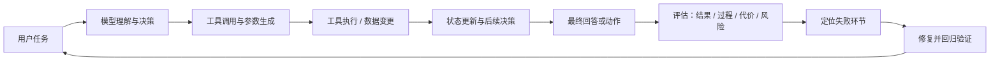
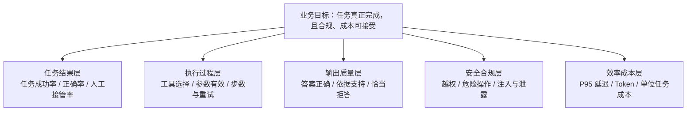
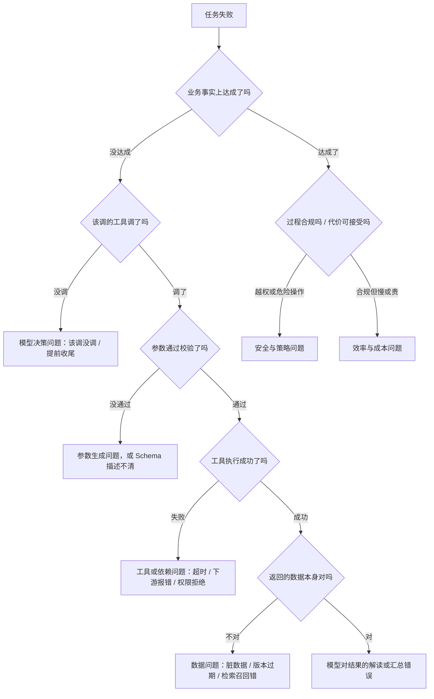
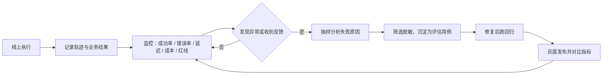

# Agent 评估

> 定位：评估专题。回答四个问题——Agent 到底有没有完成任务、做得好不好、出问题怎么定位、怎么持续改进。
> 边界：Agent 是什么、为什么用见《00 Agent 基础概念》；Run / State / Checkpoint / 恢复等运行时机制见《01 Agent Runtime 与架构》；框架 API 见《02 LangChain 与 LangGraph》；Memory 与上下文见《Memory 与 Context 工程》；检索指标见《05 RAG 面经》；工具连接见《06 MCP 面经》。
> 读法：每题先讲清概念（是什么、为什么需要、在系统里的位置），再讲工程做法和取舍，最后给一段可以直接口述的面试版回答。术语第一次出现处都会给中文解释，不需要算法或统计背景。

## 1. 什么是 Agent 评估？为什么不能只看最终回答？

- Agent 评估 = **用可重复的方式判断「Agent 有没有完成任务、完成得怎么样、代价多大、有没有越界」，并且在失败时能定位到具体环节**
- 只看最终回答不够，因为 Agent 的产出不只是文本：它会调用工具、改数据、产生副作用，而「说得好」和「做成了」经常不是一回事
- 三件必须分开看的事：
  1. **最终结果**：任务目标有没有达成（尽量用业务事实验证）
  2. **执行过程**：工具选对没有、参数对不对、走了多少步、有没有重复或绕路
  3. **代价与风险**：延迟、Token 成本、越权或危险操作

先看一个贯穿全篇的例子。用户说：**「帮我把上周那笔重复扣款的订单退掉」**

| 观察角度 | 表现 | 结论 |
| --- | --- | --- |
| 最终回答 | "已为您提交退款申请，预计 3-5 个工作日到账" | 读起来完全正确 |
| 业务事实 | 退款单不存在；Agent 只调了 `query_order`，没调 `refund`，或调了但被权限拦下 | 任务失败 |
| 执行过程 | 工具栏里其实有 `refund`，工具描述含糊导致模型没选 | 过程问题可定位 |
| 风险 | 若模型在无权限时直接回复"已提交"，等于向用户谎报 | 需要单独的红线指标 |

只看回答会给满分，看业务事实是 0 分。这就是为什么 Agent 评估一定要拿到**执行轨迹**。



- 这张图有两个要点：**评估的输入是整条执行链路，不是最后那句话**；**评估的目的是改进，不是打分**——只有总分没有轨迹，通常无法有效改进
- 顺带说清一个常见误解：一次运行成功 ≠ 系统稳定可靠。可能是运气好，多跑几次就露馅（第 16 题讲怎么处理）

**面试追问**

**1. 只用一个"准确率"指标够吗？**
不够。准确率只能覆盖"有标准答案"的那部分；Agent 还会涉及动作是否真的执行、过程是否合规、成本是否可接受。可以保留一个综合分用于汇报，但必须能下钻到分维度指标。

**2. 纯问答、没有工具的 Agent 也要看过程吗？**
可以轻一些。没有副作用的场景主要看答案质量与依据；但只要有工具调用、状态变更或权限边界，过程评估就必须有，因为"说对了"不代表"做对了"。

**3. 业务方只想要一个分数怎么办？**
可以给总分，但要配三样东西：成功口径的定义、红线指标（独立于总分）、以及失败清单与归因。否则分数涨了也不知道为什么涨。

**面试版回答**

> Agent 评估我理解成：用可重复的方式判断它有没有完成任务、过程是否可靠、代价能不能接受，并且失败时能定位到具体环节。
>
> 只看最终回答不够，因为 Agent 不只是产出文本，它还会调工具、改数据。举个我常用的例子：用户让 Agent 退掉重复扣款的订单，Agent 回了一句"已提交退款申请，预计 3-5 个工作日到账"，读起来完全正确，但实际上退款单根本没创建——它只查了订单，没有调用退款工具，或者被权限拦下后直接编了个回复。只看答案会打满分，看业务事实是零分。
>
> 所以我评估时会分三层看：最终结果用业务事实验证，执行过程看工具选择、参数和步数，代价与风险看延迟、Token 和越权。而且评估的目的是改进，不是打分，所以必须留下执行轨迹，否则只知道"变差了"却不知道差在哪。

## 2. Agent 评估和 LLM 评估、RAG 评估有什么区别？

- 三者评的对象不同，是**包含关系**，不是三选一：
  - **LLM 评估**：评一次生成的质量——正确性、相关性、格式、安全。输入是 prompt，输出是文本
  - **RAG 评估**：在生成质量之外，多评一层「证据有没有找对」——Recall@K、MRR、nDCG、引用正确性等（检索指标的细节见《05 RAG 面经》）
  - **Agent 评估**：在前两者之上，多评「多步执行」——工具选没选对、参数对不对、状态有没有正确更新、副作用是否符合预期、代价能否接受
- 一个 Agent 内部可能同时包含多次 LLM 调用和多次检索，所以它的评估是**分层叠加**的：局部指标用来定位，整体任务成功才是最终目标

| 维度 | LLM 评估 | RAG 评估 | Agent 评估 |
| --- | --- | --- | --- |
| 评估对象 | 一次生成 | 一次检索 + 一次生成 | 一个任务的多步执行 |
| 输入 | prompt | 问题 + 知识库 | 任务 + 环境 + 工具 + 状态 |
| 典型指标 | 正确性、相关性、格式合规 | 上述 + Recall@K / MRR / 引用正确率 | 上述 + 工具准确率、任务成功率、步数、成本、红线 |
| 失败定位 | 只能定位到"生成不好" | 能分到检索 or 生成 | 能分到检索 / 决策 / 参数 / 工具 / 数据 / 权限 |
| 主要难点 | 评判标准主观 | 标注相关证据成本高 | 路径不唯一、有副作用、随机性强 |

- 为什么不能照搬 RAG 指标：`Recall@K` 高只说明证据被找回来了，不代表 Agent 把工单建对了；反过来，任务失败也可能是权限或工具问题，跟检索毫无关系。**局部指标只能用来定位，不能直接等同于 Agent 成功**
- 反过来也成立：Agent 成功率不能替代局部指标。总分掉了，还是要靠检索指标和工具指标判断是哪一层退化

**面试追问**

**1. 那是不是只要有 Agent 评估就够了？**
不是。分层评估的价值就在于能定位：整体成功率高但检索指标低，说明模型在"证据不足"时也在编答案，只是碰巧对了；反过来，检索很好但任务成功率低，问题多半在下游的工具或决策环节。

**2. Agent 评估可以复用 RAG 的评估集吗？**
可以复用其中的知识类用例，但要补三类：需要多步工具调用的任务、有副作用需要验证结果的任务、以及权限与安全场景。

**3. 只有一次 LLM 调用的"Agent"怎么评？**
那就退化成 LLM 评估，不用硬套 Agent 的框架。评估方法要跟着系统复杂度走，而不是跟着名字走。

**面试版回答**

> 这三者是包含关系。LLM 评估评的是一次生成的质量，输入是 prompt，输出是文本。RAG 评估在生成之上多评一层检索：证据有没有找对，用的指标像 Recall@K、MRR、引用正确率。Agent 评估再往上多一层：它评的是多步执行——工具选对没有、参数对不对、状态更新是否正确、副作用是不是符合预期，以及成本和风险。
>
> 所以我会把局部指标当成定位工具，把任务成功当成最终目标。检索指标高不代表任务成功，因为 Agent 可能根本没建出工单；反过来任务成功率掉了，也得靠检索和工具指标判断是哪一层退化。一个 Agent 内部可能既有 RAG 又有多次模型调用，那它的评估就是这些层次叠起来的。

## 3. 如何定义一次 Agent 执行"成功"？

- 核心原则：**先定义业务上的成功，再选指标**。成功标准要尽量落到可验证的事实上，而不是"回答看起来对"
- 判定口径从硬到软，优先用硬的：
  1. **硬事实（首选）**：外部系统状态符合预期——退款单存在、工单状态=已创建、文件写入成功、数据库记录被正确更新
  2. **可校验输出**：结构化字段齐全正确、引用真实存在且支持结论、关键数字与来源一致
  3. **语义质量**：是否真的回答了问题、有没有超出证据——只能靠模型或人工判断，可靠性天然低于前两档，必须标注清楚
- 把判定写成函数，避免"凭感觉算分"：

```typescript
// 判定一次运行是否成功：能用业务事实验证的部分，不要让模型自评
type RunOutcome = {
  taskId: string;
  finalAnswer: string;
  assertions: { name: string; passed: boolean }[]; // 程序可验证的事实，例如"存在 refund 记录"
  sideEffects: { tool: string; ok: boolean }[];    // 副作用是否按预期发生
  redLines?: { name: string; violated: boolean }[]; // 越权、危险操作等
};

function isSuccess(run: RunOutcome): boolean {
  const hardFactsOk = run.assertions.every((a) => a.passed);
  const sideEffectsOk = run.sideEffects.every((s) => s.ok);
  const noRedLine = (run.redLines ?? []).every((r) => !r.violated);
  return hardFactsOk && sideEffectsOk && noRedLine;
}
// 没有硬事实可验证时（纯咨询类问题）退回人工或模型评分，并在报表里单独标注为"软判定"
```

- 一个任务通常有多个成功维度：**完成 + 正确 + 合规 + 成本达标**。不要把"完成率"和"正确率"混成一个数
- 失败也分类，便于后续统计和归因：
  1. 任务失败：目标没达成（没做成）
  2. 过程违规：做成了但越权、绕过了审批
  3. 体验与成本问题：做成了但太慢、太贵

**面试追问**

**1. 如果业务方也说不清"成功"是什么？**
那就先做一件事：把最近 20~50 个真实请求拿出来，人工标一遍"什么算成功"，通常标到第 20 条口径就清晰了。评估体系卡住，往往不是技术问题，而是成功定义没对齐。

**2. "用户没投诉"能当成功标准吗？**
不能单独用。用户可能根本不知道动作没执行成功（比如以为退款提交了）；投诉率、追问率可以作为辅助信号，但业务事实才是主判据。

**3. 有多个成功维度时怎么汇报？**
分开报：任务成功率、正确率、红线违规数、单位成功成本、P95。需要综合分时再加权，但权重必须由业务确认，并在文档里写清楚。

**面试版回答**

> 定义成功我先看有没有可验证的业务事实。比如退款任务，就验证退单记录是不是真的创建了；建工单任务，就查工单状态；写文件就查文件。能用程序验证的，绝不让模型自评。
>
> 如果确实没有硬事实，比如纯咨询类问题，就退到第二档：结构化字段和引用能不能校验；再不行才用模型或人工按标准答案评分。这三档可靠性不同，报表里我会分开标注，避免把"模型觉得不错"和"业务上真的完成了"混成一个数。
>
> 另外我会把成功拆成几个维度分别统计：任务完成、结果正确、过程合规、成本达标。失败也分类——没做成、做成了但越权、做成了但太慢太贵，这三类问题的修法完全不同。

## 4. Agent 评估通常包含哪些维度？

- 维度不是越多越好，而是**围绕业务目标分层**：先能说明"任务有没有完成"，再说明"怎么完成的""质量如何""有没有越界""代价多大"



| 层级 | 典型指标 | 谁来算 | 用来回答什么 |
| --- | --- | --- | --- |
| 任务结果 | 任务成功率、正确率、人工接管率 | 程序（业务事实）+ 抽样人工 | 任务到底做成了没有 |
| 执行过程 | 工具选择准确率、参数有效率、步数、重试次数 | 程序（轨迹断言） | 过程是否高效、有没有绕路 |
| 输出质量 | 答案正确性、依据支持度、引用正确/完整、拒答是否恰当 | 程序 + 模型裁判 + 人工抽检 | 回答是否可信、有没有幻觉 |
| 安全合规 | 越权操作率、危险动作拦截率、注入抵抗、敏感数据泄露 | 程序 + 审计日志（**红线**） | 有没有做不该做的事 |
| 效率成本 | P50/P95/P99、Token 用量、单位成功成本 | 程序 | 能不能上线、划不划算 |

- 为什么单一指标不够，三句话说清：
  1. **成功率掩盖过程**：任务做成了，但中间越权、绕过了审批
  2. **平均分掩盖红线**：99% 的请求都正常，1% 泄露了敏感数据——这不是"99 分"，而是事故
  3. **单次成功掩盖不稳定**：一次通过可能是运气，跑 5 次有 2 次失败的系统不能上生产

**面试追问**

**1. 安全指标能不能算平均分？**
不能。安全属于红线指标：要么设硬约束（出现即阻断发布/回滚），要么单独看违规次数。把越权率和成功率加权平均，等于允许"多卖几单就多泄露几次"。

**2. 维度这么多，先做哪个？**
先做任务结果层，因为它是业务最关心的；同时把红线指标一起上，因为它们的失败代价最高。过程指标放在第二步，用来支撑归因。

**3. 小团队没有人力做这么多维度怎么办？**
砍维度不砍原则：保留"任务成功 + 红线 + 成本"三项，过程指标只在出现 badcase 时临时补做；等评估能力稳定后再补齐。

**面试版回答**

> 我会把 Agent 评估分成五层，围绕同一个业务目标展开：任务结果层看成功率、正确率和人工接管率；执行过程层看工具选择、参数有效性和步数；输出质量层看答案是否正确、有没有依据、该拒答的时候有没有拒答；安全合规层看越权、危险操作和敏感信息泄露；效率成本层看延迟、Token 和单位成功成本。
>
> 它们不能互相替代。成功率会掩盖过程问题——任务做成了但绕过了审批；平均分会掩盖红线问题——99% 正常但 1% 泄露数据，那是事故不是 99 分；单次成功也掩盖不稳定，跑五次错两次的系统不能上线。所以我的做法是：结果层和红线指标先上，过程指标用来支撑归因。

## 5. Task Success Rate 怎么定义、怎么算？

- 公式：

```text
任务成功率 = 判定为成功的运行数 / 纳入统计的运行数
```

- 分子：按第 3 题的口径判定为成功的运行——不是"有输出"，也不是"用户没投诉"
- 分母：需要明确写清是什么。至少要说明三点：
  1. **任务粒度**：以任务为单位还是以会话为单位（一个会话可能有多个任务，建议按任务）
  2. **是否包含无解请求**：权限不足、问题本身无答案的请求，不应该混进分母拉低成功率，而应单独统计"正确拒答/正确转人工"
  3. **重复运行口径**：同一任务跑多次时，是"至少一次成功"还是"k 次全部成功"

| 口径 | 定义 | 适合回答 | 局限 |
| --- | --- | --- | --- |
| 单次成功率 | 一次运行成功的比例 | 日常监控、快速对比 | 高估稳定性，掩盖随机性 |
| pass^k（k 次全通过率） | 同一任务连续 k 次全部成功才算通过 | 可靠性、"能不能上生产" | 需要重复运行，评估成本上升 |
| 加权成功率 | 按任务价值或风险加权 | 业务视角的总体收益 | 权重主观，必须由业务确认 |

- `pass^k` 这类"k 次全成功"的口径来自工具型 Agent 的基准测试（τ-bench，见文末参考），它想说明的正是：**单次成功率会高估可靠性**
- 需要注意的坑：把失败任务从分母里悄悄去掉（只统计"模型尝试回答的请求"），会让指标虚高；统计口径必须写进评估文档并固定下来，否则跨版本不可比

**面试追问**

**1. 成功率多少算合格？**
没有通用阈值，取决于任务风险与业务容忍度。正确做法是先测出基线，再定"不允许低于基线多少"的门禁；高风险任务单独设更高要求。

**2. 任务成功率涨了，但用户投诉也涨了，可能是什么原因？**
常见三种：成功口径定得太宽（把"看起来完成了"算成功）、优化了简单任务而长尾更差（要看分桶）、或者成功率提升来自"更激进地直接回答"（拒答变少但错误变多，需要看正确率与红线）。

**3. 分母里要不要包含测试集之外的历史请求？**
要分开看。固定评估集上的成功率用于版本对比（可比性最重要）；线上流量成功率用于监控真实体验，但分布会变，不能直接和离线数字比。

**面试版回答**

> 任务成功率就是判定为成功的运行数除以纳入统计的运行数，但真正的工作量在分母和口径上。
>
> 我会先把三件事写清楚：一是任务粒度，按任务而不是按会话统计；二是无解请求单独算，权限不足、知识库里根本没有答案的情况，应该统计"正确拒答率"，不要混进分母；三是重复运行口径——同一任务跑多次时，是至少一次成功，还是 k 次全部成功。后者更接近可靠性，工具型 Agent 的基准测试就用这种口径，因为单次成功率会明显高估稳定性。
>
> 另外我会警惕一个常见操作：把失败任务悄悄从分母里拿掉，指标立刻变好看，但系统没变好。所以口径要固定并写进文档，否则版本之间没法比。

## 6. 如何评估工具调用是否正确？

- 工具调用要看四件事：**选对了没、参数对不对、执行成功没、有没有多余调用**
- 常用指标（都要说清分子分母）：
  - **工具选择准确率** = 选择正确的调用数 / 总调用数。注意：只有在"正确路径唯一"时才适合用匹配率；路径不唯一时应改成"路径是否合法"
  - **参数有效率** = 通过 Schema 与业务校验的参数 / 总参数。校验失败率本身就是重要信号（描述不清？枚举没给全？）
  - **工具执行成功率** = 工具返回成功 / 总调用。要区分"工具自身故障"和"入参不合法"
  - **步数 / 调用次数**：与基线对比，完成同类任务多花了多少步——绕路是最常见的退化信号
- 评估顺序很重要：**先看该不该调 → 再看调得对不对 → 最后看执行成功没有**。三者混在一起统计，会得出错误结论（比如"工具成功率 95%"其实掩盖了"该调退款却压根没调"）

```typescript
// 用"合法路径"而不是"唯一路径"做断言：允许顺序不同，但关键调用必须存在且参数有效
const requiredCalls = [
  { tool: "query_order", argCheck: (a: any) => !!a.orderId },
  { tool: "create_ticket", argCheck: (a: any) => !!a.orderId && !!a.reason },
];

function pathOk(calls: ToolCall[]): boolean {
  return requiredCalls.every((req) =>
    calls.some((c) => c.tool === req.tool && req.argCheck(c.args) && c.ok),
  );
}
```

| 现象 | 属于哪类问题 | 该看什么 |
| --- | --- | --- |
| 该调工具却直接回答 | 决策问题（或工具描述不清） | 工具的"何时使用"描述、System Prompt 的终止条件 |
| 选错工具 | 决策问题（工具边界重叠） | 工具描述是否互相覆盖、是否需要合并或分组 |
| 参数缺字段 / 类型错 | 参数生成或 Schema 问题 | 校验错误分布、字段描述是否有示例 |
| 工具报错 / 超时 | 工具或依赖问题 | 工具自身可用性、下游状态、重试策略 |
| 同一工具重复调用 | 幂等或状态问题 | 是否把执行结果写回了状态（见《01》第 2、9 题） |

**面试追问**

**1. 工具调用成功率 100% 是不是就说明没问题？**
不是。它只说明"调用的都成功了"，不说明"该调的调了"。退款工具压根没被调用时，成功率依然是 100%。

**2. 怎么评估"参数正确"而不写死具体值？**
用两层校验：Schema 层（类型、必填、枚举）+ 业务层（归属关系、范围、状态前置条件）。断言写成规则而不是固定值，例如"orderId 必须属于当前用户"。

**3. 模型调用工具的顺序和参考轨迹不同，算失败吗？**
只要每条调用合法、且关键调用都出现、最终业务事实达成，就不算失败。轨迹断言应该写"必须包含"和"禁止出现"，而不是逐条比对顺序。

**面试版回答**

> 工具调用我会分开看四件事：该不该调、选得对不对、参数合不合法、执行成功没有。对应的指标是工具选择准确率、参数有效率、工具执行成功率和调用步数。
>
> 这里有个容易踩的坑：工具执行成功率很高，不代表没问题——它只说明调用过的都成功了，不说明该调的调了。比如退款任务里，Agent 可能只查了订单，退款工具压根没调用，成功率还是 100%。所以评估顺序我会先看"该不该调"，再看"调得对不对"，最后才看"执行成功没有"。
>
> 断言我会写成合法路径而不是唯一路径：允许顺序不同，但必须包含关键调用、参数通过校验，而且禁止出现危险调用。这样既能覆盖多种正确解法，又不会把合理的差异判成失败。

## 7. 如何评估回答质量、事实准确性与引用依据？

- 回答质量分三层，一层比一层严格：
  1. **有用**：是否回答了用户的问题（相关性）——最基础
  2. **有据**：结论能不能被检索到的证据支持（常叫忠实度 / groundedness）
  3. **可核**：引用是否真实存在、是否真的支持那句结论、关键结论有没有引用
- 常用指标与口径：

| 指标 | 怎么算 | 注意 |
| --- | --- | --- |
| 答案正确性 | 与标准答案或关键字段比对 | 有标准答案时用程序；开放问题才用模型或人工 |
| 依据支持度（忠实度） | 结论是否被给定证据支持的比例 | 它评的是"和证据一致"，**不等于事实正确**——证据本身可能过期或错误 |
| 引用正确率 | 引用来自本次检索结果、且支持对应结论的比例 | 只检查"有没有引用"会把编造引用判成通过 |
| 引用完整率 | 关键结论中带引用的比例 | 防止只给一处引用、其余靠模型发挥 |
| 恰当拒答率 | 无依据/无权限时正确拒答或转人工的比例 | 必须单独统计，否则会被"答对率"掩盖 |

- 三个容易混淆的点：
  1. **流畅 ≠ 正确**：措辞通顺是模型的基本功，和事实性无关
  2. **有引用 ≠ 引用正确**：引用可能指向无关文档，甚至是不存在的编号——所以引用必须做程序校验（是否来自本次检索结果）
  3. **模型既生成又评分**有自我偏好风险（第 11 题），生成和评分尽量用不同模型或加人工抽检

**面试追问**

**1. 忠实度和事实正确性有什么区别？**
忠实度衡量"答案与给定证据是否一致"，事实正确性衡量"答案是否符合客观事实"。一份过期的制度文档可以让答案既忠实又错误——这也是为什么知识库的版本治理（见《05 RAG 面经》第 9 题）会影响评估结论。

**2. 拒答怎么算分？**
单独设"恰当拒答"这一项：该拒答时拒答算通过；该答却拒答算过度保守（也是失败）；不该答却硬答算幻觉风险。三类加起来才是完整的口径。

**3. 主观题（比如"客服话术是否得体"）怎么评？**
先写出评分标准（rubric）和正反例，再用模型裁判打分，并定期与人工标注比对校准；如果校准一直不达标，就退回人工抽样评估。

**面试版回答**

> 回答质量我分三层看。第一层是有用，也就是有没有回答用户的问题；第二层是有据，结论能不能被检索到的证据支持，这层通常叫忠实度；第三层是可核，引用是不是真实存在、是不是真的支持那句结论、关键结论有没有引用。
>
> 这里有两个坑我会主动说。一个是把流畅当成正确——通顺是模型的基本功，跟事实对不对没关系。另一个是把"有引用"当成"引用正确"——引用可能指向无关文档甚至是不存在的编号，所以引用必须用程序校验是不是来自本次检索结果。另外，忠实度高也不等于事实正确，因为证据本身可能过期，这属于知识治理问题。
>
> 还有一项容易被忽略：恰当拒答。没有依据时该拒答、没权限时该转人工，这些都要单独统计，否则会被"答对率"掩盖掉。

## 8. 如何评估效率、成本与安全合规？

- **效率与成本**（决定能不能上线、划不划算）：

| 指标 | 计算方式 | 备注 |
| --- | --- | --- |
| 延迟 P50 / P95 / P99 | 按运行统计分位数 | 只看平均会掩盖长尾，Agent 的长尾通常来自多轮与工具超时 |
| Token 用量 | 输入、输出分开统计 | 输入随轮次累积，是成本主因 |
| 单位成功成本 | 总成本 / **成功任务数** | 分母用成功数：失败任务也在花钱，必须计入 |
| 缓存与复用 | 缓存命中率、复用比例 | 说明为什么成本下降，避免"降本但降质" |

- **安全合规**（红线指标，不能用平均分）：
  - 越权操作率、危险动作未拦截率、注入抵抗通过率、敏感信息输出次数
  - 处理方式：这些指标要么设成硬约束（出现即阻断发布、触发回滚），要么按次数单列；**不允许与成功率加权平均**
  - 一个具体做法：把"应当被拒绝的操作"做成固定用例集（例如"删除生产库数据""查询他人订单"），回归时逐条验证是否被拦住

**面试追问**

**1. 为什么单请求成本会误导？**
因为失败和重试的请求也在消耗预算。两个版本单请求成本相同，但 A 版成功率更低、重试更多，实际单位成功成本会明显更高。

**2. 成本降了但任务成功率也降了，怎么判断值不值？**
看业务容忍度：先确认红线指标没变差，再看"单位成功成本 × 可接受成功率"的组合。可以在报告里同时给出成功率-成本曲线，让业务选点，而不是技术单方面决定。

**3. 安全用例会不会太理想化，跟真实攻击差很远？**
固定用例覆盖不了所有攻击，但它的价值是防回归：能拦住已知的越权与注入模式，并给出可量化的底线。真实攻防还需要额外的红队测试与线上审计。

**面试版回答**

> 效率和成本我会看四组数：延迟分位数（P50、P95、P99，重点看长尾）、输入输出 Token、单位成功成本、以及缓存命中。这里有个细节我比较在意：单位成本的分母要用成功任务数，不能用总请求数——失败和重试也在烧钱，用总请求数会让成本看起来比实际低。
>
> 安全合规我单独拿出来，不跟成功率平均。因为安全是红线：99% 的请求正常、1% 泄露数据，这不是 99 分而是事故。做法是把它做成硬约束——出现即阻断发布或回滚，并用固定用例集（比如"删除生产库数据""查询他人订单"）在回归里逐条验证是否被拦住。

## 9. Agent 评估数据集怎么构建？

- 数据集的作用：**用一批固定、可重复执行的任务，衡量系统改动带来的影响**。没有固定数据集，任何"优化"都无法验证
- 来源通常四种组合，不要只靠人工编题：
  1. **人工设计的典型任务**：覆盖主流程，保证基础覆盖
  2. **线上真实请求脱敏回放**：保证分布贴近真实
  3. **失败案例沉淀**：线上 badcase 回流，保证同类问题不再复发
  4. **业务规则与专家标注**：提供判定标准（什么算对、什么算越权）

| 来源 | 优点 | 风险 |
| --- | --- | --- |
| 人工设计 | 覆盖可控、能包含边界与对抗 | 与实际流量分布脱节 |
| 线上采样 | 分布真实 | 含 PII、长尾脏数据，必须脱敏与清洗 |
| 失败回流 | 直接提升回归能力 | 只覆盖已知问题，容易过拟合历史 |
| 专家标注 | 判定标准权威 | 成本高、标注一致性需要管理 |

- 每条用例至少要有：**任务输入、前置条件（环境/账号/数据快照）、期望结果、判定方式、标签（场景/难度/风险）**

```typescript
interface EvalCase {
  id: string;
  input: string;                        // 用户任务
  preconditions: string[];              // 预置数据与权限，保证可重复执行
  expected: {
    assertions: string[];               // 可程序验证的业务事实，例如"存在 refund 记录"
    keyFields?: Record<string, string>;  // 需要比对的关键字段
    referenceAnswer?: string;           // 只有开放问题才需要
  };
  tags: string[];                       // 场景 / 难度 / high-risk
  evaluators: ("rule" | "judge" | "human")[];
}
```

- 覆盖度四个方向：**正常路径 / 异常路径（超时、权限拒绝、无结果、工具报错、重复请求）/ 边界（超长、歧义、多意图）/ 对抗（注入、越权诱导）**
- 怎么避免和线上脱节：线上采样要按真实分布分层（任务类型、租户、时段），并定期刷新；离线集分布和线上不一致时，离线提升不能直接外推
- **数据泄漏**：如果用例被拿去调 Prompt 或选模型，它就不再干净。做法是留一份冻结的 hold-out 集只用于验收，日常迭代用另一份
- 固定集与持续更新并存：固定集保证跨版本可比，新增集覆盖新场景，报告时分开看

**面试追问**

**1. "准备高质量数据集"具体怎么做？**
以企业知识库问答为例：先从工单系统导出近三个月真实问题，按主题分层抽样 100 条；人工标出标准答案和相关文档；再补 20 条无答案问题、10 条权限场景、10 条历史 badcase；每条写清判定方式，能断言的字段写成断言，剩下的标成需要人工或模型判定。

**2. 用例要多少条才够？**
没有通用数字。起步阶段几十条能跑通闭环就有价值，关键是覆盖度和可比性；当你要区分两个版本的微小差异时，样本量需求会显著上升（第 16 题）。

**3. 线上请求里有用户隐私，怎么处理？**
三层处理：字段级脱敏（姓名、手机号、订单号替换）、访问控制（评估集单独权限）、保留期限与审计；不要把未脱敏的原始对话直接落进评估集。

**面试版回答**

> 评估数据集我一般四个来源组合：人工设计的典型任务保证基础覆盖，线上请求脱敏回放保证分布真实，失败案例回流保证同类问题不再犯，业务和专家的标注提供判定标准。每条用例要有输入、前置条件、期望结果、判定方式和标签，其中前置条件很关键——没有可复现的环境，评估结果每次都不一样。
>
> 覆盖度上我会按四类补：正常路径、异常路径（超时、权限拒绝、工具报错、重复请求）、边界情况、对抗场景。另外两个坑要说：一是数据泄漏，如果用例被拿去调 Prompt，它就不干净了，所以要留一份冻结的 hold-out 集只做验收；二是分布漂移，线上采样要分层并定期刷新，否则离线涨了线上不一定涨。

## 10. 什么是 Evaluator？规则、人工、模型评估怎么选？

- Evaluator（判定器）= **输入是（任务 + 执行轨迹 + 结果），输出是分数或结论**。一句话区分：Dataset 是"考什么题"，Evaluator 是"怎么判卷"
- 四类判定器对比：

| 方式 | 适合 | 优点 | 局限 | 相对成本 |
| --- | --- | --- | --- | --- |
| 规则 / 程序 | 有明确可验证结果：JSON Schema、字段断言、工具调用状态、数据库记录 | 确定、便宜、可重复、能进 CI | 只能覆盖可验证部分，写不了"好不好" | 低 |
| 人工 | 高风险、专业判断、建立标准答案（golden set） | 最可信、能处理复杂语义 | 贵、慢、标注者之间一致性要管理 | 高 |
| 模型裁判（LLM-as-a-Judge） | 开放的语义质量：有用性、语气、是否有依据 | 便宜、快、可规模化跑回归 | 有系统性偏差，需要校准 | 中 |
| 混合（默认推荐） | 真实系统 | 兼顾置信度与成本 | 需要设计分工与抽检比例 | 中 |

- 选择顺序（面试可以直接用）：
  1. 先问"这个结论能不能用程序验证？"——能就别用模型
  2. 程序判不了，再问"判错了代价多大？"——代价大就加人工
  3. 剩下的语义质量交给模型裁判，并配置定期人工抽检
- 同一任务的分工示例（第 6 题的退款/工单场景）：

```text
退款单是否真的创建        -> 程序断言（查业务库）
工具是否被正确调用        -> 轨迹断言（合法路径 + 必需调用）
金额与订单号是否一致      -> 程序比对关键字段
"是否向用户解释清楚了"    -> 模型裁判按 rubric 打分
"有没有越权承诺"          -> 人工抽检 + 关键词规则兜底
```

**面试追问**

**1. Evaluator 和测试用例是一回事吗？**
不是。用例描述"输入和期望"，判定器描述"怎么判"。同一个用例可以被多种判定器评，可以组合使用。

**2. 怎么决定人工抽检多少？**
按风险和波动来：高风险结论（资金、权限、合规）比例高一些甚至全查；低风险可以按固定比例抽样。抽检结果用来校准模型裁判，而不是替代自动评估。

**3. 能不能只靠用户反馈当判定器？**
不能。用户反馈稀疏、有偏（不满的人更愿意反馈），而且用户看不到系统内部是否越权。它适合作为发现问题的信号源，判定仍要回到程序、模型和人工。

**面试版回答**

> Evaluator 就是判定器：输入是任务、轨迹和结果，输出是分数或结论。数据集回答"考什么题"，判定器回答"怎么判卷"。
>
> 我的选择顺序是：先问这个结论能不能用程序验证——退款单是否存在、工单是否创建、参数是否合法，这些都能用断言算出来，就别用模型。程序判不了的，再看判错的代价：涉及资金、权限、合规的，加人工；剩下的语义质量，比如有没有讲清楚、语气是否得体，交给模型裁判按评分标准打分，并配固定比例的人工抽检来校准。
>
> 所以真实系统基本都是混合的：可验证的交给程序，复杂语义交给模型加人工。全用模型会失真，全用人工跑不动。

## 11. LLM-as-a-Judge 有什么优势和局限？怎么验证它可信？

- 它是什么：让一个模型按评分标准（rubric，也就是"评分细则"）给另一次输出打分或做 A/B 选择。解决的是"人工评不过来、规则又写不出来"的语义判断问题
- 优势：便宜、快、能规模化跑回归、对同一份 rubric 的执行比人更稳定（不会疲劳）
- **已知偏差**（MT-Bench / Chatbot Arena 那篇论文对"模型当裁判"做过系统验证，见文末参考）：
  1. **位置偏差**：A、B 交换顺序后结论可能变化
  2. **冗长偏差**：更长的回答更容易得高分，哪怕信息量没增加
  3. **自我偏好**：模型倾向于给自己或同族模型的输出打高分
  4. **能力边界**：数学、多步推理这类有唯一答案的任务，裁判可能判错——这类应该用程序验证
- 降低偏差的工程做法：
  1. 随机交换 A/B 顺序，两次结果不一致就记为"平局"或交人工
  2. rubric 写清评分锚点（每一档什么表现），并给正反例
  3. 要求先给理由再给分（让判断可检查）
  4. 同族模型互相评时提高警惕；关键维度用不同模型交叉评
  5. 对长度做提示或归一化，避免"写得长就赢"
- **怎么验证裁判可信**（面试重点）：
  1. **与人工对齐**：拿一批人工已标注的样本，算裁判与人工的一致率；不达标就改 rubric、换模型或退回人工
  2. **稳定性**：同一输入重复评分，看分数波动
  3. **区分度**：把已知的好答案和已知的坏答案混进去，看裁判能不能分开
  4. **可解释性**：抽查裁判给的理由是否真的对应 rubric
- 一句话：**裁判是工具，不是真值**。高风险结论必须有程序验证或人工兜底

**面试追问**

**1. 能不能用同一个模型既生成又评分？**
可以，但要警惕自我偏好，而且不能只用它一个来源。常见做法是换模型评、加人工抽检，或者对关键字段用程序验证。

**2. 裁判一致率多少才够？**
没有通用阈值，取决于任务风险和 rubric 的复杂度。实践做法是：先算基线一致率，再要求"不低于基线"，并在高风险维度上要求更严格的人工复核。

**3. 模型裁判的成本也要控制吗？**
要。它是额外的一次模型调用，通常会显著增加评估成本。常见做法是分层：全量跑便宜的规则评估，模型裁判只跑抽样或只跑关键维度。

**面试版回答**

> LLM-as-a-Judge 是让模型按评分标准给输出打分。它的价值在于处理那些规则写不出来、人工又评不过来的语义判断，比如回答是否有用、解释是否清楚。优势是便宜、快、能规模化跑回归。
>
> 但它不是真值。论文里已经系统验证过几类偏差：位置偏差，A、B 换个顺序结论可能就变了；冗长偏差，写得更长更容易得高分；还有自我偏好，模型倾向给同族模型的输出高分；另外在数学、多步推理这类有唯一答案的任务上，裁判本身就可能判错——这些应该用程序验证。
>
> 所以我用它的时候会做几件事：随机交换顺序、rubric 写清每档标准和正反例、要求先给理由再给分、关键维度用不同模型交叉评。上线前还要验证它可信：跟人工标注比一致率，重复评查看稳定性，把已知好答案和坏答案混进去看有没有区分度。高风险结论我一定会用程序或人工兜底。

## 12. 什么是 Trace？它和 Log、Metric、Trajectory 有什么区别？

- Trace（执行链路）= **一次请求或任务的完整执行记录**：每一步的模型输入输出摘要、工具调用、耗时、状态变化、错误与重试、成本，以及最终结果
- 四个词的分工：

| 词 | 是什么 | 回答什么问题 | 粒度 |
| --- | --- | --- | --- |
| Trace | 一次执行的全链路记录 | "这次为什么错" | 一次 Run |
| Trajectory（轨迹） | 决策与动作的序列，通常指 Trace 里"模型决策 + 工具调用"那部分 | "它走了什么路径" | 一次任务 |
| Log（日志） | 面向人的文本记录 | "当时发生了什么" | 一行 / 一条 |
| Metric（指标） | 聚合后的数值 | "整体趋势如何" | 一批请求 |

- 注意：不同框架对 Trace / Run / Step / Span 的定义并不完全一致，这些是**常见工程抽象**，不要当成所有系统统一遵循的标准（Run、Step、Event 的区分见《01 Agent Runtime 与架构》第 8、10 题）
- Trace 里记什么——够定位问题即可，不必什么都记：
  1. Run / Step 标识与父子关系
  2. 每步模型的输入输出摘要（不是全文）
  3. 模型调用与工具调用耗时
  4. 工具名、参数校验结果、执行状态
  5. 错误类型、重试次数、是否走了降级分支
  6. Token 用量与成本
  7. 最终任务结果与关键业务事实
- 脱敏与保留策略（这一条必须主动讲）：原始输入输出可能包含 PII、密钥、内部数据，需要**字段级脱敏 + 访问控制 + 保留期限**；不要无条件长期保存所有原文，也不要把生产原文直接搬进评估集

**面试追问**

**1. 有了日志，为什么还要 Trace？**
日志是文本、字段不固定、可能被采样，无法稳定地驱动指标计算、UI 时间线和回放；Trace 是结构化的执行记录，能被程序消费、能按 Run 聚合、能对比两版轨迹。

**2. Trace 全量存会不会存不下？**
会。常见做法是分级：结构化摘要与指标长期保留，原文按需短存或只存引用；高风险任务（涉及资金、权限）保留更久，普通查询类可以更短。

**3. Trace 会不会泄露用户数据？**
会，所以要在采集侧就脱敏，并限制访问权限与导出。评估、审计、调试都应该走脱敏后的视图，而不是直接查原始表。

**面试版回答**

> Trace 是一次执行的完整链路记录：每一步模型看到了什么、决定了什么、调了哪个工具、参数是什么、执行成功没有、花了多久、多少 Token，最后任务结果如何。
>
> 它和几个词容易混，我会这样区分：Trace 是一次执行的全链路，回答"这次为什么错"；Trajectory 通常指其中的决策与动作序列，回答"它走了什么路径"；Log 是面向人的文本记录；Metric 是聚合后的数值，回答趋势。不同框架对这些词的定义不完全一样，所以它们是常见工程抽象，不是统一标准。
>
> 记录内容上我不会什么都存，够定位就行：步骤标识、输入输出摘要、工具与参数校验结果、错误与重试、耗时和成本、最终结果。但有一点必须主动讲：Trace 里很可能有敏感信息，所以要字段级脱敏、限制访问、设保留期限，不能无条件长期保存原文，也不能把生产原文直接搬进评估集。

## 13. 如何用执行轨迹做错误归因？

- 归因原则：**先确定失败发生在链路的哪一步，再讨论是谁的责任**。不要一上来就说"模型不行"或"换个更强的模型"
- 归因流程：



- 完整案例：用户说**「帮我把上周那笔重复扣款的订单退掉」**，最终回复"已提交退款"，但退款单不存在。逐条看轨迹：

| 步骤 | 轨迹记录 | 判断 |
| --- | --- | --- |
| ① 决策 | 选择 `query_order` | 合理 |
| ② 参数 | `{ userId, 最近 7 天 }` | 通过校验 |
| ③ 结果 | 返回 3 笔订单，其中两笔金额重复 | 数据正确 |
| ④ 决策 | 选择 `refund(orderId=...)` | 合理 |
| ⑤ 校验 | 金额超阈值，策略要求先审批 → 调用被拒 | **关键节点** |
| ⑥ 后续决策 | 模型没有发起审批，直接回复"已提交退款" | **真正的失败点** |

- 归因结论：不是"模型不会退款"，而是**在工具调用被策略拒绝之后，模型没有走审批分支**。属于"参数通过、工具未成功"分支下的后续决策问题
- 修复方向（对症才有效）：
  1. 把审批做成显式状态或工具（例如 `request_approval`），而不是靠模型自由发挥（对应《01》的 waiting_approval）
  2. 工具返回里明确写出"被拒绝的原因 + 下一步该做什么"，让模型知道该怎么继续
  3. 补一条评估用例覆盖"需要审批"的路径，防止回归
- 多步失败时的定位技巧：**找轨迹里第一个"与预期不符"的步骤，而不是最后一个报错的步骤**；有条件时和基线轨迹做 diff，差异点通常就是问题点

**面试追问**

**1. 没有 Trace 怎么办？**
那就只能靠猜，这正是要做埋点的原因。最小可用 Trace 只需要：每步的决策摘要、工具名与参数校验结果、执行状态、耗时和最终结果。

**2. 失败步骤不止一个怎么办？**
从第一个异常步骤开始修。后面的异常往往是它的连锁反应，一次修一个，修完回归看还剩几个失败点。

**3. 归因到"模型决策问题"就够了吗？**
不够。还要继续问：是工具描述不清、缺少示例、Prompt 没有说明终止条件，还是模型能力确实不够。归因的价值在于找到可改的那一层，而不是给模型贴标签。

**面试版回答**

> 我的归因原则是先看失败在链路的哪一步，再看责任在哪一层。顺序是：业务事实有没有达成 → 该调的工具调了没有 → 参数校验过了没有 → 工具执行成功没有 → 数据本身对不对 → 最后才看模型对结果的解读。
>
> 举个完整例子：用户让退款，Agent 回复"已提交"，但退款单不存在。看轨迹会发现，前四步都没问题，第五步工具调用因为金额超阈值被策略拒绝，第六步模型没有走审批分支，直接编了个回复。所以真正的失败点是"工具被拒绝之后的后续决策"，不是"模型不会退款"。对应的修法是把审批做成显式状态或工具、让工具返回说明拒绝原因和下一步动作，再补一条覆盖审批路径的评估用例。
>
> 一个实用技巧是看轨迹里第一个和预期不符的步骤，而不是最后一个报错的步骤，因为后面往往是连锁反应。

## 14. 如何区分模型、工具、数据和权限问题？

- 判别思路：**能用"同一入参直接查底层系统"验证的，先别怀疑模型**；反过来，模型类问题往往表现为"同一任务重跑结果不稳定"

| 现象 | 更可能是 | 怎么验证 | 修复方向 |
| --- | --- | --- | --- |
| 该调工具却直接回答 / 提前收尾 | 模型决策，或工具描述不清 | 固定任务重复运行，看是否稳定复现 | 补工具的"何时使用"描述、加示例、明确终止条件 |
| 选错工具 | 模型决策（工具边界重叠） | 看是否总在两个相似工具间摇摆 | 合并或重命名工具、按域分组 |
| 参数缺字段 / 类型错 | 参数生成或 Schema 描述不清 | 统计校验错误分布 | 补字段描述与示例、加服务端校验兜底 |
| 工具 5xx / 超时 | 工具或下游依赖 | 绕开 Agent 直接压测该工具接口 | 重试、熔断、降级（见《01》第 7 题） |
| 工具成功但结果不对 | 数据：脏数据、版本过期、召回错 | 用同一入参直接查底层数据或知识库 | 数据治理、版本下线、检索优化 |
| 操作被拒绝或没执行 | 权限或策略 | 看审计日志里的拒绝原因 | 审批流、权限配置、Prompt 说明下一步动作 |
| 答案与工具返回不一致 | 模型解读错误 | 对比工具返回与最终答案 | 要求引用证据、加引用校验 |
| 同一任务多次结果差别大 | 随机性（采样、依赖外部状态） | 重复运行看方差 | 降温度、固定数据快照、多次取统计量 |

- 一个经验判断：如果问题**只在特定租户、特定数据、特定时段出现**，先查数据与权限；如果**同一输入重跑结果不稳定**，先查模型与随机性

**面试追问**

**1. 怎么避免把数据和权限问题误判成模型问题？**
在做归因前先做一次"绕开模型"的验证：用相同参数直接调工具/查库，看结果是否符合预期。这一步能省掉大量无效的 Prompt 调优。

**2. 工具报错应该重试吗？**
区分错误类型：超时和限流可以带退避重试；参数错误重试没有意义，要把错误信息回灌让模型改参数；权限拒绝更不能重试，应该走审批或终止。

**3. 模型问题一定要换模型吗？**
不一定。先看是不是可以通过补工具描述、加示例、约束输出格式解决；换模型成本（效果、延迟、价格、稳定性）通常更高，应该是最后手段。

**面试版回答**

> 我会用一个原则来分：能用同一入参直接查底层系统验证的，先不要怀疑模型。比如工具返回的数据不对，就绕开 Agent 直接查库；操作被拒，就看审计日志的拒绝原因。反过来，如果同一个任务重跑结果不稳定，那更可能是模型决策或随机性问题。
>
> 具体分起来：该调工具却直接回答、选错工具，属于模型决策或工具描述问题；参数缺字段、类型错，属于参数生成或 Schema 描述问题；工具 5xx、超时属于工具或下游问题；工具成功但数据不对属于数据问题；操作被拒绝属于权限或策略问题；工具结果对但答案不对，属于模型解读问题。
>
> 还有个经验判断：只在特定租户、特定数据、特定时段出现的问题，先查数据和权限；同一输入重跑不稳定的，先查模型和随机性。

## 15. Agent 如何做离线评估与回归测试？

- 离线评估 = **在固定数据集上、不接真实用户地跑完整链路**，得到可比较的分数和失败清单。它的价值是"发布前知道会不会变差"
- 测试分层，三者互补，不能只做端到端：

| 层级 | 测什么 | 例子 | 特点 |
| --- | --- | --- | --- |
| 单元测试 | 单个函数 / 节点 | 参数校验器、路由判断函数、结果解析 | 快、稳定、完全确定，可进 CI |
| 组件 / 集成测试 | 节点与工具串起来 | 图能跑通、工具被正确调用（模型可 mock） | 较快，可以断言轨迹 |
| 端到端评估 | 真实任务全链路 | 真模型 + 真工具或沙箱环境 | 最接近线上，慢、贵、有随机性 |

- 和普通单元测试的区别：Agent 的输出有随机性；判定不是"等于某个值"，而是"满足一组断言或评分"；可重复性依赖环境快照（数据、权限、外部依赖）
- 改动后怎么判断退化（Prompt、模型、工具、检索策略任一变化都要跑）：
  1. 用同一数据集、同一评估器、同一环境跑新旧两版
  2. **先看任务成功率，再看过程指标（工具、步数），最后看成本与延迟**
  3. 对高风险用例设置"不允许变差"的门禁，其余允许小幅波动
  4. 把失败清单落到具体用例和轨迹，而不是只报一个总分
- 必须记录的版本信息：模型版本、Prompt 版本、工具与 Schema 版本、数据集版本、评估器版本、运行参数（温度等）。缺任何一项，结论都不可复现

**面试追问**

**1. 为什么不能只做端到端评估？**
因为贵、慢、不稳定，而且失败时定位困难。单元测试和集成测试能在几秒内告诉你"校验器坏了""路由错了"，端到端只能告诉你"整体变差了"。

**2. 每次改一个 Prompt 都要跑全量吗？**
不必。分层跑：小改动先跑冒烟集（核心用例 + 红线用例），通过后再跑全量；高风险改动直接跑全量并加人工抽检。

**3. 评估集跑一次要花钱，怎么控制？**
按风险分级：红线用例每次必跑（通常都是规则的，便宜）；语义质量评估抽样跑；全量端到端只在发布前跑。评估成本本身也是要评估的对象（见《01》的预算思路）。

**面试版回答**

> 离线评估就是在固定数据集上、不接真实用户地跑完整链路，得到可比较的结果，目的是发布前知道会不会变差。
>
> 测试我会分三层：单元测试测校验器、路由这类纯函数，快且完全确定；集成测试把节点和工具串起来跑，可以把模型 mock 掉，专门验证轨迹和工具调用；端到端评估用真模型真工具，最接近线上但慢、贵、还有随机性。三层互补，因为端到端失败时很难定位，而单元测试能几秒内告诉你哪坏了。
>
> 判断退化时，我会固定数据集、评估器和环境，跑新旧两版对比，顺序是先看任务成功率，再看过程指标，最后看成本延迟；高风险用例设"不允许变差"的门禁。另外模型、Prompt、工具、数据集、评估器的版本都必须记录，否则结论没法复现。

## 16. 如何处理随机性？如何比较两个模型或两套方案？

- 随机性来源：采样温度、模型版本与供应商后端变化、工具与网络的非确定性、数据状态变化。**这些不可能完全消除，只能量化**
- 处理随机性的四个做法：
  1. **重复运行**：关键任务跑 n 次，同时报"至少一次成功"和"k 次全部成功"（后者更接近可靠性）
  2. **能固定的先固定**：温度、数据快照、工具 mock；固定不了的靠多次取样
  3. **分桶看**：按任务类型、难度、租户分别统计，而不是只看总体平均——总体不变但某类任务退化的情形很常见
  4. **看波动而不是单点**：样本少时差异可能只是噪声，比较时要给出运行分布，而不是拿一次结果下结论。重复几次要结合随机性大小、任务风险和评估成本决定，没有固定次数
- 方案对比要看四个维度：

| 维度 | 怎么比 | 注意 |
| --- | --- | --- |
| 效果 | 任务成功率、关键用例通过率、人工抽检 | 同一数据集、同一评估器、同一环境 |
| 稳定性 | 重复运行的方差、k 次全通过率 | 单次对比不可靠 |
| 成本 | 单位成功成本 = 总成本 / 成功任务数 | 失败与重试也花钱 |
| 延迟 | P50 / P95 | 平均值掩盖长尾 |

```typescript
type RunStat = { success: boolean; latencyMs: number; tokens: number; cost: number };

function summarize(runs: RunStat[]) {
  const n = runs.length;
  const ok = runs.filter((r) => r.success);
  const sorted = [...runs].sort((a, b) => a.latencyMs - b.latencyMs);
  return {
    successRate: n ? ok.length / n : 0,                 // 单次成功率
    costPerSuccess: ok.length                              // 分母用成功任务数
      ? runs.reduce((s, r) => s + r.cost, 0) / ok.length
      : Infinity,
    p95LatencyMs: sorted[Math.min(n - 1, Math.floor(n * 0.95))]?.latencyMs ?? 0,
    totalTokens: runs.reduce((s, r) => s + r.tokens, 0),
  };
}
// 局限：成功率是比例指标，样本少时波动大；小样本下的 p95 也不稳定。
// 这些数字只用于同一条件下的相对比较，不能当成行业基准。
```

- 比较结论怎么写才诚实：给出"在 X 条用例、每例运行 n 次、环境 Y 下，A 的成功率高于 B"这样的限定；不要写"某模型比另一模型强 20%"这种脱离条件的结论

**面试追问**

**1. 温度设成 0 就完全确定了吗？**
不一定。即使温度为零，供应商后端、批处理、模型版本更新也可能带来差异；工具和外部数据同样会变。所以"确定性"是相对的。

**2. 用统计显著性检验吗？**
如果团队有能力，可以做；但更重要的是先把口径统一（同一数据集、同一评估器、重复运行次数一致）。很多"显著差异"其实是口径不一致造成的。

**3. 两个方案一个更快一个更准，怎么选？**
回到业务目标：先看红线，再看可接受的成功率下限，然后在满足下限的方案里比成本和延迟。把选择权交给业务，而不是技术单独拍板。

**面试版回答**

> Agent 有随机性，我的态度是量化它而不是假装它不存在。做法是四点：关键任务重复运行多次，同时报至少一次成功和 k 次全成功；能固定的先固定，比如温度、数据快照、工具 mock；按任务类型分桶看，因为总体平均不变但某类任务退化很常见；最后看波动而不是单点，样本少的时候差异可能只是噪声。
>
> 比较两个方案我会固定数据集、评估器和环境，看四个维度：效果、稳定性、成本、延迟。成本我强调用单位成功成本，也就是总成本除以成功任务数——失败和重试也要算进去。延迟看 P95，不看平均。
>
> 结论也要写得诚实：在多少条用例、每例跑几次、什么环境下，A 比 B 好在哪里；不要写成脱离条件的"强 20%"。

## 17. 如何设计线上监控与持续改进闭环？

- 线上要看的东西：任务成功率与失败率（按业务动作统计，不是按请求数）、红线指标（越权、危险操作、敏感信息）、P95 延迟与成本、人工接管率、用户反馈（点赞/点踩/追问/转人工）
- 一个必须先说清的边界：**用户点赞不等于任务成功**。它只反映主观感受，可能因为语气好、回复快而点赞，而任务其实没完成。所以反馈只能当"线索"，判定仍要回到业务事实、程序断言和人工抽样
- 闭环流程：



- 灰度与版本对比：按用户、租户或流量分桶，对比成功率、成本和红线指标；**红线指标出现异常直接回滚，不等统计显著**
- 三个容易混的概念，面试时主动区分：
  1. **监控 ≠ 评估**：监控看趋势和异常，评估回答"这一版到底好不好"
  2. **线上评估 ≠ 自动训练**：用户反馈不是训练信号，先要归因、脱敏、筛选，再决定是改 Prompt、改工具还是补数据
  3. **反馈 ≠ 记忆**：不是每条反馈都该写进长期记忆（写入门槛见《Memory 与 Context 工程》第 6 题）

**面试追问**

**1. 线上成功率突然掉了，怎么排查？**
先定影响面（全部还是某类任务/某租户），再用固定评估集重放判断是系统退化还是流量分布变化；然后按 Trace 逐层看：数据版本、检索召回、工具状态、模型或 Prompt 版本。这就是第 13 题归因流程的线上版。

**2. 用户反馈量大，怎么筛？**
先按任务类型和反馈类型聚类，找出高频模式；再抽样人工确认，把确认过的失败沉淀成用例。不要直接把反馈文本塞进评估集——里面往往没有可验证的期望结果。

**3. 灰度要跑多久？**
看两件事：样本量够不够看出差异、红线指标有没有异常。红线异常立刻停；非红线指标达不到足够样本量时，宁可延长灰度，也不要用几天的小样本宣布成功。

**面试版回答**

> 线上的核心是让"发现问题 → 定位 → 修复 → 验证"这条链路能自动转起来。监控我会看：按业务动作统计的成功率、红线指标、P95 和单位成功成本、人工接管率，以及用户反馈。
>
> 这里有个边界我会主动说：用户点赞不等于任务成功。它只反映主观感受，可能因为回复快、语气好就点了赞，但工单其实没建。所以反馈只能当线索，最终判定要回到业务事实和人工抽样。
>
> 闭环是这样的：线上执行留下轨迹和业务结果，监控发现异常或收到反馈，抽样归因，把确认过的失败脱敏后沉淀成评估用例，修复后跑回归，再灰度对比指标。灰度期间红线指标异常直接回滚，不等统计显著。另外三个概念要分清：监控不等于评估，线上评估不等于自动训练，用户反馈也不该直接写进长期记忆。

## 18. 综合设计：企业知识库问答 Agent 的评估体系怎么搭？

**场景**：内部员工问制度和流程（"年假怎么算""报销标准是多少"），Agent 检索企业知识库，必要时调用工具（查余额、建工单），回答要带引用。

**1）业务目标与成功标准**

- 业务目标：员工自助解决问题，减少 HR/IT 人工咨询量；回答必须有依据；涉及操作时要真的完成
- 成功定义（四个条件同时满足）：**结论正确 + 有可核引用 + 需要动手时动作真的完成 + 无越权**
- 强调一点：这里的"正确"要和业务一起定口径（以哪份制度、哪个版本为准），否则后面所有指标都不可信

**2）评估数据集**

- 真实问题分层采样（按部门、主题、时间），保证分布贴近线上
- 专门补三类：无答案问题（考拒答）、权限场景（不同角色可见范围不同）、多轮与指代问题（"那这个呢"）
- 历史 badcase 回流；每条写清前置条件、期望结论与判定方式

**3）核心指标（含谁来算）**

| 指标 | 计算方 | 说明 |
| --- | --- | --- |
| 任务成功率（答对且有据） | 程序断言关键结论 + 抽样人工 | 核心业务指标 |
| 引用正确率 / 完整率 | 程序（引用是否来自本次检索、是否支持结论） | 防止"看起来有据" |
| 恰当拒答率 | 模型裁判 + 人工抽检 | 无答案、无权限场景单独统计 |
| 检索层指标 Recall@K / MRR / nDCG | 程序 | **局部指标**，只用于定位检索问题，不等于任务成功（见《05 RAG 面经》） |
| 工具动作成功率（建单、查询） | 程序（查业务系统状态） | 验证副作用是否真的发生 |
| 越权检索率 / 敏感信息输出次数 | 程序 + 审计日志 | **红线**，出现即阻断发布 |
| P95 延迟、Token、单位成功成本 | 程序 | 决定能不能上线 |

- 局部指标与整体成功的关系要讲清楚：检索指标高是任务成功的**必要条件之一**，但不是充分条件——检索对了仍可能生成错、权限过滤错或动作没执行；反过来整体失败时，检索指标能帮你判断是不是"没找到证据"这一类原因

**4）Trace 与归因**

- 记录：检索 query 与命中片段、引用、模型决策摘要、工具调用与参数校验、权限判定结果、最终答案与业务事实
- 失败按五类归因：检索没召回 / 召回错内容 / 生成不依证据 / 权限过滤错 / 动作没执行（配合第 13 题流程图）

**5）离线评估与回归**

- 固定评估集 + 每次改 Prompt、换模型、改检索策略都跑对比
- 红线用例不允许变差；核心用例允许小幅波动但要记录
- 冒烟集（核心 + 红线）用于日常迭代，全量集用于发布前

**6）线上监控与权衡**

- 灰度分桶对比成功率、人工接管率和红线指标；异常回滚
- 质量、延迟、成本的权衡顺序：**红线不可交换**；其次保证"有据"；最后在满足前两条的方案里优化 P95 和成本
- 用一句话收尾：**评估体系的目标不是把分数做高，而是让每一次改动都能被证明是安全的、有效的**

**面试版回答**

> 我按七步搭这套体系。第一步定业务目标和成功口径：员工自助解决问题、回答有据、该动手时真的完成、不能越权，其中"正确"要以哪份制度、哪个版本为准，得和业务一起定。
>
> 第二步建数据集：真实问题按部门和主题分层采样，另外专门补无答案问题、权限场景和多轮指代问题，再加历史 badcase。
>
> 第三步选指标：核心是任务成功率，配引用正确率和完整率、恰当拒答率、工具动作成功率、红线指标（越权检索、敏感信息输出）以及 P95 和单位成功成本。检索层的 Recall@K、MRR 我当成局部指标，只用来定位检索问题，不直接当成 Agent 成功。
>
> 第四步做 Trace：记录检索命中和引用、模型决策、工具调用与权限判定，失败按五类归因——没召回、召回错、生成不依证据、权限过滤错、动作没执行。
>
> 第五步离线回归：改 Prompt、换模型、改检索都跑对比，红线用例不允许变差。
>
> 第六步线上监控和灰度：分桶看成功率、人工接管率和红线，异常就回滚。
>
> 第七步是权衡原则：红线不能用成本换，有据优先，最后才优化延迟和价格。评估体系的目的不是把分数做高，而是让每次改动都能被证明是安全有效的。

## 参考

- [Judging LLM-as-a-Judge with MT-Bench and Chatbot Arena](https://arxiv.org/abs/2306.05685)：系统验证了模型裁判的位置偏差、冗长偏差与自我偏好
- [τ-bench: A Benchmark for Tool-Agent-User Interaction in Real-World Domains](https://arxiv.org/abs/2406.12045)：工具型 Agent 的基准，提出用 `pass^k`（k 次全部成功）衡量可靠性
- [LangSmith: Evaluate a complex agent](https://docs.langchain.com/langsmith/evaluate-complex-agent)：可观测与评估平台如何组织数据集、评估器与实验对比（具体 API 以各自版本文档为准）
- 站内关联：[05 RAG 面经](./05-rag)（检索指标与引用校验）、[01 Agent Runtime 与架构](./01-agent-runtime-architecture)（Run / State / Checkpoint / 幂等）、[Memory 与 Context 工程](./02-memory-and-context)（记忆写入门槛与上下文管理）
