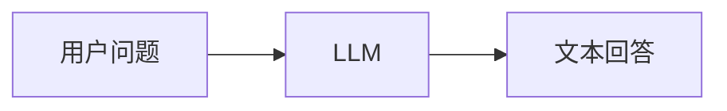
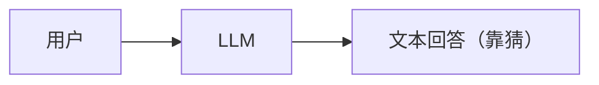
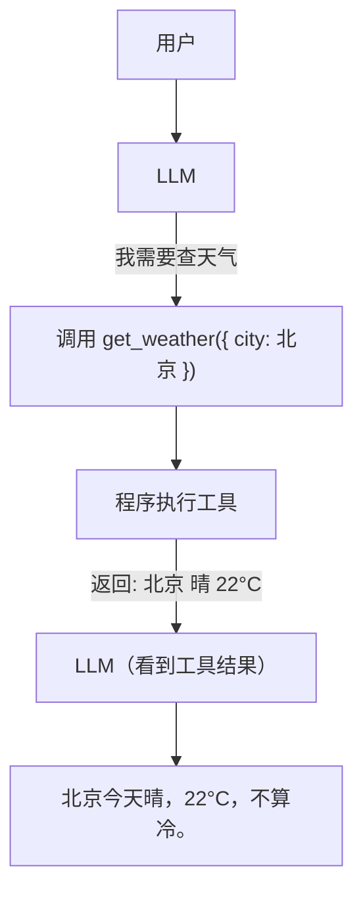
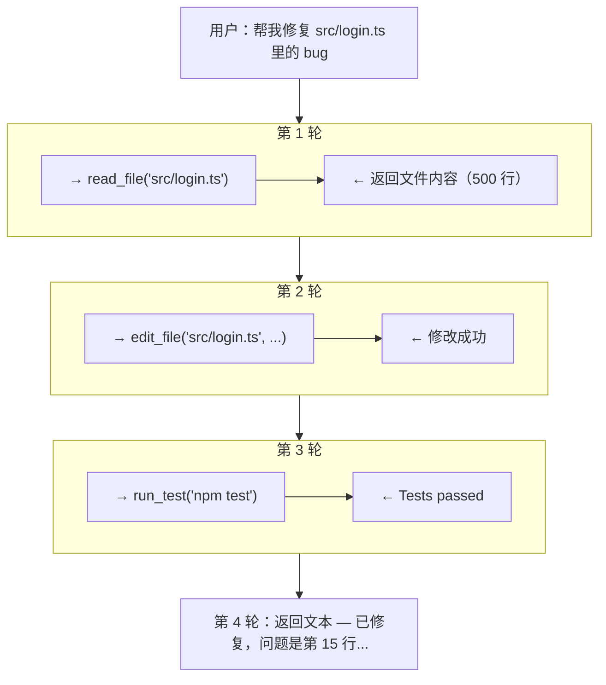
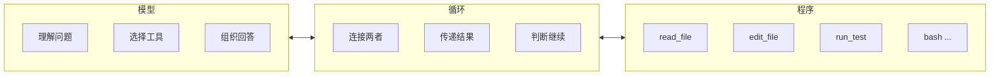
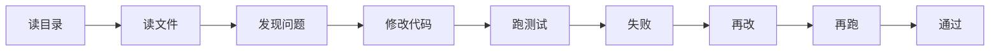

# 普通聊天 vs Agent

如果只把 Agent 理解成"调用一次大模型"，很快就会迷路。我们先用**一个天气查询的例子**，说清楚普通聊天和 Agent 的根本区别。

这篇文章不追求马上做出一个生产级产品。目标是建立一张可靠的心智模型：**模型负责决定下一步，程序负责提供能力并执行，循环负责把两者接起来。**

## 1. 先看普通聊天

普通聊天只有一条直线：



```typescript
// 普通聊天：把用户的问题直接发给 LLM，等一个文本回答
const answer = await llm.chat([
  { role: 'user', content: '北京今天冷吗？' }
]);
// → "北京秋天一般比较凉爽，建议带件外套。"
// 模型只能根据训练数据回答，无法获取实时信息
```

模型只能根据训练时学到的知识回答。它不能查实时天气，不能读你的文件，不能运行你的测试。这不是模型"不够聪明"的问题——哪怕模型知道所有编程知识，它仍然不能帮你**做事**，因为它没有手。

再看一个编码场景：

```typescript
// 同样是普通聊天：模型没有读过你的代码，只能给通用建议
const answer = await llm.chat([
  { role: 'user', content: '帮我修复 src/login.ts 里的 bug' }
]);
// → "你可以尝试检查第 15 行的错误处理逻辑，确保..."
// 它不知道你的 login.ts 长什么样，不知道项目用了什么框架
```

模型给了一段建议，但它**没读过你的文件**。它不知道你的 `login.ts` 长什么样，不知道项目用了什么框架，不知道测试怎么跑。它只能给通用建议，不能真的帮你修。

## 2. 给模型一双手

Agent 的核心变化只有一个：**程序给了模型一组工具，模型可以主动提出要用哪个**。

还是天气的例子。对比一下两种方式：

**普通聊天（一条直线）**



**Agent（一个循环）**



再看编码场景。这次模型有 `read_file`、`edit_file`、`run_test` 三个工具：



:::warning 关键边界

模型不是自己跑去执行了什么。它只是提出“我想用这个工具”，程序检查之后才去执行。这个边界很重要——后面讲安全时会回到这里。

:::

## 3. 三个角色的分工



| 角色 | 负责什么 | 不负责什么 |
|---|---|---|
| **模型** | 理解问题、选择工具、组织回答 | 执行任何操作、直接访问文件系统 |
| **程序** | 注册工具、校验参数、执行工具、返回结果 | 决定下一步做什么、理解业务逻辑 |
| **循环** | 把工具结果送回模型、判断是否继续 | 任何具体的业务或执行逻辑 |

这三者缺一不可：

- 没有**模型**，程序不知道该用哪个工具、传什么参数
- 没有**程序**，模型只能给建议，不能真的做事
- 没有**循环**，模型调完一次工具就结束了，不能根据结果继续

## 4. 为什么不是两次请求？

你可能会想：先让模型看问题，再手动查天气，然后把结果告诉模型——不也行吗？

对于"查天气"确实可以。但真实的编码任务往往需要好几步：



每一步要做什么，**取决于上一步看到了什么**。程序不知道每个项目该先看哪个文件，模型不知道测试会不会通过。所以需要一个循环——模型和程序轮流工作，直到任务完成。

把两种方式对比一下：

| 维度 | 手动串联两次请求 | Agent Loop |
|---|---|---|
| 步骤数 | 事先确定 | 动态决定 |
| 谁决定下一步 | 人 | 模型 |
| 失败后怎么办 | 人手动调整 | 模型看到错误后自动调整 |
| 适合的任务 | 步骤固定、简单 | 步骤不定、需要判断 |

## 5. Agent 不是什么

| 常见误解 | 实际情况 |
|---|---|
| "更聪明的 Chat" | 能力来自工具，不是来自更好的模型 |
| "自动化脚本" | 脚本是写死的步骤，Agent 根据上下文动态决定 |
| "让模型执行代码" | 模型只提出请求，程序负责执行和校验 |
| "能做任何事" | 只能用已注册的工具，做不了没有工具支持的事 |

## 6. 读完后试着自己解释

如果你能回答下面三个问题，就已经理解了本篇核心：

- 普通聊天和 Agent 的区别到底是什么？
- 为什么模型不能直接执行工具，必须通过程序？
- 为什么需要循环，而不是固定次数的调用？

## 7. 对照 Pi 源码

在 Pi 中，上面的三个角色大致对应：

| 本篇概念 | Pi 中的实现 | 先看什么 |
|---|---|---|
| `模型决策` | 注入的 `StreamFn`（类型定义）调用 LLM | `packages/agent/src/types.ts:28` |
| `程序执行` | `executeToolCalls()` 与工具定义 | `packages/agent/src/agent-loop.ts` |
| `循环连接` | `runLoop()` 的 while 循环 | `packages/agent/src/agent-loop.ts` |

Pi 的重要取舍是：Agent Loop 不直接知道 API key，也不把具体模型服务写死。它只需要一个能流式调用模型的 `streamFn`。`coding-agent` 再用 `ModelRuntime` 把模型、认证、Provider 配置接到这个接口上。

## 下一步

→ [最小 Agent Loop](./02-minimal-loop) — 这个循环具体长什么样？用 25 行代码写出来，看看它是怎么运转的
