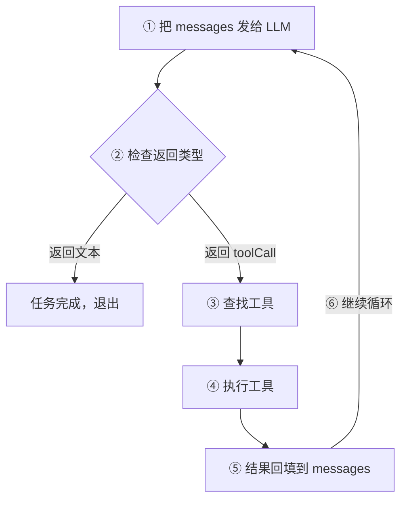
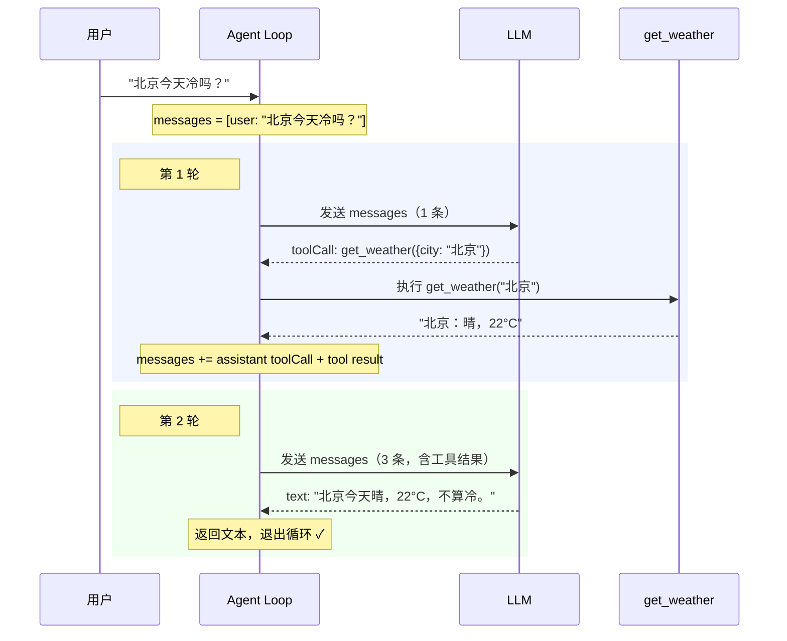

# 最小 Agent Loop

上一篇说 Agent 是一个循环：模型决策 → 程序执行 → 结果回填 → 继续。这篇文章用**一个可以运行的最小例子**写出这个循环，然后逐步拆解每一个部分。

目标是看清楚循环的骨架：**请求模型 → 检查是否调工具 → 调了就执行 → 结果回填 → 再请求模型 → 直到不调工具为止。**

## 1. 全景图

先看完整的循环流程，后面会逐步拆解：



## 2. 先定义工具

在写循环之前，先定义一个最简单的工具：

```typescript
// 工具的类型定义：每个工具都有名字、描述和执行函数
type Tool = {
  name: string;        // 唯一标识，模型用这个名字来调用
  description: string; // 告诉模型这个工具能做什么
  execute: (args: unknown) => Promise<string>; // 真正执行的函数
};

// 一个查询天气的工具示例
const getWeather: Tool = {
  name: 'get_weather',
  description: '查询一个城市当前的天气',
  async execute(args) {
    // 真实项目这里会调用天气 API，这里用假数据代替
    const city = (args as { city: string }).city;
    return `${city}：晴，22°C`;
  },
};
```

:::tip 核心原则

模型不能直接执行 `execute`，它只能提出一个结构化的工具请求；程序检查请求后才真正执行。

:::

## 3. 写出循环

我们假设 LLM 返回两种结果：普通文本，或者工具调用（toolCall）。最小的 Agent 只需要一个 `while` 循环：

```typescript
async function runAgent(question: string, tools: Tool[]) {
  // 消息列表：记录整个对话历史，每次调 LLM 都把完整列表传过去
  // 模型靠这个列表理解之前发生了什么
  const messages = [{ role: 'user', content: question }];

  while (true) {
    // ① 把所有消息 + 工具列表发给模型
    // 模型只能看到工具的 name 和 description，看不到 execute 函数
    const response = await llm.chat(messages, {
      tools: tools.map(({ name, description }) => ({ name, description })),
    });

    // ② 检查模型的返回类型
    // 如果是纯文本，说明模型觉得任务完成了，不需要再调工具
    if (response.type === 'text') {
      return response.text; // 退出循环，返回最终回答
    }

    // ③ 模型返回了工具调用请求，按名字查找对应的工具
    const tool = tools.find(t => t.name === response.toolCall.name);
    if (!tool) throw new Error(`未知工具：${response.toolCall.name}`);

    // ④ 程序执行工具函数，拿到实际结果
    const result = await tool.execute(response.toolCall.arguments);

    // ⑤ 把"模型的调用请求"和"工具的执行结果"都追加到消息列表
    // 这样下一轮模型就能看到工具返回了什么
    messages.push({ role: 'assistant', content: response.toolCall });
    messages.push({ role: 'tool', name: tool.name, content: result });

    // ⑥ 回到 while(true) 顶部，带着更新后的消息列表再次请求模型
  }
}
```

这 25 行代码就是 Agent 的全部骨架。把上面标记的 ①-⑥ 拆开来看：

| 步骤 | 做什么 | 谁负责 |
|---|---|---|
| ① 发送消息 | 把完整上下文传给 LLM | 程序 |
| ② 检查类型 | 模型回了文本还是工具调用？ | 程序 |
| ③ 查找工具 | 按名字找到对应的工具定义 | 程序 |
| ④ 执行工具 | 调用工具函数，拿到结果 | 程序 |
| ⑤ 回填结果 | 工具请求和结果都追加到消息列表 | 程序 |
| ⑥ 继续循环 | 带着新消息再次请求模型 | 程序 |

模型在整个过程中只做一件事：**看到当前消息列表，决定回复文本还是调用工具**。所有"执行"都是程序做的。

## 4. 跟踪一次运行

用天气查询跟踪一次完整执行，观察消息列表的变化：



两轮就完成了。第 1 轮模型决定调工具，第 2 轮模型看到结果后给出回答。

## 5. 一个更复杂的任务

天气例子只需要 2 轮。但如果任务是"帮我重构这个函数"，过程可能是这样的：

| 轮次 | 模型请求 | 工具返回 |
|---|---|---|
| 1 | `read_file("src/utils.ts")` | 文件内容（200 行） |
| 2 | `read_file("src/utils.test")` | 测试文件内容 |
| 3 | `edit_file("src/utils.ts")` | 修改成功 |
| 4 | `run_test("npm test")` | 2 tests failed |
| 5 | `edit_file("src/utils.ts")` | 再改一处 |
| 6 | `run_test("npm test")` | All tests passed |
| 7 | 返回文本："已完成重构..." | —（退出循环） |

7 轮才完成，而且每一轮的决定都取决于上一轮的结果——第 4 轮测试失败后，模型才知道要改第 5 轮的内容。程序不可能提前知道这些步骤。

## 6. 为什么是 while(true)？

因为我们不知道需要多少轮：

| 场景 | 轮数 | 退出原因 |
|---|---|---|
| 直接回答，不需要工具 | 1 轮 | 模型返回文本 |
| 查一次天气后回答 | 2 轮 | 模型返回文本 |
| 读文件、改代码、跑测试 | 5-10 轮 | 测试通过后模型返回文本 |
| 复杂调试任务 | 20+ 轮 | 问题解决后模型返回文本 |

循环的退出条件是**模型自己决定不再调用工具**。当模型觉得信息够了、任务完成了，它就返回文本回答，循环自然结束。

## 7. 这个循环还缺什么？

最小循环能说明原理，但要成为一个实用的 Coding Agent，还有很多问题没解决：

| 问题 | 为什么重要 | 哪一篇讲 |
|---|---|---|
| 工具参数怎么校验？ | 模型给的参数可能不合法 | [03 工具的定义与执行](./03-tool-basics) |
| 消息列表越来越长怎么办？ | LLM 有上下文窗口限制 | [04 消息与上下文窗口](./04-message-and-context) |
| LLM 回答是一个字一个字出来的 | 需要流式处理 | [05 流式输出与事件](./05-streaming-and-events) |
| 模型工作时用户想补充信息 | 需要插队机制 | [06 多轮交互与用户插队](./06-multi-turn) |
| 模型想执行 `rm -rf /` | 需要安全控制 | [07 副作用与安全边界](./07-side-effects-and-safety) |
| 关掉终端就全丢了 | 需要持久化 | [08 会话保存与恢复](./08-session-and-persistence) |

后面的每一篇都是在这个骨架上加一个能力。骨架本身不会变——**while(true) + 调 LLM + 执行工具 + 结果回填**。

## 8. 对照 Pi 源码

在 Pi 中，最小循环的每个部分都有对应的生产实现：

| 最小例子 | Pi 中的实现 | 先看什么 |
|---|---|---|
| `messages` | `AgentContext` 与会话消息 | `packages/agent/src/types.ts` |
| `while (true)` | `runLoop()` 的内外双层循环 | `packages/agent/src/agent-loop.ts` |
| `llm.chat()` | 注入的 `StreamFn`（流式调用） | `packages/agent/src/types.ts:28` |
| `tool.execute()` | `executeToolCalls()` 与工具定义 | `packages/agent/src/agent-loop.ts` |
| 工具结果回填 | `ToolResultMessage` 追加到 context | `packages/agent/src/agent-loop.ts` |
| 退出条件 | `stopReason` 检查 + `shouldStopAfterTurn` | `packages/agent/src/agent-loop.ts` |

Pi 的生产循环比这 25 行复杂得多——它有双层循环（内层处理工具调用和用户插队，外层处理后续消息）、错误处理、中止逻辑和多种钩子。但核心骨架和这 25 行代码是一样的。

## 9. 读完后试着自己解释

- 循环的退出条件是什么？谁决定退出？
- 为什么工具结果必须放回消息列表，而不是单独处理？
- 如果模型要求调用一个不存在的工具，程序应该怎么做？

## 下一步

→ [工具的定义与执行](./03-tool-basics) — 上面的 `tool.execute()` 只是一行代码。真实的工具怎么定义参数 schema？模型给了错误参数怎么办？一次可以调多个工具吗？
