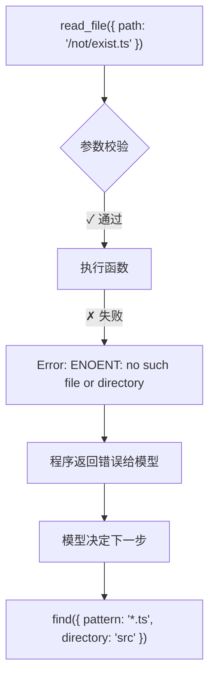
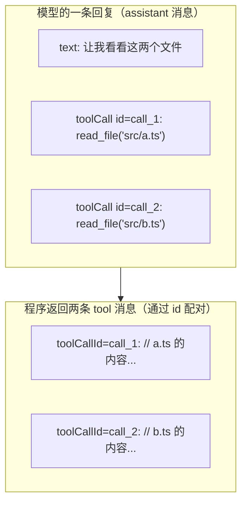

# 工具的定义与执行

上一篇的 Agent Loop 里，工具只出现了一行 `tool.execute()`。但在真实的 Agent 中，工具是最核心的能力来源——**模型能做什么，完全取决于你给了它哪些工具。**

这篇文章讲清楚工具的完整结构、参数校验、执行失败处理，以及一次回复调用多个工具的情况。

## 1. 全景图

一个工具从定义到执行的完整流程：

```
┌─────────────────────────────────────────────────────────┐
│ 工具定义阶段（程序启动时）                                 │
│                                                         │
│  Tool {                                                 │
│    name: "read_file"           ← 唯一标识                │
│    description: "读取文件内容"  ← 模型看的说明             │
│    parameters: { ... }         ← JSON Schema 参数约束    │
│    execute: async (args) => {} ← 真正的执行函数           │
│  }                                                      │
└───────────────────────────┬─────────────────────────────┘
                            │ 注册到 Agent
                            ▼
┌─────────────────────────────────────────────────────────┐
│ 模型调用阶段（Agent Loop 运行时）                          │
│                                                         │
│  模型看到:  name + description + parameters              │
│  模型发出:  toolCall { name, arguments }                 │
│                                                         │
│  程序收到 toolCall:                                      │
│    ├─ 1. 查找工具    → 按 name 找到 Tool                 │
│    ├─ 2. 校验参数    → 按 parameters 验证 arguments      │
│    ├─ 3. 执行函数    → 调用 execute(arguments)           │
│    └─ 4. 返回结果    → 包装成 tool 消息放回上下文         │
└─────────────────────────────────────────────────────────┘
```

## 2. 工具的完整结构

上一篇的工具定义只有 `name`、`description` 和 `execute`。真实的工具还需要一个参数 schema——告诉模型应该传什么参数，也让程序能够校验：

```typescript
type Tool = {
  name: string;            // 唯一标识，模型通过这个名字来指定要调用哪个工具
  description: string;     // 工具的自然语言描述，模型据此判断什么时候该用这个工具
  parameters: JSONSchema;  // 参数的结构约束（JSON Schema 格式），用于校验模型传入的参数
  execute: (args: unknown) => Promise<string>;  // 真正执行的函数，模型看不到这个
};
```

一个读取文件的工具：

```typescript
const readFile: Tool = {
  name: 'read_file',
  // description 要写得清楚：做什么 + 传什么 + 返回什么
  description: '读取指定路径的文件内容。传入文件路径，返回文件的文本内容。',
  // parameters 用 JSON Schema 定义参数约束
  parameters: {
    type: 'object',
    properties: {
      path: {
        type: 'string', // 参数类型必须是字符串
        description: '要读取的文件路径，相对于项目根目录',
      },
    },
    required: ['path'], // path 是必填参数，缺少时校验会报错
  },
  async execute(args) {
    // 模型看不到这个函数，它只在程序端执行
    const { path } = args as { path: string };
    return fs.readFileSync(path, 'utf-8'); // 读取文件并返回内容
  },
};
```

### 模型看到了什么？

模型不知道 `execute` 函数的实现细节。它能看到的只有：

:::tip 模型眼中的工具

- **名字**: `read_file`
- **说明**: 读取指定路径的文件内容
- **参数**: `path` (string, 必填) — 要读取的文件路径
- ✗ 看不到 `execute` 的实现
- ✗ 看不到文件系统的实际结构
- ✗ 看不到权限和安全限制

:::

所以 `description` 写得好不好，直接影响模型的使用准确性。描述越清楚，模型越知道什么时候该用、参数应该传什么。

## 3. 模型和程序的分工

这是 Agent 中最重要的边界。可以把它想象成"点菜"：

:::info 类比

- **模型 = 顾客** — 看菜单、点菜、决定吃什么
- **程序 = 厨师** — 验证订单、烹饪、上菜
- **菜单 = 工具列表** — name + description + parameters

:::

| 模型能做的 | 程序能做的 |
|---|---|
| 看到工具列表（名字+描述+参数） | 注册和维护工具 |
| 决定调哪个工具 | 查找工具是否存在 |
| 提供参数 | 校验参数是否合法 |
| 看到执行结果 | 执行函数、捕获异常 |
| 决定下一步 | 控制执行权限和安全 |

模型发出的**工具请求**（toolCall）是一个结构化的 JSON：

```json
{
  "type": "toolCall",
  "id": "call_abc123",
  "name": "read_file",
  "arguments": { "path": "src/index.ts" }
}
```

这里的 `id` 是给结果配对用的——等会第 6 节会解释。

## 4. 参数校验

模型给的参数不一定对。它可能拼错字段名、类型不对、缺少必填字段。所以程序需要在执行前校验：

```typescript
// 用 JSON Schema 校验模型传入的参数是否符合 tool.parameters 的定义
const error = validateArgs(tool, response.toolCall.arguments);

if (error) {
  // 参数不合法，不执行工具
  // 把错误信息作为 tool 消息返回给模型，让它知道哪里错了
  messages.push({
    role: 'tool',
    name: tool.name,
    content: `参数错误：${error}`,
    isError: true, // 标记这是一个错误结果
  });
  // continue 回到 while(true) 顶部，模型看到错误后通常会修正参数重试
  continue;
}
```

校验失败**不是**程序崩溃——而是返回一条错误消息给模型。模型看到后通常会修正参数重试。这个"失败 → 修正 → 重试"的过程是 Agent Loop 自然支持的，不需要额外逻辑。

常见的参数错误和模型的应对：

| 错误类型 | 例子 | 模型通常的反应 |
|---|---|---|
| 缺少必填字段 | `read_file({})` 缺了 `path` | 补上 path 重新调用 |
| 类型不对 | `path: 123` 应该是 string | 改成字符串重试 |
| 字段名拼错 | `filepath` 应该是 `path` | 修正字段名重试 |
| 值不合法 | `path: ""` 空路径 | 换一个有效路径 |

## 5. 执行失败

即使参数合法，工具执行也可能失败。整个过程是这样的：



:::tip 关键点

程序把错误结果返回给模型，模型自己决定怎么处理。程序不需要替模型做决定——它可能换一种方式重试，可能调用另一个工具搜索，也可能直接告诉用户“这个文件不存在”。

:::

参数错误和执行失败的区别：

| 类型 | 发生在什么时候 | 例子 |
|---|---|---|
| **参数错误** | 校验阶段，还没执行 | 缺字段、类型错、拼错名字 |
| **执行失败** | 执行阶段，参数合法但操作失败 | 文件不存在、命令报错、超时 |

两者都不会让 Agent 崩溃，都是返回错误消息让模型继续循环。

## 6. 一次调用多个工具

模型可以在一条回复中请求调用多个工具。比如同时读两个文件：



每个 toolCall 都有一个 `id`，程序通过 `toolCallId` 把结果和请求配对。这保证了多个工具的结果不会搞混。

程序需要决定怎么执行这些工具——**串行还是并行**：

| 策略 | 做法 | 什么时候用 |
|---|---|---|
| **串行**（sequential） | 一个执行完再执行下一个 | 工具之间有依赖、需要精确控制顺序 |
| **并行**（parallel） | 同时执行多个 | 工具之间无依赖，比如读多个不同文件 |

并行执行更快，但有风险：如果两个工具修改同一个文件，可能产生冲突。在实际的 Coding Agent 中，读操作通常可以并行，写操作通常需要串行。

## 7. 一个 Coding Agent 的工具集

一个典型的 Coding Agent 需要这些工具：

| 工具 | 用途 | 风险等级 | 可否并行 |
|---|---|---|---|
| `read` | 读取文件内容 | 低 | 可以 |
| `ls` | 列出目录内容 | 低 | 可以 |
| `grep` / `find` | 搜索文件和内容 | 低 | 可以 |
| `write` | 创建或覆盖文件 | **高** | 需要串行 |
| `edit` | 精确修改文件的一部分 | **高** | 需要串行 |
| `bash` | 执行 shell 命令 | **高** | 视情况 |

注意风险等级的差异：读和搜索是安全的，但写文件和执行命令可能造成不可逆的修改。后面讲安全边界时会详细讨论这个问题。

## 8. 对照 Pi 源码

在 Pi 中，上面这些概念都有对应的实现：

| 本篇概念 | Pi 中的实现 | 先看什么 |
|---|---|---|
| Tool 定义 | `AgentTool` 接口 | `packages/agent/src/types.ts` |
| 参数 schema | `Tool.parameters`（JSON Schema / TypeBox） | `packages/ai/src/types.ts` |
| 参数校验 | `validateToolArguments()` | `packages/agent/src/agent-loop.ts` |
| 执行策略 | `ToolExecutionMode: "sequential" \| "parallel"` | `packages/agent/src/types.ts` |
| toolCall id 配对 | `toolCallId` 字段 | `packages/ai/src/types.ts` |
| 内置工具 | read / write / edit / bash / grep / find / ls | `packages/coding-agent/src/core/tools/` |

## 9. 读完后试着自己解释

- 模型看到的工具信息包含哪些部分？不包含什么？
- 参数校验失败后，Agent 会崩溃吗？接下来会发生什么？
- 多个工具调用的结果怎么和请求配对？

## 下一步

→ [消息、角色与上下文窗口](./04-message-and-context) — 工具结果放回 `messages` 后，这个列表的完整结构是什么？为什么它越来越长会成为问题？
