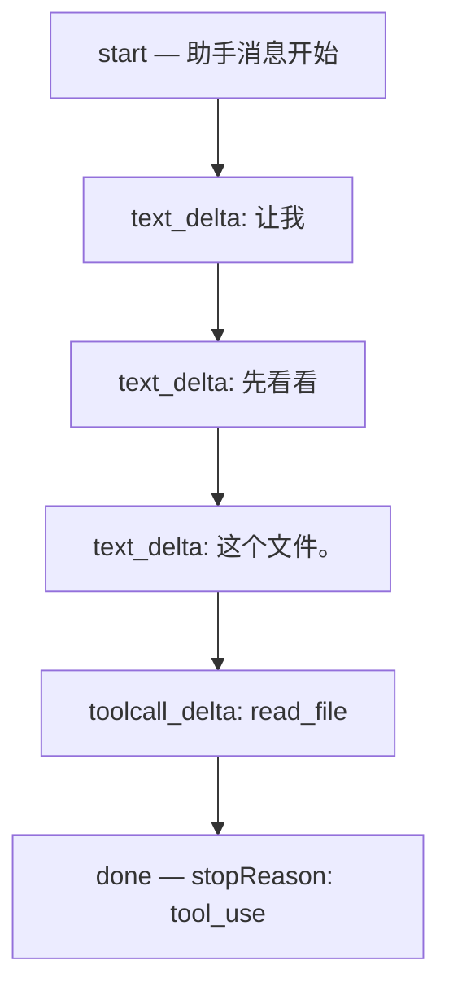

# 流式输出与事件

前面几篇的 `llm.chat()` 都假设模型一次性返回完整结果。但用过 ChatGPT 的人都知道——回答是一个字一个字出来的。

这篇文章讲清楚**流式输出对 Agent 意味着什么**：事件的种类、什么时候执行工具、以及 `stopReason` 如何控制循环行为。

## 1. 为什么要流式

对比两种方式：

```
非流式（等完再返回）
══════════════════════════════════════════
用户提问 → [等待 10 秒] → 完整回答一次性出现

流式（边生成边返回）
══════════════════════════════════════════
用户提问 → [让][我][看][看][这][个][文][件] → 逐字出现
```

如果等模型生成完所有内容再返回，用户可能需要等 10-30 秒看到第一个字。流式输出让用户边等边看，体验好很多。

但对 Agent 来说，流式不只是体验问题。模型一次回复可能包含文本**和**工具调用，两者是交替出现在流里的——程序需要正确地拆分和处理它们。

## 2. 流式事件

模型的回答被拆成一系列事件，按时间顺序一个一个到达：



这些事件可以归为几类：

| 事件类型 | 说明 | 程序怎么处理 |
|---|---|---|
| `start` | 助手消息开始 | 准备接收内容 |
| `text_delta` | 文本片段 | **立即显示给用户** |
| `thinking_delta` | 模型思考过程（部分模型支持） | 可选择显示或隐藏 |
| `toolcall_delta` | 工具调用的参数片段 | **拼接，等完整后再解析** |
| `done` | 消息结束，附带 `stopReason` | 决定下一步行为 |
| `error` | 出错 | 处理错误 |

注意 `text_delta` 和 `toolcall_delta` 的处理方式不同：

- **文本**可以立即显示给用户，一个字一个字出现
- **工具参数**必须等完整拼接后才能解析成 JSON，不能边流边执行

## 3. Agent 什么时候执行工具？

**等 `done` 事件之后。** 不是收到 `toolcall_delta` 就立即执行。原因有三个：

```
┌─────────────────────────────────────────────────────────┐
│ 为什么不能边流边执行工具                                   │
│                                                         │
│  1. 参数还没流完                                         │
│     toolcall_delta: {"path":"/sr     ← 参数不完整        │
│     toolcall_delta: c/index.ts"}     ← 拼完才是合法 JSON │
│                                                         │
│  2. 可能有多个工具调用                                    │
│     toolCall[0]: read_file("a.ts")                       │
│     toolCall[1]: read_file("b.ts")  ← 需要全部收齐       │
│                                        才能决定串行/并行  │
│                                                         │
│  3. stopReason 还不知道                                   │
│     done 之前不知道模型是要调工具，还是被截断了            │
└─────────────────────────────────────────────────────────┘
```

## 4. stopReason

模型停止生成时会给出一个原因。这个原因决定了 Agent 接下来怎么做：

| stopReason | 含义 | Agent 怎么做 |
|---|---|---|
| `end_turn` | 模型主动结束，觉得回答完了 | **退出循环**，把回答返回给用户 |
| `tool_use` | 模型想调用一个或多个工具 | **执行工具**，结果回填后继续循环 |
| `length` | 输出达到 Token 上限，被截断 | 工具参数可能不完整，**全部标记失败** |
| `error` | 模型或 API 出错 | **退出循环**，报告错误 |
| `aborted` | 被用户或程序中止（如 Ctrl+C） | **退出循环** |

:::warning stopReason: length

当输出被截断时，工具调用的参数可能只传了一半，JSON 不完整。这时不应尝试执行——而是把所有工具调用标记为失败，让模型重试。

:::

用一个表格对比各种 stopReason 下循环的行为：

```
┌───────────┬──────────────────────────────────────────┐
│ stopReason│ 循环行为                                  │
├───────────┼──────────────────────────────────────────┤
│ end_turn  │ 退出 → 返回文本给用户                     │
│ tool_use  │ 执行工具 → 回填结果 → 继续循环             │
│ length    │ 全部工具标记失败 → 回填错误 → 继续循环     │
│ error     │ 退出 → 报告错误                           │
│ aborted   │ 退出 → 通知用户已中止                     │
└───────────┴──────────────────────────────────────────┘
```

## 5. 把流式改写进 Agent Loop

第 02 篇的 `llm.chat()` 是同步返回完整消息。改成流式后，中间加了一步"收集事件"：

```typescript
// 流式版本的模型调用
// 与同步的 llm.chat() 不同，llm.stream() 返回一个异步迭代器
async function streamAndCollect(messages, tools) {
  // 开始流式调用，事件会一个一个到达
  const stream = llm.stream(messages, { tools });
  const chunks = []; // 收集所有事件，用于最后拼装完整消息

  // for await ... of 逐个处理流式事件
  for await (const event of stream) {
    switch (event.type) {
      case 'text_delta':
        // 文本片段可以立即显示给用户，让用户看到"正在生成"
        process.stdout.write(event.text);
        break;
      case 'toolcall_delta':
        // 工具参数片段不能立即执行！
        // 参数可能是不完整的 JSON，必须等所有片段到齐后拼接
        break;
    }
    chunks.push(event); // 收集每个事件
  }

  // 流结束后，把所有片段拼装成完整的 AssistantMessage
  // 这时工具参数才是完整的，可以解析和执行
  return assembleMessage(chunks);
}
```

Agent Loop 的结构不变——仍然是 while(true) + 执行工具 + 结果回填。区别只是 `llm.chat()` 变成了 `streamAndCollect()`，中间可以实时输出文本：

```
┌─────────────────────────────────────────────────────────┐
│ Agent Loop（流式版）                                      │
│                                                         │
│  while (true) {                                         │
│    // 这里从 llm.chat() 换成了 streamAndCollect()        │
│    const message = await streamAndCollect(messages, tools)│
│                            │                             │
│                            ├─ text_delta → 实时显示      │
│                            └─ toolcall_delta → 收集      │
│                                                         │
│    if (message.stopReason === 'end_turn') return         │
│    if (message.stopReason === 'error') throw             │
│                                                         │
│    // 后面的逻辑和同步版完全一样                           │
│    executeToolCalls(message) → 结果回填 → 继续循环        │
│  }                                                      │
└─────────────────────────────────────────────────────────┘
```

## 6. 对照 Pi 源码

在 Pi 中，流式处理的每个部分都有对应实现：

| 本篇概念 | Pi 中的实现 | 先看什么 |
|---|---|---|
| 流式调用 | `StreamFn`（注入到 Agent Loop 的函数类型） | `packages/agent/src/types.ts:28` |
| 事件流 | `AssistantMessageEventStream` | `packages/ai/src/types.ts` |
| 收集完整消息 | `streamAssistantResponse()` | `packages/agent/src/agent-loop.ts` |
| stopReason 分支 | `message.stopReason` 检查 | `packages/agent/src/agent-loop.ts` |
| length 截断处理 | `failToolCallsFromTruncatedMessage()` | `packages/agent/src/agent-loop.ts` |
| 事件通知 | `emit({ type: 'message_update', ... })` | `packages/agent/src/agent-loop.ts` |

Pi 的流式处理还做了一件重要的事：**把流式事件通过 `emit()` 通知给 TUI**。TUI 收到 `text_delta` 后立即渲染到屏幕上，这就是你在终端里看到文字逐渐出现的原因。

## 7. 读完后试着自己解释

- 为什么 `text_delta` 可以立即显示，但 `toolcall_delta` 不能立即执行？
- `stopReason` 为 `length` 时，工具调用的参数处于什么状态？应该怎么处理？
- 流式输出改变了 Agent Loop 的结构吗？改变了什么？

## 下一步

→ [多轮交互与用户插队](./06-multi-turn) — 模型在流式生成时，用户可能还在打字。Agent 工作了 5 轮还没完成，用户想补充信息。这些输入怎么处理？
