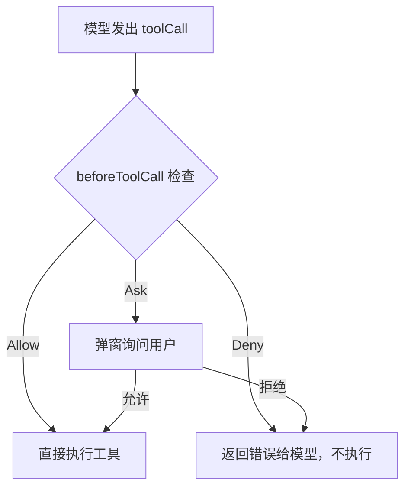

# 副作用与安全边界

前面几篇的 Agent 可以读文件、写文件、执行命令。但这些操作的风险**完全不同**——读一个文件不会改变任何东西，删一个文件可能无法恢复。

这篇文章讲清楚**为什么 Agent 需要安全控制**、最基本的拦截机制、以及应用层 Permission 和操作系统级 Sandbox 的区别。

## 1. 并非所有工具都一样危险

```
┌─────────────────────────────────────────────────────────┐
│ 工具风险等级                                              │
│                                                         │
│  低风险（只读，不修改任何东西）                            │
│  ┌─────────────────────────────────────────────────┐    │
│  │ read_file   grep   find   ls                    │    │
│  └─────────────────────────────────────────────────┘    │
│                                                         │
│  中风险（创建或修改文件）                                 │
│  ┌─────────────────────────────────────────────────┐    │
│  │ write_file   edit_file                          │    │
│  └─────────────────────────────────────────────────┘    │
│                                                         │
│  高风险（执行任意命令，可能做任何事）                      │
│  ┌─────────────────────────────────────────────────┐    │
│  │ bash   powershell                               │    │
│  └─────────────────────────────────────────────────┘    │
└─────────────────────────────────────────────────────────┘
```

具体的风险差异：

| 操作 | 可逆吗 | 最坏情况 |
|---|---|---|
| `read_file("src/index.ts")` | 无副作用，不需要可逆 | 读到敏感文件内容 |
| `write_file("src/index.ts", ...)` | 原内容被覆盖，可能通过 Git 恢复 | 覆盖重要文件 |
| `bash("rm -rf /")` | **不可逆** | 删除整个文件系统 |
| `bash("curl ... \| sh")` | **不可逆** | 执行未知的远程脚本 |

:::danger 安全警告

读文件和删文件的风险完全不同。Agent 必须在执行前区分工具的副作用等级，高风险操作应要求用户确认或直接拒绝。

:::

## 2. 最基本的拦截机制

在工具**执行之前**插入一个检查点：



用代码表示这个机制：

```typescript
// 在工具执行前调用，决定是否允许执行
// 返回 { block: false } 表示允许，{ block: true } 表示拒绝
async function beforeToolCall(toolName: string, args: unknown) {
  // 只读操作没有副作用，直接允许
  if (['read_file', 'grep', 'find', 'ls'].includes(toolName)) {
    return { block: false };
  }

  // 已知的危险命令（如 rm -rf、curl | sh），直接拒绝
  // reason 会作为错误信息返回给模型
  if (toolName === 'bash' && isSensitiveCommand(args)) {
    return { block: true, reason: '危险命令，已拒绝' };
  }

  // 其他操作（如写文件），弹窗询问用户是否允许
  return { block: true, reason: '需要确认', ask: true };
}
```

## 3. 三种策略

| 策略 | 适用场景 | 例子 |
|---|---|---|
| **Allow** | 只读操作、已信任的安全操作 | 读文件、搜索、列目录 |
| **Deny** | 明确禁止的危险操作 | `rm -rf`、`curl | sh`、写系统文件 |
| **Ask** | 有风险但可能合理的操作 | 修改项目文件、执行项目脚本 |

实际场景中的一个策略配置：

```
┌──────────────┬───────────────────┬────────────┐
│ 工具          │ 操作               │ 策略       │
├──────────────┼───────────────────┼────────────┤
│ read_file    │ 任意               │ Allow      │
│ grep         │ 任意               │ Allow      │
│ find         │ 任意               │ Allow      │
│ ls           │ 任意               │ Allow      │
│ write_file   │ 项目目录内         │ Ask        │
│ write_file   │ 项目目录外         │ Deny       │
│ edit_file    │ 项目目录内         │ Ask        │
│ edit_file    │ 项目目录外         │ Deny       │
│ bash         │ npm test / build   │ Allow      │
│ bash         │ rm / curl / sudo   │ Deny       │
│ bash         │ 其他               │ Ask        │
└──────────────┴───────────────────┴────────────┘
```

## 4. 无 UI 模式

如果 Agent 在没有用户界面的环境下运行（比如 CI/CD、后台脚本、API 调用），Ask 策略无法弹窗询问用户。这时候的处理原则是：

```
                      有 UI                    无 UI
                    ─────────                ─────────
  Allow          →  直接执行                  直接执行
  Deny           →  返回错误                  返回错误
  Ask            →  弹窗询问用户              默认拒绝 ←── 关键区别
```

**无 UI 模式下 Ask 必须默认拒绝。** 否则 Agent 可能在没人看的情况下执行危险操作。

## 5. 被拦截后模型怎么办？

当工具被 block 时，程序返回一条错误消息给模型：

```
模型请求: bash({ command: "rm -rf /tmp/old_data" })
  │
  ▼
beforeToolCall → block: true, reason: "危险命令，已拒绝"
  │
  ▼
程序返回:
  { role: "tool", content: "Error: 危险命令，已拒绝", isError: true }
  │
  ▼
模型看到错误后的可能反应：
  ├─ "好的，那我用更安全的方式删除指定文件..."
  ├─ "已了解，我不会执行删除操作。"
  └─ "让我换一种方式处理这些旧数据..."
```

和工具执行失败一样——模型看到拒绝后会自行调整。这是 Agent Loop "失败 → 修正 → 重试"机制的又一个应用。

## 6. Permission 不等于 Sandbox

一个重要的区分：

```
┌─────────────────────────────────────────────────────────┐
│  应用层 Permission（beforeToolCall）                       │
│                                                         │
│  ✓ 在工具执行前询问                                      │
│  ✓ 可以区分工具类型和参数                                 │
│  ✗ 依赖程序正确实现，可以被绕过                           │
│  ✗ 如果工具函数本身有 bug，Permission 帮不了               │
│  ✗ 不能限制工具函数内部的系统调用                         │
├─────────────────────────────────────────────────────────┤
│  操作系统级 Sandbox（容器、沙箱）                          │
│                                                         │
│  ✓ 在操作系统层面限制文件访问、网络、进程                  │
│  ✓ 即使工具函数有 bug，也无法超出沙箱边界                  │
│  ✗ 配置复杂，影响正常工具的执行                           │
│  ✗ 不了解业务语义（不知道"这个目录可以写，那个不行"）      │
└─────────────────────────────────────────────────────────┘
```

| 维度 | 应用层 Permission | 操作系统 Sandbox |
|---|---|---|
| 防御层级 | 应用代码 | 操作系统内核 |
| 粒度 | 工具名 + 参数 | 文件路径 + 系统调用 |
| 可靠性 | 取决于代码实现 | 强制隔离 |
| 灵活性 | 可按业务规则定制 | 通常只能按路径/权限 |

最安全的做法是**两层都用**：应用层 Permission 处理业务规则（"这个工具需要确认"），Sandbox 兜底（"即使 Permission 被绕过，也不能访问这些目录"）。

## 7. 对照 Pi 源码

| 本篇概念 | Pi 中的实现 | 先看什么 |
|---|---|---|
| beforeToolCall 钩子 | `BeforeToolCallResult: { block, reason, terminate }` | `packages/agent/src/types.ts` |
| 工具拦截 | Agent Loop 中的 `beforeToolCall` 检查 | `packages/agent/src/agent-loop.ts` |
| 项目信任 | `resolveProjectTrusted()` / `trust-manager.ts` | `packages/coding-agent/src/core/project-trust.ts` |
| 路径安全 | `path-utils.ts` 中的路径检查 | `packages/coding-agent/src/core/tools/path-utils.ts` |
| 容器化 | Docker 容器运行 Pi | `packages/coding-agent/docs/containerization.md` |
| terminate 提示 | 被拦截后建议停止当前批次 | `packages/agent/src/types.ts` |

Pi 还有一个**项目信任**机制：在加载项目目录下的扩展和配置之前，先询问用户是否信任这个项目。这防止了恶意项目通过 `.pi/` 配置文件自动执行危险操作。

## 8. 读完后试着自己解释

- 为什么读文件和执行 bash 命令的风险等级不同？
- 无 UI 模式下 Ask 为什么必须默认拒绝？
- Permission 和 Sandbox 各自能防住什么，不能防住什么？

## 下一步

→ [会话保存与恢复](./08-session-and-persistence) — Agent 的工具可以执行写文件、跑测试这些有副作用的操作。如果执行到一半崩溃了怎么办？关掉终端后怎么恢复？
