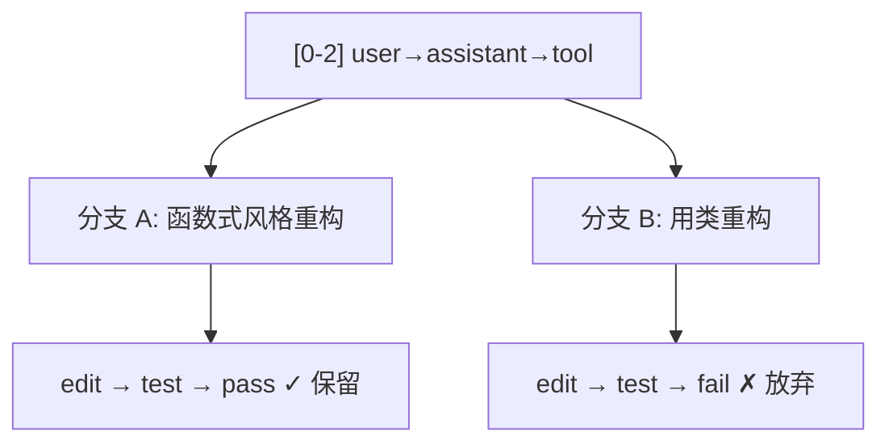

# 会话保存与恢复

前面七篇建立了一个完整的 Agent：循环、工具、消息、流式、插队、权限。但所有这些都在内存里——**关掉终端，一切就丢了。**

这篇文章讲清楚会话持久化的基本原理：怎么保存、怎么恢复、崩溃时怎么办、以及为什么不是所有工具都能"重放"。

## 1. 最简单的持久化

把消息列表写成文件，每行一条 JSON——这就是 JSONL（JSON Lines）格式：

```typescript
// 保存会话：把消息列表写成 JSONL 文件
// JSONL = 每行一个独立的 JSON 对象，方便追加写入和逐行解析
function saveSession(messages: Message[], path: string) {
  const lines = messages.map(m => JSON.stringify(m));
  fs.writeFileSync(path, lines.join('\n'));
}

// 恢复会话：读取 JSONL 文件，每行解析为一条消息
function loadSession(path: string): Message[] {
  const content = fs.readFileSync(path, 'utf-8');
  return content
    .split('\n')                    // 按行分割
    .filter(line => line.trim())    // 过滤空行
    .map(line => JSON.parse(line)); // 每行解析为 JSON 对象
}
```

保存后的文件长这样：

```
session.jsonl
═══════════════════════════════════════════════════════════

{"role":"system","content":"你是一个编码助手..."}
{"role":"user","content":"帮我看看 src/index.ts"}
{"role":"assistant","content":[{"type":"toolCall","name":"read_file",...}]}
{"role":"tool","content":"const app = express();..."}
{"role":"assistant","content":[{"type":"text","text":"我发现第15行..."}]}
```

下次打开时读取这个文件，就能恢复之前的对话上下文。

## 2. Resume：继续上次的工作

恢复会话的基本流程：

```
上次的会话
┌─────────────────────────────────────────────────────────┐
│ [0] system: "你是一个编码助手"                           │
│ [1] user: "帮我重构 utils.ts"                            │
│ [2] assistant: toolCall(read_file)                       │
│ [3] tool: "文件内容..."                                  │
│ [4] assistant: toolCall(edit_file)                       │
│ [5] tool: "修改成功"                                     │
│ [6] assistant: "已完成第一步重构..."                      │
└─────────────────────────────────────────────────────────┘
                         │
                         │ 读取 session.jsonl
                         ▼
┌─────────────────────────────────────────────────────────┐
│ 恢复后，用户可以继续提问：                                 │
│                                                         │
│ [7] user: "继续下一步，把那个类拆成两个"                   │
│ [8] assistant: toolCall(read_file)                       │
│ ... Agent 继续工作                                       │
└─────────────────────────────────────────────────────────┘
```

模型看到之前的完整上下文（包括读过的文件、做过的修改），可以无缝继续。

## 3. 崩溃恢复的难题

简单的 Resume 在正常退出时没问题。但如果 Agent **崩溃**了呢？

```
Agent 运行中...
  │
  ├─ [0-5] 之前的消息已保存
  │
  ├─ [6] assistant: toolCall(bash, "npm install xxx") ← 已执行
  │                                                     npm 包已安装
  │
  ├─ [7] tool 结果还没来得及写入  ← 崩溃点！
  │
  ╳ 程序崩溃
```

崩溃后，文件系统的状态是：npm 包**已经装了**，但会话记录里没有这条工具结果。恢复时会出现不一致。

### 三个崩溃切点

根据崩溃发生的时机，情况完全不同：

```
┌──────────────────────────────────────────────────────────┐
│ 崩溃切点                                                  │
│                                                          │
│  工具执行前 ─── 崩溃 ──→ 副作用还没发生，安全              │
│                          重启后可以重新执行                │
│                                                          │
│  工具执行中 ─── 崩溃 ──→ 副作用可能部分完成                │
│                          文件可能写了一半                  │
│                          状态未知                          │
│                                                          │
│  工具执行后 ─── 崩溃 ──→ 副作用已完成                      │
│  结果写入前              但结果没记录                      │
│                          不知道是否成功                    │
└──────────────────────────────────────────────────────────┘
```

| 崩溃时机 | 副作用状态 | 恢复策略 |
|---|---|---|
| 工具执行**前** | 没发生 | 安全重试 |
| 工具执行**中** | 部分完成 | 需要检查 + 人工判断 |
| 工具执行**后**，结果写入**前** | 已完成但没记录 | 最危险——不知道结果 |

:::danger 最危险的崩溃点

工具执行后、结果写入前崩溃：副作用已发生但没有记录。恢复时无法判断上次操作是否成功，重新执行可能导致重复副作用。

:::

## 4. 安全重放 vs 不可重放

不是所有工具都能在恢复时重新执行。关键问题是：**同一个操作执行两次，结果一样吗？**

```
┌─────────────────────────────────────────────────────────┐
│ 安全重放（幂等操作）                                       │
│                                                         │
│  read_file("src/index.ts")                               │
│    → 读两次结果一样（文件没变的话）                        │
│                                                         │
│  grep("TODO", "src/")                                    │
│    → 搜两次结果一样                                      │
│                                                         │
│  ls("src/")                                              │
│    → 列两次结果一样                                      │
├─────────────────────────────────────────────────────────┤
│ 不可重放（有副作用）                                       │
│                                                         │
│  bash("npm publish")                                     │
│    → 发布两次 = 发了两个版本！                            │
│                                                         │
│  bash("curl -X POST https://api.example.com/send-email")│
│    → 发两次 = 发了两封邮件！                              │
│                                                         │
│  write_file("log.txt", appendContent)                    │
│    → 写两次 = 内容重复！                                  │
└─────────────────────────────────────────────────────────┘
```

对比表：

| 类型 | 特征 | 例子 | 恢复时能重放吗 |
|---|---|---|---|
| **安全重放** | 执行多次结果一样（幂等） | read / grep / find / ls | 可以 |
| **不可重放** | 每次执行都产生新的副作用 | publish / send-email / 追加写入 | 不可以 |
| **取决于参数** | 有些操作看参数才知道 | bash（可能是 ls，也可能是 rm） | 需要判断 |

## 5. 会话分支（Branch）

另一个常见需求：在某个节点**尝试不同方向**。



分支让你可以在不丢失历史的情况下探索不同方案。如果一个方向走不通，可以回到分叉点走另一条路。

## 6. 上下文压缩（Compaction）

第 04 篇提到过消息越来越长的问题。持久化之后这个问题更明显——一个长会话的 JSONL 文件可能有几 MB，每次恢复都要全部读入。

压缩的原理：

```
压缩前（完整历史）
┌─────────────────────────────────────────────────────────┐
│ [0]  system                                              │
│ [1]  user: "重构 utils.ts"                               │
│ [2]  assistant + tool (读文件，3000 tokens)               │
│ [3]  assistant + tool (读测试，2000 tokens)               │
│ [4]  assistant + tool (修改文件)                          │
│ [5]  assistant + tool (跑测试)                            │
│ [6]  user: "再把 helper.ts 也改一下"                      │
│ [7]  assistant + tool (读文件)                            │
│ [8]  assistant + tool (修改文件)                          │
│ [9]  assistant + tool (跑测试)                            │
│ [10] user: "最后检查一下类型"                              │
│                                                          │
│  总计: ~12000 tokens                                      │
└─────────────────────────────────────────────────────────┘
                         │
                         │ 压缩（用 LLM 生成摘要）
                         ▼
压缩后
┌─────────────────────────────────────────────────────────┐
│ [0]  system                                              │
│ [摘要] "用户要求重构 utils.ts 和 helper.ts。              │
│       已完成：utils.ts 的函数拆分、helper.ts 的类型修正。 │
│       测试全部通过。当前在处理类型检查。"                   │
│ [10] user: "最后检查一下类型"                              │
│                                                          │
│  总计: ~1500 tokens                                       │
└─────────────────────────────────────────────────────────┘
```

压缩的代价是**信息损失**——摘要不可能包含原始代码的所有细节。所以压缩通常只对"距离现在较远"的历史做，最近的几轮保持完整。

## 7. 对照 Pi 源码

| 本篇概念 | Pi 中的实现 | 先看什么 |
|---|---|---|
| 会话格式 | JSONL + Entry 类型 | `packages/agent/src/harness/session/types.ts` |
| Resume | `AgentSession` 的 resume 逻辑 | `packages/coding-agent/src/core/agent-session.ts` |
| 分支：树的接口 | `SessionTree` | `packages/agent/src/harness/session/types.ts:328` |
| 分支：树的实现 | `Session` 类 | `packages/agent/src/harness/session/session.ts:102` |
| 树导航 | `navigateTree()` | `packages/coding-agent/src/core/agent-session.ts:3085` |
| 压缩 | `shouldCompact()` / `CompactionSettings` | `packages/coding-agent/src/core/compaction/compaction.ts` |
| 分支摘要 | `branch-summarization.ts` | `packages/coding-agent/src/core/compaction/` |
| 重放标记 | `HarnessTool.replay` | `packages/agent/src/harness/agent-harness.ts:237` |
| 崩溃恢复 | `SuspendedOperation` | `packages/agent/src/harness/agent-harness.ts:140` |

:::warning 最后两行是「设计」，不是「已经在跑的东西」

`HarnessTool.replay` 和 `SuspendedOperation` 属于 Pi 新一代的 `AgentHarness`。它的**接口和持久化 schema 已经完整发布，但方法体全部未实现**：`resume()`（`packages/agent/src/harness/agent-harness.ts:380`）直接抛 `HarnessNotImplemented`，`create()`（`agent-harness.ts:351`）遇到已有记录也一样抛。

当前跑生产的仍然是 `packages/coding-agent/src/core/agent-session.ts`。

所以正确的说法是：**Pi 的作者已经把断点续跑的语义设计出来并写进了类型，但还没有实现它**。不能说成「Pi 已经这样运行」。

:::

在这套**设计**里，`SuspendedOperation`（`agent-harness.ts:140`）描述了崩溃时留下的现场：哪个操作被挂起、原因是 `"crash"` 还是 `"deferred"`、以及缺少哪些模型或工具身份。`HarnessTool.replay`（`agent-harness.ts:237`）则把工具标成 `"safe"` 或 `"never"`——正好对应本篇第 4 节讲的「能不能重放」。

本篇要你记住的是这套**思路**，而不是「Pi 现在就能这么恢复」。这两代运行时的差集本身就是很好的学习材料，留到 [Pi 源码深入](/pi/source/) 展开。

## 8. 读完后试着自己解释

- 为什么工具执行后、结果写入前的崩溃最危险？
- `read_file` 和 `npm publish` 在恢复时的处理有什么区别？为什么？
- 压缩历史消息的代价是什么？什么时候值得做？

## 本系列完成

你已经从"普通聊天 vs Agent"一路走到了"会话保存与恢复"。回顾一下每篇建立的认知点：

| 篇章 | 核心认知 |
|---|---|
| [01 普通聊天 vs Agent](./01-what-is-agent) | Agent = 模型决策 + 程序执行 + 循环连接 |
| [02 最小 Agent Loop](./02-minimal-loop) | while(true) + 调 LLM + 执行工具 + 结果回填 |
| [03 工具的定义与执行](./03-tool-basics) | 工具 = name + description + schema + execute |
| [04 消息与上下文窗口](./04-message-and-context) | 四种角色、Token 限制、需要压缩 |
| [05 流式输出与事件](./05-streaming-and-events) | 流式事件、stopReason 控制循环 |
| [06 多轮交互与用户插队](./06-multi-turn) | Steering + Follow-up、双层循环 |
| [07 副作用与安全边界](./07-side-effects-and-safety) | Allow/Deny/Ask、Permission vs Sandbox |
| [08 会话保存与恢复](./08-session-and-persistence) | JSONL 持久化、崩溃恢复、重放安全性 |

## 下一步

这些概念在 Pi Coding Agent 中都有真实的生产实现。准备好了就进入：

→ [Pi 源码深入](/pi/source/) — 从启动链路到核心循环，看看这些概念是怎么变成几万行代码的
