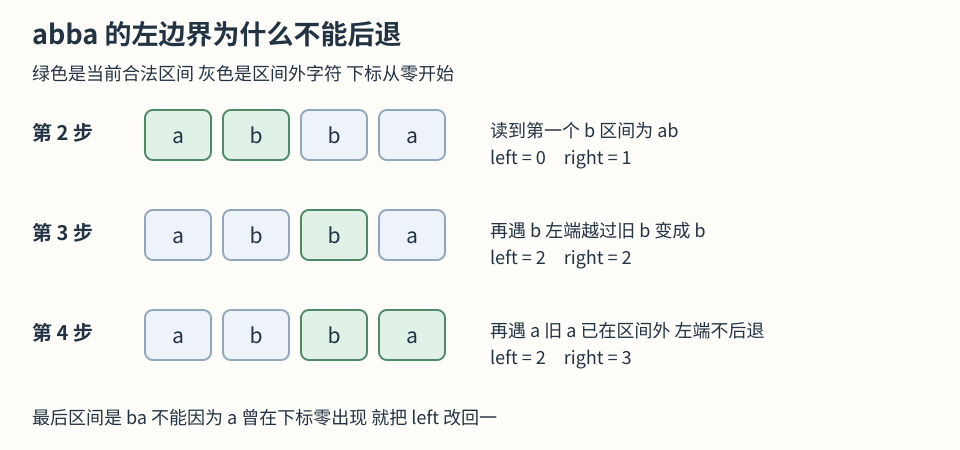
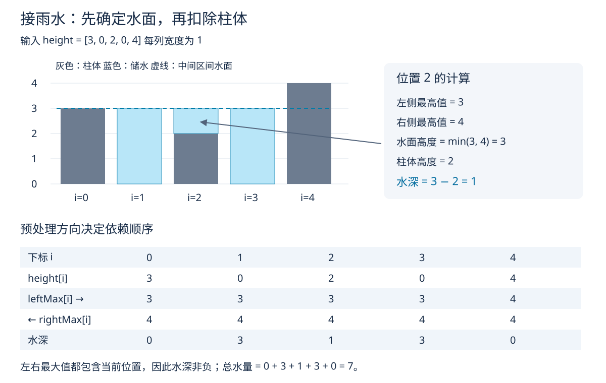
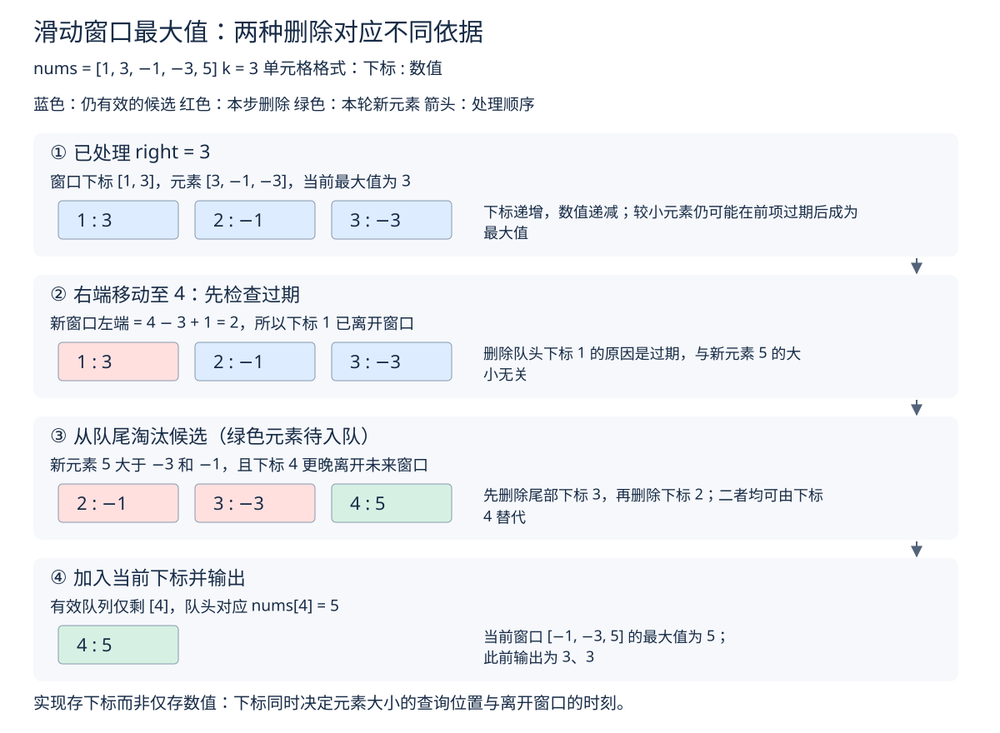
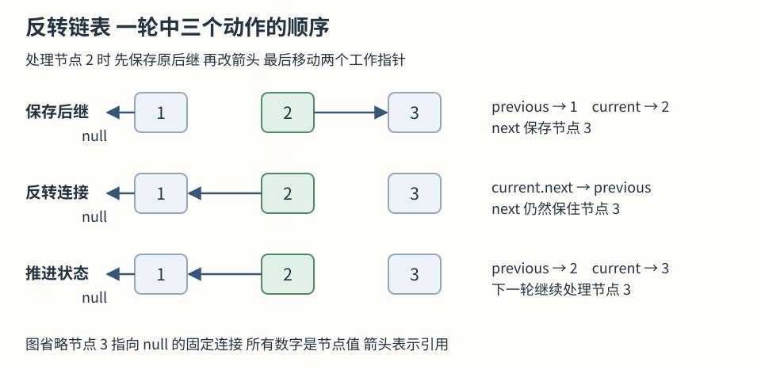
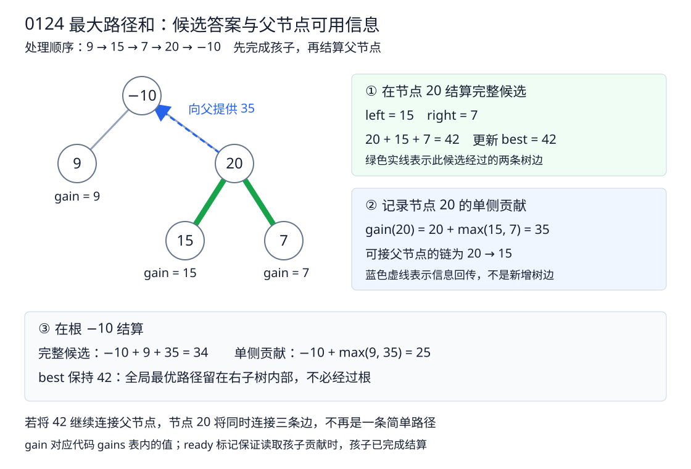
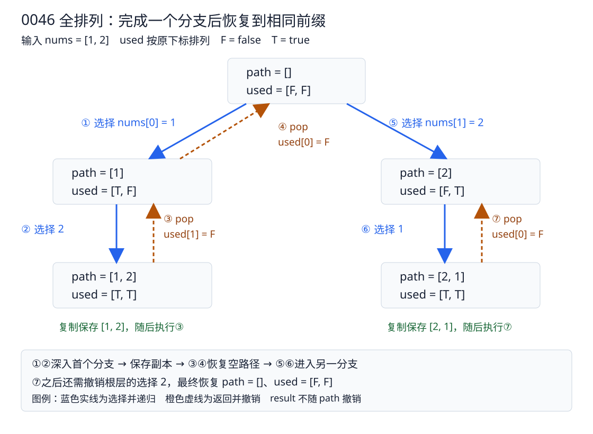
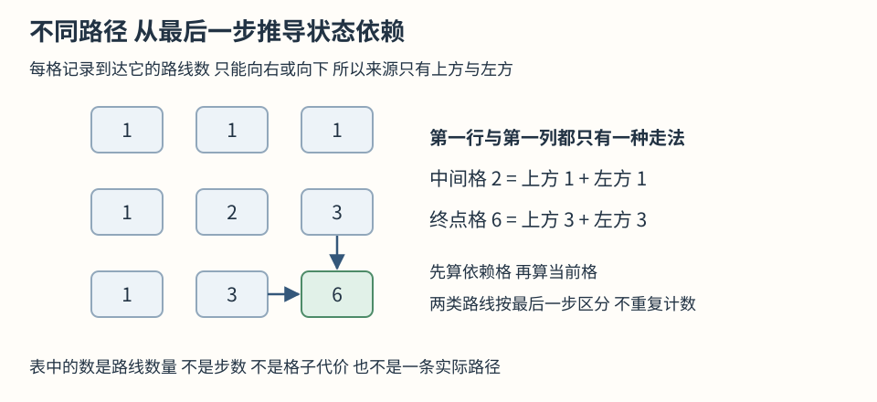
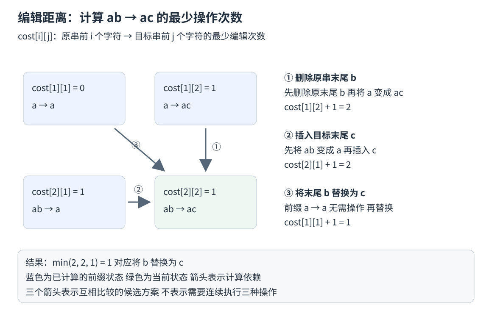

# 算法图示索引

图示用于表达单段文字难以同时呈现的结构、状态和依赖关系。每张图均对应具体输入，并在题解正文中配有变量说明与推导。建议结合相应的执行过程示例阅读。

## 3 无重复字符的最长子串

[题目讲解](/leetcode/03-sliding-window/0003-longest-substring-without-repeating-characters)

历史出现位置落在窗口外时 左边界不回退

## 42 接雨水

[题目讲解](/leetcode/02-two-pointers/0042-trapping-rain-water)

左右最高值决定水位 水位减柱高得到水深

## 239 滑动窗口最大值

[题目讲解](/leetcode/04-substring/0239-sliding-window-maximum)

过期删除与受支配候选淘汰的依据不同

## 206 反转链表

[题目讲解](/leetcode/07-linked-list/0206-reverse-linked-list)

保存原后继 反转连接 推进工作引用

## 124 二叉树中的最大路径和

[题目讲解](/leetcode/08-binary-tree/0124-binary-tree-maximum-path-sum)

当前完整候选与父节点可接收的信息不同

## 46 全排列

[题目讲解](/leetcode/10-backtracking/0046-permutations)

复制结果与恢复共享路径分别处理

## 295 数据流的中位数

[题目讲解](/leetcode/13-heap/0295-find-median-from-data-stream)

插入后通过移动边界值恢复数量条件

## 62 不同路径

[题目讲解](/leetcode/16-2d-dp/0062-unique-paths)

按最后一步分类 得到上方与左方两类来源

## 72 编辑距离

[题目讲解](/leetcode/16-2d-dp/0072-edit-distance)

删除 插入与替换分别对应不同前驱状态

图中的状态示意不一定表示数据结构在内存中的完整排列。例如双堆图按数值排列元素以便比较，并不表示堆数组整体有序；候选队列图只展示逻辑有效区间，已越过的存储槽位不在图中。相关说明均在原图及题解中标注。
