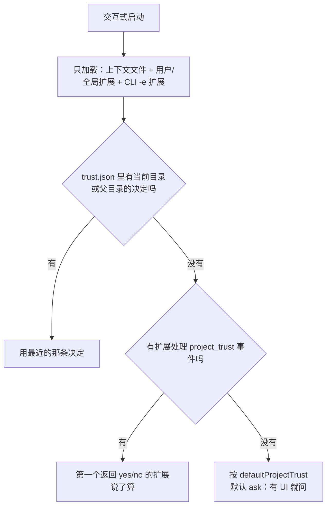

# 安全模型

先说结论，这一页只讲清楚一件事：

:::danger Pi 没有内置沙箱

Pi 以**启动它的用户账号的权限**运行。它把该用户可写的所有文件都视为同一个本地信任边界之内。

内置工具能读文件、写文件、改文件、执行 shell 命令；扩展是以同样权限运行的 TypeScript 模块。

这是**故意的设计**，不是待补的坑。真正的隔离必须来自操作系统或虚拟化边界。

:::

理解这句话之后，剩下的机制才有意义。

## 1. 全景图：三层，各管各的

```
┌─────────────────────────────────────────────────────────┐
│ 第 3 层  OS / 容器隔离          ← 真正的安全边界           │
│          容器 · VM · micro-VM · sandbox-exec/bubblewrap  │
│          见「容器化」                                      │
├─────────────────────────────────────────────────────────┤
│ 第 2 层  项目信任                ← 只是"输入加载门禁"       │
│          决定要不要加载并执行项目里的设置/扩展/包           │
│          不限制模型开始工作后能让工具做什么                  │
├─────────────────────────────────────────────────────────┤
│ 第 1 层  工具白名单              ← 减小攻击面               │
│          --tools read,grep,find,ls                       │
│          defaultTools 设置                                │
└─────────────────────────────────────────────────────────┘
```

常见的错误认知是把第 2 层当成第 3 层。**项目信任不是沙箱。**

## 2. 项目信任：它到底挡住了什么

项目信任控制的是：Pi 要不要加载项目级的设置、资源、包和扩展。

Pi 认为一个项目"含有需要信任的资源"，当它从当前工作目录发现下列任意一项时：

| 触发项 | 说明 |
|---|---|
| `.pi/settings.json` | 项目设置 |
| `.pi/extensions`、`.pi/skills`、`.pi/prompts`、`.pi/themes` | 项目资源目录 |
| `.pi/SYSTEM.md` 或 `.pi/APPEND_SYSTEM.md` | 项目系统提示词 |
| 当前目录或祖先目录的 `.agents/skills` | 项目 Skill |

:::info 一个空的 `.pi` 目录不算

只有目录本身、没有上述内容，不会触发信任提问。

:::

### 信任 / 拒绝分别发生什么

| | 信任 | 拒绝 |
|---|---|---|
| `.pi/settings.json` | 加载 | 跳过 |
| `.pi` 扩展、Skill、Prompt、主题、系统提示词 | 加载 | 跳过 |
| 项目设置里配置的缺失包 | 安装 | 跳过 |
| 项目本地扩展、项目包管理的扩展 | **执行** | 跳过 |
| `AGENTS.md` / `CLAUDE.md` / `AGENTS.override.md` | 加载 | **仍然加载** |

最后一行是重点：**上下文文件不受项目信任保护**（除非用 `-nc` 完全禁用加载）。也就是说，拒绝信任并不能防住来自仓库文件的 prompt injection。

### 决定是怎么做出的



决定按**规范化目录**保存在 `~/.pi/agent/trust.json`，路径上最近的那条优先于全局默认值。

### 非交互模式

`-p`、`--mode json`、`--mode rpc` **不弹提示**。没有可用的已保存决定时：

| `defaultProjectTrust` | 非交互模式行为 |
|---|---|
| `ask`（默认） | 忽略这些资源 |
| `never` | 忽略这些资源 |
| `always` | 信任这些资源 |

单次覆盖：`--approve` / `-a` 或 `--no-approve` / `-na`。

## 3. 为什么不做内置沙箱

官方给的理由值得完整理解，它也是本项目在 [§15 供应链门禁](/pi/lab/) 里必须遵守的前提：

:::tip 官方原话的意思

一个**部分实现的进程内沙箱**很容易被误解成安全边界，但它实际上仍然依赖宿主的 shell、文件系统、包管理器、凭据和扩展代码。

与其提供一个假的边界，不如明确说没有——真正的隔离交给 OS 或虚拟化/容器。

:::

同时要接受这条现实：

> 来自仓库文件、注释、文档、上下文文件、构建输出的 prompt injection，是**本地 Agent 的预期风险**，Pi 无法可靠地阻止。

所以"我拒绝了项目信任所以安全了"是错的。项目信任只防止仓库在你批准前偷偷改掉 Pi 的设置和扩展。

## 4. 跑不可信代码时怎么办

如果要处理不可信仓库、不打算逐条盯的生成代码、或者无人值守的自动化，**把 Pi 放进受限环境里跑**：

| 做法 | 效果 |
|---|---|
| 整个 `pi` 进程跑在容器/沙箱里 | 最彻底 |
| 宿主跑 Pi，但把内置工具的执行路由进 Gondolin micro-VM | 保留宿主体验 |
| 只挂载 Agent 该访问的工作区路径 | 缩小文件面 |
| **不要**挂载宿主的 `~/.pi/agent` | 除非确实要共享会话/设置/凭据 |
| 只传必需的 API Key，或用短期凭据 | 缩小凭据面 |
| 任务不需要网络时就禁网 | 缩小网络面 |
| 把结果拷回可信系统前先看 diff | 最后一道人工闸门 |

:::warning 读写挂载仍会改宿主文件

如果你把宿主工作区以读写方式 bind-mount 进去，容器/VM 内的写入照样会改到宿主文件。需要更强保护时用只读挂载，或者把文件拷进拷出。

:::

三种隔离模式的对比见 [容器化](../platform/containerization)。

## 5. 我该怎么做：分场景

| 场景 | 建议 |
|---|---|
| 自己的项目，人在旁边看 | 默认配置即可，配合 git 兜底 |
| 只想让它读代码写评审 | `pi --tools read,grep,find,ls -p "..."` |
| 别人的仓库，第一次打开 | 拒绝项目信任；必要时 `-nc` 连上下文文件一起禁 |
| 不可信仓库 / 无人值守 | 容器或 micro-VM，最小挂载 + 最小凭据 + 限网 |
| 装了第三方包 | 当作不可信代码审查：License、源、scripts、依赖、lockfile |

## 6. 报告安全问题

按仓库的 [Security Policy](https://github.com/earendil-works/pi-mono/blob/main/SECURITY.md) 走，**不要开公开 issue**。

下面这些通常**不在**安全边界内，除非能证明存在真实的权限边界绕过、或者 Pi 给出了本地用户本来就没有的访问权：

- 本地 Agent 的预期行为
- 没有内置沙箱这件事本身
- 来自不可信内容的 prompt injection
- 用户自己安装的扩展或 Skill 的行为

## 7. 本篇小结

| 主题 | 记住这一点 |
|---|---|
| 权限模型 | Pi = 你的用户权限，扩展也是 |
| 项目信任 | 输入加载门禁，**不是**沙箱 |
| 上下文文件 | 不受项目信任保护，仍会加载 |
| prompt injection | 官方明确表示无法可靠防止 |
| 真隔离 | 只能来自 OS / 容器 / VM |

:::info 对本文档项目的意义

因为上游已提供 sandbox 扩展、Gondolin micro-VM、Docker 三条隔离路径，**"实现 Sandbox"不能作为本项目的差异化目标**，只能作为已有能力去学习并说清三者边界。见交接文档 §15。

:::

## 下一步

→ [设置](./settings) — `settings.json` 的全部字段、默认值与项目级覆盖规则
