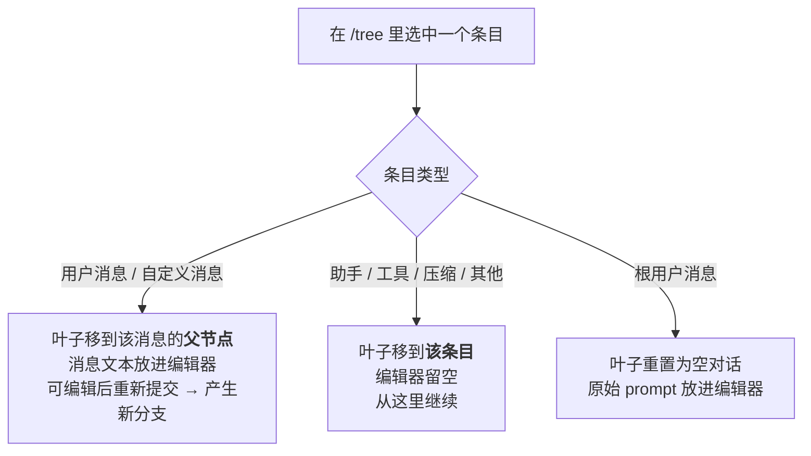

# 会话管理

Pi 把对话保存成会话，于是你可以继续未完的工作、从更早的轮次分叉、回头看走过的岔路。

这一篇解决的核心问题是：**`/tree`、`/fork`、`/clone` 到底有什么区别，什么时候用哪个。**

## 1. 会话存在哪

会话自动保存到 `~/.pi/agent/sessions/`，按工作目录分组。每个会话是一个 **JSONL 文件，内部是树结构**。

```bash title="启动时的会话参数"
pi -c                  # 继续最近一次会话
pi -r                  # 浏览并选择历史会话
pi --no-session        # 临时模式，不保存
pi --name "my task"    # 启动时设置显示名
pi --session <path|id> # 指定会话文件或会话 ID 前缀
pi --fork <path|id>    # 把指定会话 fork 成新会话
```

交互模式里用 `/session` 查看当前会话文件、会话 ID、消息数、token 和花费。

:::info 想换存储位置

用 `sessionDir` 设置，或 `--session-dir`、`PI_CODING_AGENT_SESSION_DIR`。优先级见 [设置 §12](./settings#12-会话)。

:::

JSONL 的逐行格式和 SessionManager API 见 [会话文件格式](../reference/session-format)。

## 2. 会话命令

| 命令 | 作用 |
|---|---|
| `/resume` | 浏览并选择历史会话 |
| `/new` | 开新会话 |
| `/name <name>` | 设置当前会话显示名 |
| `/session` | 显示会话信息 |
| `/tree` | 在当前会话树里导航 |
| `/fork` | 从某条历史用户消息创建新会话 |
| `/clone` | 把当前活动分支复制成新会话 |
| `/compact [prompt]` | 压缩早期上下文，见 [上下文压缩](./compaction) |
| `/export [file]` | 导出为 HTML |
| `/share` | 上传为私有 GitHub gist 并给出可分享链接 |

## 3. 恢复与删除

`/resume` 打开当前项目的会话选择器，`pi -r` 是在启动时打开同一个界面。

选择器里可以：

| 操作 | 键 |
|---|---|
| 搜索 | 直接打字 |
| 切换路径显示 | Ctrl+P |
| 切换排序 | Ctrl+S |
| 只看已命名会话 | Ctrl+N |
| 重命名 | Ctrl+R |
| 删除（需确认） | Ctrl+D |

:::tip 删除走回收站

如果系统上有 `trash` CLI，Pi 会用它而不是永久删除文件。

:::

### 起名字

```text
/name Refactor auth module
```

```bash
pi --name "Refactor auth module"
pi --name "CI audit" -p "Review this build failure"
```

命名过的会话在 `/resume` 和 `pi -r` 里更好找——尤其配合 Ctrl+N 的"只看已命名"过滤。

## 4. 会话树

会话是**树**不是线性列表。每个条目都有 `id` 和 `parentId`，当前位置就是**活动叶子（active leaf）**。

`/tree` 让你跳到之前任意一点继续，而且**不产生新文件**。

```text
├─ user: "Hello, can you help..."
│  └─ assistant: "Of course! I can..."
│     ├─ user: "Let's try approach A..."
│     │  └─ assistant: "For approach A..."
│     │     └─ user: "That worked..."  ← 活动叶子
│     └─ user: "Actually, approach B..."
│        └─ assistant: "For approach B..."
```

### 树内操作

| 键 | 动作 |
|---|---|
| ↑ / ↓ | 在可见条目间移动 |
| ← / → | 上下翻页 |
| Ctrl+← / Ctrl+→（或 Alt+←/→） | 折叠展开，或在分支段之间跳转 |
| Shift+L | 给选中条目加/清标签 |
| Shift+T | 切换标签时间戳 |
| Enter | 选中 |
| Escape / Ctrl+C | 取消 |
| Ctrl+O | 循环切换过滤模式 |

过滤模式有五种：default、no-tools、user-only、labeled-only、all。默认值用 `treeFilterMode` 配置。

### 选中不同类型条目的行为不同

这是 `/tree` 最容易搞混的地方：



| 选中的条目 | 叶子落在哪 | 编辑器 | 典型用途 |
|---|---|---|---|
| 用户消息 | 该消息的**父节点** | 填入原消息文本 | 改写提问，走另一条路 |
| 助手/工具/压缩等 | **该条目本身** | 空 | 从这一步继续 |
| 根用户消息 | 空对话 | 填入原始 prompt | 整个重来 |

## 5. `/tree` vs `/fork` vs `/clone`

| 维度 | `/tree` | `/fork` | `/clone` |
|---|---|---|---|
| 产出 | **同一个**会话文件 | 新会话文件 | 新会话文件 |
| 视图 | 完整树 | 用户消息选择器 | 当前活动分支 |
| 典型用途 | 原地探索备选方案 | 从更早的 prompt 开新会话 | 继续之前先复制一份当前工作 |
| 摘要 | 可选的分支摘要 | 无 | 无 |

:::tip 一句话选型

想把多个方案**放在一起对比** → `/tree`；
想要一个**独立的会话文件** → `/fork`（从更早的点开始）或 `/clone`（从现在开始）。

:::

## 6. 分支摘要

用 `/tree` 从一个分支切到另一个分支时，Pi 可以**总结你放弃的那条分支**，并把摘要挂在新位置上。

这样你不用重放整条分支，也能保留那边的重要上下文。

提示出现时有三个选项：

1. 不生成摘要
2. 用默认提示词总结
3. 用自定义关注点总结

用 `branchSummary.skipPrompt` 可以跳过这个提问（跳过 = 不生成摘要），`branchSummary.reserveTokens` 控制预留 token。内部机制和扩展钩子见 [上下文压缩](./compaction)。

## 7. 会话文件里有什么

会话 JSONL 除了消息条目，还包含：

- 模型变更
- thinking level 变更
- 标签（label）
- 压缩记录（compaction）
- 分支摘要
- 扩展写入的条目

:::info 这一点在面试里有用

会话文件是 **append-only 的树**，模型切换、压缩、分支摘要都是**显式条目**而不是隐式状态。这意味着"这次跑为什么慢/为什么贵"是可以事后从文件里查出来的。

具体格式见 [会话文件格式](../reference/session-format)；双流（Entry / Record）的设计讨论属于 [Pi 源码深入](/pi/source/) 的范围。

:::

## 8. 本篇小结

| 主题 | 记住这一点 |
|---|---|
| 存储 | `~/.pi/agent/sessions/`，按 cwd 分组，JSONL + 树 |
| 位置 | 每条目有 `id`/`parentId`，当前位置 = 活动叶子 |
| `/tree` | 原地分叉，不产生新文件；选用户消息会回到其父节点 |
| `/fork` `/clone` | 产生新文件；一个从早期点开始，一个从当前分支复制 |
| 分支摘要 | 切分支时可保留被放弃分支的上下文 |

## 下一步

→ [上下文压缩](./compaction) — 上下文快满时 Pi 做了什么，怎么配，什么时候该手动 `/compact`
