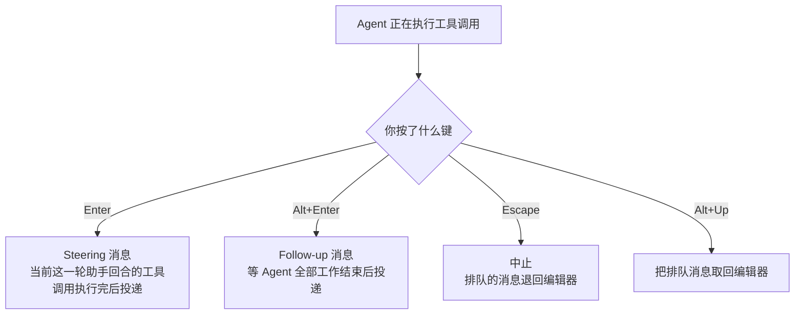

# 使用 Pi

[快速开始](./quickstart) 让你跑通了第一个会话。这一篇解决的是**日常使用中的所有细节**：界面上每个区域是什么、有哪些命令、Agent 干活时能不能插话、CLI 到底有多少参数。

这也是最适合当速查表的一页。

## 1. 交互模式的四个区域

```
┌─────────────────────────────────────────────────────────┐
│ 启动头部                                                  │
│   快捷键、已加载的上下文文件、Prompt 模板、Skill、扩展       │
├─────────────────────────────────────────────────────────┤
│ 消息区                                                    │
│   用户消息 / 助手回复 / 工具调用 / 工具结果                  │
│   通知 / 错误 / 扩展 UI                                    │
├─────────────────────────────────────────────────────────┤
│ 编辑器                          ← 你打字的地方              │
│   边框颜色 = 当前 thinking level                          │
├─────────────────────────────────────────────────────────┤
│ 底部状态栏                                                │
│   工作目录 · 会话名 · token/缓存用量 · 花费 · 上下文占用 · 模型│
└─────────────────────────────────────────────────────────┘
```

底部的用量统计包含三部分：助手回复、工具自报的用量、以及摘要生成的开销。

编辑器区域会被临时替换——比如运行 `/settings` 时，或者扩展自己的 UI 弹出来时。

### 编辑器功能

| 功能 | 怎么用 |
|---|---|
| 引用文件 | 输入 `@` 模糊搜索项目文件 |
| 路径补全 | Tab |
| 多行输入 | Shift+Enter，Windows Terminal 上是 Ctrl+Enter |
| 复制回复 | Ctrl+X 复制最后一条助手消息；在 `/tree` 里复制选中的消息 |
| 图片 | Ctrl+V 粘贴（Windows 上 Alt+V），或拖进终端 |
| Shell 命令 | `!command` 执行并把输出送给模型 |
| 隐藏 Shell 命令 | `!!command` 执行但**不**送给模型 |
| 外部编辑器 | Ctrl+G 打开 `externalEditor` / `$VISUAL` / `$EDITOR`；Windows 回落 Notepad，其他系统回落 nano |

完整快捷键与自定义见 [快捷键](./keybindings)。

## 2. 斜杠命令

在编辑器里输入 `/` 会弹出命令补全。除了内置命令，扩展可以注册自己的命令，Skill 以 `/skill:name` 出现，Prompt 模板以 `/模板名` 展开。

按用途分组更好记：

**认证与模型**

| 命令 | 作用 |
|---|---|
| `/login`、`/logout` | 管理 OAuth 或 API Key 凭据 |
| `/llama` | 下载、加载、卸载 llama.cpp 路由模型 |
| `/model` | 切换模型 |
| `/scoped-models` | 设置 Ctrl+P 循环时可选的模型 |
| `/settings` | 思考级别、主题、消息投递方式、传输层 |

**会话**

| 命令 | 作用 |
|---|---|
| `/resume` | 从历史会话中挑一个 |
| `/new` | 开新会话 |
| `/name <name>` | 设置会话显示名 |
| `/session` | 显示会话文件、ID、消息数、token、花费 |
| `/tree` | 跳到会话中的任意一点并从那里继续 |
| `/fork` | 从某条历史用户消息创建新会话 |
| `/clone` | 把当前活动分支复制成新会话 |
| `/compact [prompt]` | 手动压缩上下文，可带自定义指令 |

**输入输出**

| 命令 | 作用 |
|---|---|
| `/copy` | 复制最后一条助手消息到剪贴板 |
| `/export [file]` | 导出会话为 HTML 或 JSONL |
| `/import <file>` | 从 JSONL 导入并恢复会话 |
| `/share` | 上传为私有 GitHub gist，得到可分享的 HTML 链接 |

**其他**

| 命令 | 作用 |
|---|---|
| `/trust` | 保存项目信任决定，供后续会话使用 |
| `/reload` | 重新加载快捷键、扩展、Skill、Prompt、主题、上下文文件 |
| `/hotkeys` | 显示所有快捷键 |
| `/changelog` | 显示版本历史 |
| `/quit` | 退出 |

## 3. 消息队列：Agent 干活时怎么插话

Agent 还在跑的时候，你可以继续提交消息。区别在于**什么时候投递**：



| 键 | 类型 | 语义 |
|---|---|---|
| Enter | Steering | 尽快影响当前工作（当前助手回合的工具调用执行完毕后送达） |
| Alt+Enter | Follow-up | 等当前任务全部做完再处理 |
| Escape | Abort | 中止，并把排队消息还给编辑器 |
| Alt+Up | 取回 | 把排队消息拉回编辑器修改 |

:::warning Windows Terminal 上的 Alt+Enter

Alt+Enter 默认是"全屏"快捷键，会被终端吃掉。需要按 [终端设置](../platform/terminal-setup) 里的方法重新映射，Pi 才能收到。

:::

投递行为可以在 [设置](./settings) 里用 `steeringMode` 和 `followUpMode` 配置。

:::tip 这就是 Learn 里讲过的东西

Steering / Follow-up 的原理见 [Learn Agent 06 多轮交互与用户插队](/learn/06-multi-turn)。

:::

## 4. 会话

会话自动保存到 `~/.pi/agent/sessions/`，按工作目录分组。

```bash title="启动时的会话选项"
pi -c                  # 继续最近一次会话
pi -r                  # 浏览并选择
pi --no-session        # 临时模式，不保存
pi --name "my task"    # 启动时设置显示名
pi --session <path|id> # 指定会话文件或会话 ID
pi --fork <path|id>    # 把某个会话 fork 成新会话文件
```

会话内的常用命令：`/session` 看当前文件和 ID，`/tree` 在会话树里导航（还能给放弃的分支生成摘要），`/fork` 从更早的用户消息开新会话，`/clone` 把当前分支复制成独立文件，`/compact` 压缩早期消息腾出上下文。

细节见 [会话管理](./sessions) 和 [上下文压缩](./compaction)。

## 5. 上下文文件

Pi 启动时按这个顺序加载 `AGENTS.md` 或 `CLAUDE.md`：

1. `~/.pi/agent/AGENTS.md` — 全局指令
2. 从当前工作目录逐级向上的父目录
3. 当前目录

如果某个目录里有 `AGENTS.override.md`，Pi 会用它**替代**该目录的 `AGENTS.md` / `CLAUDE.md`；其他目录的上下文文件仍然正常层叠。

上下文文件适合放：项目约定、常用命令、安全规则、个人偏好。用 `--no-context-files`（或 `-nc`）可以完全禁用加载。

### 系统提示词文件

想**替换**默认 system prompt：

| 文件 | 范围 |
|---|---|
| `.pi/SYSTEM.md` | 项目 |
| `~/.pi/agent/SYSTEM.md` | 全局 |

只想**追加**而不替换，用同样两个位置的 `APPEND_SYSTEM.md`。

## 6. 项目信任

这是 Pi 一个容易被忽略但很重要的机制。

交互模式启动时，如果一个项目目录里含有项目级设置、资源或 `.agents/skills`，而 `~/.pi/agent/trust.json` 里对该目录（或其父目录）没有已保存的决定，Pi 会先问你信不信任它。

```
                   启动
                     │
                     ▼
        ┌────────────────────────────┐
        │ 信任决定之前只加载：          │
        │   上下文文件                 │
        │   用户级/全局扩展            │
        │   CLI -e 指定的扩展          │
        │ （让它们能处理 project_trust）│
        └─────────────┬──────────────┘
                      ▼
              信任这个项目吗？
                 ├─ 是 ─→ 加载 .pi/settings.json、.pi 资源、
                 │        安装缺失的项目包、执行项目扩展
                 └─ 否 ─→ 忽略上述全部项目级资源
```

信任一个项目意味着允许 Pi：加载 `.pi/settings.json` 和 `.pi` 资源、安装缺失的项目包、**执行项目里的扩展代码**。最后一条是真正的风险点——扩展是任意 JS/TS。

切换到另一个 cwd 的会话、且该 cwd 的信任在当前进程里还没解决时，同样走这套流程。

### 非交互模式怎么办

`-p`、`--mode json`、`--mode rpc` **不会**弹信任提示。没有可用的已保存决定时，走全局设置里的 `defaultProjectTrust`：

| 值 | 行为 |
|---|---|
| `ask`（默认） | 忽略项目级资源 |
| `never` | 忽略项目级资源 |
| `always` | 信任项目级资源 |

单次覆盖用 `--approve` / `-a`（信任）或 `--no-approve` / `-na`（忽略）。

`pi config` 和包管理命令走同一套流程，例外是 `pi update` 永远不提示。

交互模式下用 `/trust` 保存决定（可以连带信任上一级目录）。它只写 `~/.pi/agent/trust.json`，**不会重载当前会话**，改完要重启 Pi 才生效。

## 7. CLI 参考

```bash
pi [options] [--] [@files...] [messages...]
```

### 包命令

```bash
pi install <source> [-l]     # 安装包，-l 表示项目级
pi remove <source> [-l]      # 移除包
pi uninstall <source> [-l]   # remove 的别名
pi update [source|self|pi]   # 只更新 pi，或更新某个包
pi update --all              # 更新 pi 和所有包，并对齐 pin 住的 git ref
pi update --extensions       # 只更新包
pi update --models           # 只刷新模型目录
pi update --self             # 只更新 pi
pi update --extension <src>  # 更新单个包
pi list                      # 列出已安装的包
pi config                    # 启用/禁用包内资源
```

### 运行模式

| 参数 | 说明 |
|---|---|
| 默认 | 交互模式 |
| `-p`, `--print` | 打印回复后退出 |
| `--mode json` | 以 JSON 行输出所有事件，见 [JSON 模式](../programmatic/json) |
| `--mode rpc` | 走 stdin/stdout 的 RPC 模式，见 [RPC 模式](../programmatic/rpc) |
| `--export <in> [out]` | 把会话导出为 HTML |

print 模式还会读取管道输入并合并进初始 prompt：

```bash
cat README.md | pi -p "Summarize this text"
```

### 模型选项

| 参数 | 说明 |
|---|---|
| `--provider <name>` | Provider，如 `anthropic`、`openai`、`google` |
| `--model <pattern>` | 模型 pattern 或 ID，支持 `provider/id` 与可选的 `:<thinking>` |
| `--api-key <key>` | API Key，优先级高于环境变量 |
| `--thinking <level>` | `off`、`minimal`、`low`、`medium`、`high`、`xhigh`、`max` |
| `--models <patterns>` | 逗号分隔的 pattern，供 Ctrl+P 循环 |
| `--list-models [search]` | 列出可用模型 |

### 会话选项

| 参数 | 说明 |
|---|---|
| `-c`, `--continue` | 继续最近一次会话 |
| `-r`, `--resume` | 浏览并选择会话 |
| `--session <path\|id>` | 指定会话文件或 UUID 前缀 |
| `--fork <path\|id>` | 把会话 fork 成新会话 |
| `--session-dir <dir>` | 自定义会话存储目录 |
| `--no-session` | 临时模式，不保存 |
| `--name <name>`, `-n` | 启动时设置显示名 |

### 工具选项

| 参数 | 说明 |
|---|---|
| `--tools <list>`, `-t` | 白名单：内置、扩展、自定义工具 |
| `--exclude-tools <list>`, `-xt` | 禁用指定工具 |
| `--no-builtin-tools`, `-nbt` | 禁用内置工具，保留扩展/自定义工具 |
| `--no-tools`, `-nt` | 禁用所有工具 |

内置工具：`read`、`bash`、`powershell`（Windows）、`edit`、`write`、`grep`、`find`、`ls`。

### 资源选项

| 参数 | 说明 |
|---|---|
| `-e`, `--extension <source>` | 从路径、npm 或 git 加载扩展，可重复 |
| `--no-extensions` | 禁用扩展发现 |
| `--skill <path>` | 加载 Skill，可重复 |
| `--no-skills` | 禁用 Skill 发现 |
| `--prompt-template <path>` | 加载 Prompt 模板，可重复 |
| `--no-prompt-templates` | 禁用模板发现 |
| `--theme <path>` | 加载主题，可重复 |
| `--no-themes` | 禁用主题发现 |
| `--no-context-files`, `-nc` | 禁用 `AGENTS.md` / `CLAUDE.md` 发现 |

`--no-*` 和显式加载可以组合，用来精确控制加载内容、忽略设置：

```bash {1}
pi --no-extensions -e ./my-extension.ts
```

### 其他选项

| 参数 | 说明 |
|---|---|
| `--system-prompt <text>` | 替换默认提示词；上下文文件和 Skill 仍会追加 |
| `--append-system-prompt <text>` | 追加到系统提示词 |
| `--tui-mode <mode>` | `regular`（默认）或实验性的 `fullscreen` |
| `--use-theme <name[/name]>` | 只对本次运行设置主题，不改设置 |
| `--verbose` | 强制显示详细启动信息 |
| `-a`, `--approve` | 本次运行信任项目级文件 |
| `-na`, `--no-approve` | 本次运行忽略项目级文件 |
| `--` | 停止解析选项，后面的都当作 prompt 或 `@file` |
| `-h`, `--help` | 帮助 |
| `-v`, `--version` | 版本 |

:::info fullscreen 模式的取舍

`fullscreen` 下对话区在终端视口内滚动，排队消息、工作状态、扩展 widget、编辑器、底栏固定在底部。

内联图片在支持 Kitty 图形协议的终端（Kitty、Ghostty）正常工作；**iTerm2 下会退化成文字占位符**，因为它的内联图片协议无法在应用自绘滚动时删除或裁剪图像。`regular` 模式使用主屏幕和终端自带的 scrollback，iTerm2 的内联图片正常。

在 `/settings` 里可以即时切换 TUI 模式并设置默认值。

:::

### 文件参数

用 `@` 前缀把文件带进消息：

```bash
pi @prompt.md "Answer this"
pi -p @screenshot.png "What's in this image?"
pi @code.ts @test.ts "Review these files"
```

### 常用组合

```bash title="日常最常用的几条"
# 带初始 prompt 的交互模式
pi "List all .ts files in src/"

# 一次性任务
pi -p "Summarize this codebase"

# prompt 以短横线开头时用 -- 隔断
pi -p -- "- Summarize these points"

# 管道输入
cat README.md | pi -p "Summarize this text"

# 命名的一次性会话
pi --name "release audit" -p "Audit this repository"

# 换模型
pi --provider openai --model gpt-4o "Help me refactor"
pi --model openai/gpt-4o "Help me refactor"
pi --model sonnet:high "Solve this complex problem"

# 限制 Ctrl+P 循环范围
pi --models "claude-*,gpt-4o"

# 只读模式（评审代码时最实用）
pi --tools read,grep,find,ls -p "Review the code"

# 禁掉某个扩展工具，其余照常
pi --exclude-tools ask_question
```

## 8. 导出与分享

`/export [file]` 把会话写成 HTML；`/share` 上传为私有 GitHub gist 并给出可分享的 HTML 链接。

## 9. 设计原则

:::tip 为什么很多"标配"功能 Pi 都没有

Pi 保持核心小，把工作流相关的行为推给扩展、Skill、Prompt 模板和包。

它**故意不内置**：MCP、sub-agents、权限弹窗、plan mode、to-dos、后台 bash。这些应该做成扩展或包，或者用容器、tmux 之类的外部工具解决。

出处：`packages/coding-agent/docs/usage.md:304`（Design Principles 小节）与 `usage.md:308`（六项清单）

:::

这六项里，官方示例已经覆盖了其中四项（sub-agents、权限门、plan mode、to-dos），MCP 和后台 bash 没有示例——这正是 [实验室](/pi/lab/) 选题时值得关注的空白。

## 10. 本篇小结

| 主题 | 记住这一点 |
|---|---|
| 界面 | 四区：头部 / 消息 / 编辑器 / 底栏，编辑器边框色 = thinking level |
| 插话 | Enter = Steering（当前回合后），Alt+Enter = Follow-up（全部完成后） |
| 上下文文件 | 逐级向上层叠，`AGENTS.override.md` 是替换不是追加 |
| 项目信任 | 信任 = 允许执行项目扩展代码；非交互模式默认不信任 |
| 只读模式 | `--tools read,grep,find,ls` |

## 下一步

→ [Providers](./providers) — 30+ 个 Provider 怎么认证，凭据按什么顺序解析，云厂商怎么配
