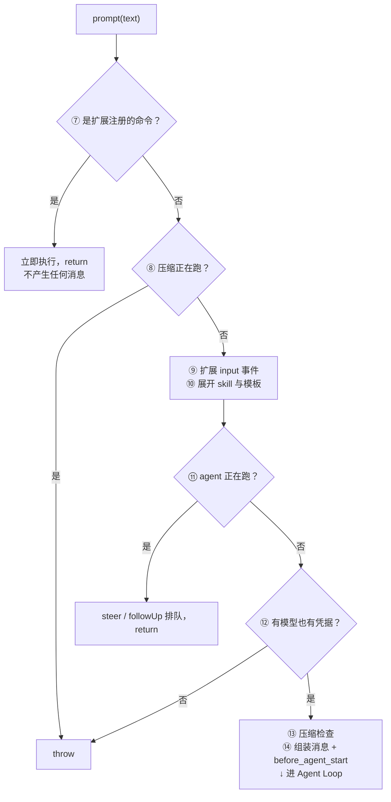

# 02.1 十四道闸

[← 回到 02 总览](./)｜以 **Pi v0.84.3 (+20, `8fa7eebd`)** 源码为基准，代码块里的中文注释为本文补充。

总览里的十四道闸速查表给了结论，这一页给证据：每道闸的代码在哪、判断什么、换来什么、代价是什么。

## 一、TUI 层：六条岔路

**文件**：`packages/coding-agent/src/modes/interactive/interactive-mode.ts:2962`

交互模式的输入回调是一条长长的 if 链，一路匹配下来：

```typescript title="packages/coding-agent/src/modes/interactive/interactive-mode.ts:2962" {5,8}
this.defaultEditor.onSubmit = async (text: string) => {
  text = text.trim();
  if (!text) return;                          // ① 空串直接丢

  if (text === "/settings") {                 // ② 26 条内置命令逐条精确匹配
    this.showSettingsSelector();              // 打开 UI，不产生任何消息
    this.editor.setText("");
    return;                                   // 到这里就结束，session 一无所知
  }
  // ... /model /tree /export /fork /compact /resume /quit ...
```

内置命令一共 **23 条**声明在 `BUILTIN_SLASH_COMMANDS`（`packages/coding-agent/src/core/slash-commands.ts:19`），另有 `/debug`、`/arminsayshi`、`/dementedelves` 三条只在 `onSubmit` 里处理、不出现在补全列表中，实际处理 26 条。

这个数组只提供**名字、描述、参数提示**三样东西，供补全 UI 使用。真正的行为写在 TUI 的 if 链里。

### 换来什么 / 代价是什么

声明和实现分家，好处是 `core` 不需要知道 `/model` 会打开一个选择器——命令的 UI 行为完全属于界面层。

代价是加一条内置命令要动两个文件，忘一个就出现"能补全但按了没反应"，或者"能用但补不出来"。

### 命令之外的三条岔路

- **③ shell 直通**：`!ls -la` 直接执行 shell，结果作为 `bashExecution` 消息记进会话；`!!` 前缀的结果标记 `excludeFromContext`，只给人看不给模型看
- **④ 压缩排队**：压缩正在跑，普通输入进 `compactionQueuedMessages` 本地队列，等压缩结束再 flush
- **⑤ 流式分流**：agent 正在跑，直接走 `session.prompt(text, { streamingBehavior: "steer" })`

只有全都不匹配（⑥），文本才通过 `getUserInput()`（`packages/coding-agent/src/modes/interactive/interactive-mode.ts:3878`）交给主循环：

```typescript title="packages/coding-agent/src/modes/interactive/interactive-mode.ts:1176" {3,5}
// Main interactive loop
while (true) {
  const userInput = await this.getUserInput();   // 阻塞等一条真正的用户消息
  try {
    await this.session.prompt(userInput);        // 这里才进入产品层
  } catch (error: unknown) {
    this.showError(error instanceof Error ? error.message : "Unknown error occurred");
  }
}
```

这个 `while(true)` 是整个交互模式的主循环，但它不是 Agent Loop。它只负责"取一条输入、喂进去、把错误打到屏幕上"。真正的循环在两层之下（[第 03 章](../03-agent-loop/)）。

## 二、产品层：八道闸的形状

**文件**：`packages/coding-agent/src/core/agent-session.ts:1139`

先看形状，再看细节。八道闸在 `prompt()` 里是顺序执行的，其中五道会**提前返回或抛错**：



为了不把图画糊，上面省略了一条分支：闸 ⑨ 的扩展如果返回 `handled`，同样会当场 `return`。

五个提前出口的语义各不相同：

| 出口 | 用户看到什么 | 会话里留下什么 |
|---|---|---|
| ⑦ 扩展命令 | 扩展自己画的 UI 或消息 | 由扩展决定 |
| ⑧ 压缩互斥 | 一条报错 | 什么都没有 |
| ⑨ 扩展 `handled` | 由扩展决定 | 由扩展决定 |
| ⑪ 流式排队 | 待发消息列表多一条 | 等真正出队时才写入 |
| ⑫ 认证失败 | 一条报错 | 什么都没有 |

## 三、闸 ⑦ 扩展命令：唯一能在流式中插队执行的东西

```typescript title="packages/coding-agent/src/core/agent-session.ts:1147" {2,5}
if (expandPromptTemplates && text.startsWith("/")) {
  const handled = await this._tryExecuteExtensionCommand(text);   // 查扩展注册表
  if (handled) {
    preflightResult?.(true);                                       // 执行完直接返回
    return;                                                        // 不产生任何消息
  }
}
```

放在最前面是有意的：扩展命令自己管自己的 LLM 交互（通过 `pi.sendMessage()`），所以**即使 agent 正在流式输出，它也照样立即执行**。相比之下 steer/followUp 只能排队。

代价是命名冲突没有仲裁。把 TUI 内置命令算上，`/` 前缀一共有四类主人，匹配顺序写死为：

```text
内置命令  →  扩展命令  →  skill  →  prompt 模板
 (TUI)      (闸 ⑦)      (闸 ⑩)      (闸 ⑩)
```

一个扩展注册了 `/review`，你的 `prompts/review.md` 就永远不会被触发，而且没有任何警告。

## 四、闸 ⑧ 压缩互斥：唯一一处直接 throw 的并发保护

```typescript title="packages/coding-agent/src/core/agent-session.ts:1156" {2-4}
if (this._compactionAbortController !== undefined) {
  throw new Error(
    "Cannot submit a prompt while compaction is in progress. Wait for compaction to finish and retry.",
  );
}
```

压缩会重写 `agent.state.messages`。如果这时候插进一条新消息，压缩产出的摘要就会盖掉它。

产品层的做法是直接拒绝，让 TUI 自己去排队（闸 ④）——**冲突不在这里解决，只在这里检测**。这是一种常见的分层策略：底层只负责让错误变得可见，恢复策略留给更懂用户意图的那一层。

## 五、闸 ⑨ 扩展 `input` 事件：改用户原话的地方

```typescript title="packages/coding-agent/src/core/agent-session.ts:1163" {4,9-10}
let currentText = text;
let currentImages = options?.images;
if (this._extensionRunner.hasHandlers("input")) {
  const inputResult = await this._extensionRunner.emitInput(
    currentText, currentImages,
    options?.source ?? "interactive",              // interactive / extension / cli
    this.isStreaming ? options?.streamingBehavior : undefined,
  );
  if (inputResult.action === "handled") { preflightResult?.(true); return; }   // 吃掉
  if (inputResult.action === "transform") { currentText = inputResult.text; }  // 改写
}
```

`emitInput`（`packages/coding-agent/src/core/extensions/runner.ts:1196`）把所有扩展的 `input` 处理器串成一条流水线：上一个的 `transform` 结果是下一个的输入，任何一个返回 `handled` 就立刻短路。

三种返回值的语义：

- `continue` —— 不管，交给下一个处理器
- `transform` —— 改写文本或图片，继续往下走
- `handled` —— 我处理完了，整条链路到此为止

注意它在 skill/模板展开**之前**。这个顺序意味着扩展看到的是用户敲的原文 `/review src/api.ts`，而不是展开后的几千字。想做"输入审计"或"敏感词拦截"，这是唯一正确的位置——展开之后再拦，拦的是模板作者写的字，不是用户写的字。

## 六、闸 ⑩ Skill 与模板展开：两套语法，同一个出口

```typescript title="packages/coding-agent/src/core/agent-session.ts:1183" {3-4}
let expandedText = currentText;
if (expandPromptTemplates) {
  expandedText = this._expandSkillCommand(expandedText);                    // /skill:name
  expandedText = expandPromptTemplate(expandedText, [...this.promptTemplates]);  // /tplname
}
```

两者的产物形态完全不同：

| | 触发语法 | 产物 | 不匹配时 |
|---|---|---|---|
| Skill | `/skill:name args` | `<skill>` 标签包住的整份 SKILL.md | 原样返回 |
| Prompt 模板 | `/name arg1 arg2` | 模板正文，`$1` `$2` `$@` 被替换 | 原样返回 |

`_expandSkillCommand`（`packages/coding-agent/src/core/agent-session.ts:1333`）读整份 SKILL.md，剥掉 frontmatter，包进一个带 `location` 和 `baseDir` 的标签：

```typescript title="packages/coding-agent/src/core/agent-session.ts:1344" {3-4}
const content = readFileSync(skill.filePath, "utf-8");
const body = stripFrontmatter(content).trim();
const skillBlock = `<skill name="${skill.name}" location="${skill.filePath}">
References are relative to ${skill.baseDir}.\n\n${body}\n</skill>`;   // 告诉模型相对路径基准
return args ? `${skillBlock}\n\n${args}` : skillBlock;
```

那句 `References are relative to ...` 是渐进披露能跑通的关键：SKILL.md 里写 `scripts/run.py`，模型才知道该去哪个目录找（第 05 章展开）。

`expandPromptTemplate`（`packages/coding-agent/src/core/prompt-templates.ts:269`）走的是位置参数替换，产物是模板文件的正文。

:::warning 两条路都静默失败

skill 名不存在就原样返回，模板名不存在也原样返回。你敲错一个字母，得到的是模型收到一条 `/reveiw src/api.ts`，然后开始猜你想干什么。

:::

## 七、闸 ⑪ 流式分流：steer 与 followUp 的分岔口

```typescript title="packages/coding-agent/src/core/agent-session.ts:1190" {2-6,8,10}
if (this.isStreaming) {
  if (!options?.streamingBehavior) {
    throw new Error(
      "Agent is already processing. Specify streamingBehavior ('steer' or 'followUp') to queue the message.",
    );
  }
  if (options.streamingBehavior === "followUp") {
    await this._queueFollowUp(expandedText, currentImages);   // 等它完全停下来再说
  } else {
    await this._queueSteer(expandedText, currentImages);      // 本轮工具跑完就插进去
  }
  preflightResult?.(true);
  return;
}
```

关键在于**排队的是展开后的文本**。`/skill:review` 排进队列时已经变成了完整的 skill 块，等真正出队时不会再展开一次。

### 换来什么 / 代价是什么

避免了"排队期间 SKILL.md 被改了"导致的时序问题——排的是快照，不是引用。

代价是队列里躺的可能是几千字，TUI 显示待发消息时得自己截断。

`isStreaming` 的定义值得留意（`packages/coding-agent/src/core/agent-session.ts:900`）：它返回的是 `_isAgentRunActive`，这个标志在 `_runAgentPrompt` 入口置真、在 `_emitAgentSettled` 里置假。也就是说它覆盖了自动重试和压缩后重跑的整个区间，而不只是"正在吐字"的那一段（[第 03 章](../03-agent-loop/)）。

## 八、闸 ⑫ 模型与认证：两次 fail fast

```typescript title="packages/coding-agent/src/core/agent-session.ts:1210" {1,5-7}
if (!this.model) throw new Error(formatNoModelSelectedMessage());

const hasConfiguredAuth =
  this._modelRuntime.hasConfiguredAuth(this.model.provider) ||
  (await this._modelRuntime.checkAuth(this.model.provider)) !== undefined;   // 可能打网络
if (!hasConfiguredAuth) {
  const isOAuth = this._modelRuntime.isUsingOAuth(this.model.provider);      // 区分两种失败
  // OAuth: 提示 /login 重新授权；API Key: 提示去哪配 key
}
```

两种"没凭据"给的是不同的提示：OAuth 过期要重新 `/login`，API Key 缺失要去配环境变量。同一个 `undefined`，两条排查路径。

这里也是链路上第一次可能**打网络**的地方（`checkAuth` 可能触发 token 刷新）。它发生在消息组装之前，所以失败时会话里不会留下半条消息。

## 九、闸 ⑬ 压缩检查：为什么要看"上一条"

```typescript title="packages/coding-agent/src/core/agent-session.ts:1231" {3}
const lastAssistant = this._findLastAssistantMessage();
if (lastAssistant) {
  await this._checkCompaction(lastAssistant, false);   // false = 连被中止的消息也检查
}
```

判断上下文满没满，靠的是**上一条 assistant 消息带回来的 usage**，不是本地估算。这是链路上一个有点反直觉的设计：要发的是新消息，检查的却是旧回复。

原因在第 01 章说过——循环层拿到的 `messages` 就是要发出去的全部内容，它没有"发之前先问一下还剩多少额度"的能力。唯一可靠的 token 数来自 provider 上一次的回执。

第二个参数 `skipAbortedCheck = false` 是这条路径独有的。正常的 turn 结束后检查会跳过被用户 Esc 掉的消息，但"用户中止了一个已经溢出的回复，然后又发了新消息"这种情况必须处理，否则新消息一样会溢出。压缩的完整机制在第 06 章。

## 十、闸 ⑭ 组装消息与 `before_agent_start`

```typescript title="packages/coding-agent/src/core/agent-session.ts:1237" {4,6,9}
messages = [];
const userContent: (TextContent | ImageContent)[] = [{ type: "text", text: expandedText }];
if (currentImages) userContent.push(...currentImages);
messages.push({ role: "user", content: userContent, timestamp: Date.now() });

for (const msg of this._pendingNextTurnMessages) messages.push(msg);   // deliverAs:"nextTurn"
this._pendingNextTurnMessages = [];

const result = await this._extensionRunner.emitBeforeAgentStart(
  expandedText, currentImages, this._baseSystemPrompt, this._baseSystemPromptOptions,
);
```

`emitBeforeAgentStart`（`packages/coding-agent/src/core/extensions/runner.ts:1081`）能干两件 `input` 干不了的事：

- 追加 `role: "custom"` 的上下文消息，跟着用户消息一起进本轮
- **整体替换 system prompt**，只对这一轮生效

```typescript title="packages/coding-agent/src/core/agent-session.ts:1278" {2-3,6-7}
if (result?.systemPrompt !== undefined) {
  this._systemPromptOverride = result.systemPrompt;      // 记下来，供后续 turn 复用
  this.agent.state.systemPrompt = result.systemPrompt;
} else {
  this._systemPromptOverride = undefined;                // 没返回就恢复基线
  this.agent.state.systemPrompt = this._baseSystemPrompt;
}
```

`else` 分支不是多余的。没有它，上一轮扩展改过的 system prompt 会一直粘着——注释里写得很直白："in case previous turn had modifications"。这类"每轮显式重置"的写法在 `AgentSession` 里出现了好几处，是长生命周期对象常见的坑。

八道闸走完，`_runAgentPrompt(messages)` 接手，产品层的活到此为止。

## 十一、小结

- TUI 的六条岔路里有五条会就地结束，只有第六条才进产品层
- 内置命令的声明在 `core`、行为在 TUI，分家的代价是加命令要动两个文件
- 产品层八道闸里有四道会提前返回或抛错，语义各不相同（见 §二 的表）
- 只有闸 ⑨ 和 ⑩ 在改文本；⑨ 看到的是原文，⑩ 之后才是展开后的几千字
- `/` 前缀四类主人，先到先得且无警告
- 排队排的是展开后的快照，不是原始命令
- 压缩检查看的是上一条 assistant 的 usage，因为循环层没有"发之前问额度"的能力

<details>
<summary>本页源码索引</summary>

| 符号 | 位置 |
|---|---|
| `onSubmit` 输入回调 | `packages/coding-agent/src/modes/interactive/interactive-mode.ts:2962` |
| 交互主循环 | `packages/coding-agent/src/modes/interactive/interactive-mode.ts:1176` |
| `getUserInput` | `packages/coding-agent/src/modes/interactive/interactive-mode.ts:3878` |
| `BUILTIN_SLASH_COMMANDS` | `packages/coding-agent/src/core/slash-commands.ts:19` |
| `AgentSession.prompt` | `packages/coding-agent/src/core/agent-session.ts:1139` |
| `_tryExecuteExtensionCommand` | `packages/coding-agent/src/core/agent-session.ts:1302` |
| `_expandSkillCommand` | `packages/coding-agent/src/core/agent-session.ts:1333` |
| `expandPromptTemplate` | `packages/coding-agent/src/core/prompt-templates.ts:269` |
| `isStreaming` | `packages/coding-agent/src/core/agent-session.ts:900` |
| `_checkCompaction` | `packages/coding-agent/src/core/agent-session.ts:2105` |
| `_runAgentPrompt` | `packages/coding-agent/src/core/agent-session.ts:1085` |
| `emitInput` | `packages/coding-agent/src/core/extensions/runner.ts:1196` |
| `emitBeforeAgentStart` | `packages/coding-agent/src/core/extensions/runner.ts:1081` |

</details>

## 下一步

→ [02.2 从上下文到请求体](./assembly) — 消息进了循环层之后的三次格式转换，以及 system prompt 到底什么时候拼好。
