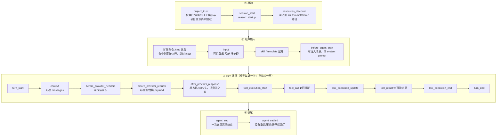
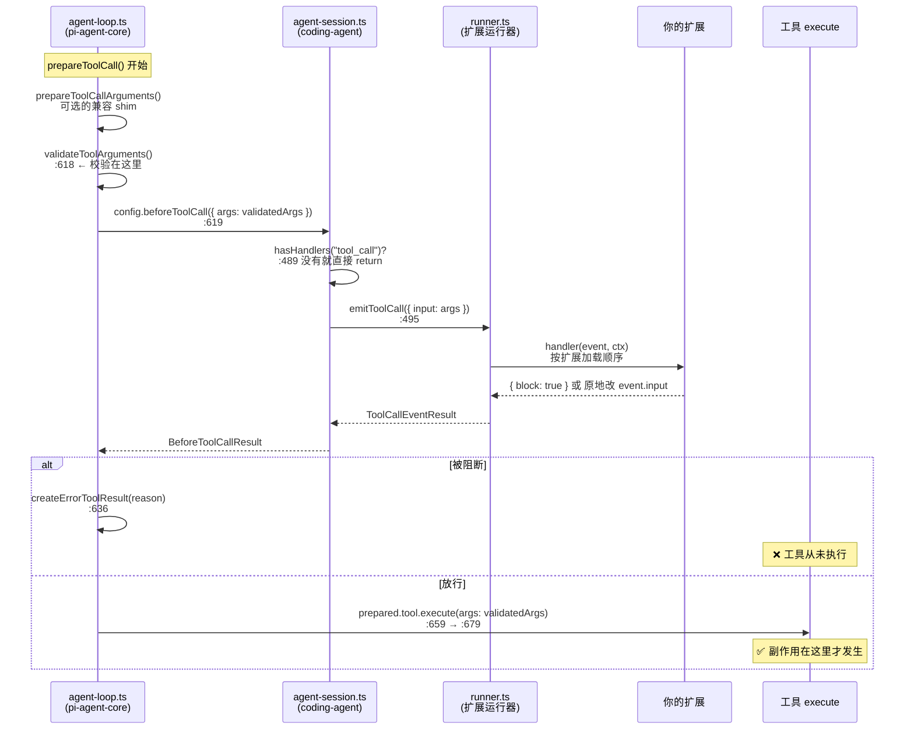
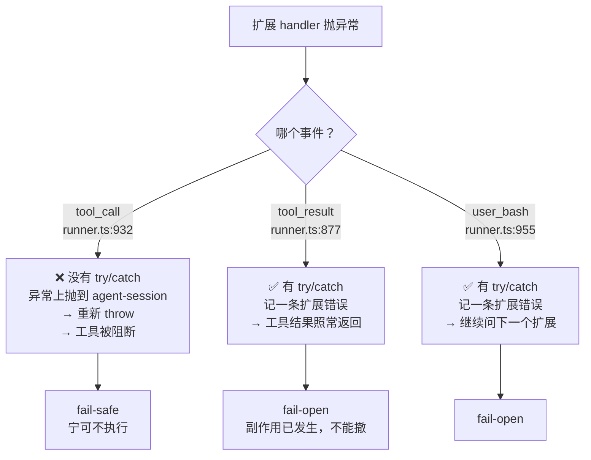

# 05 扩展体系与能力边界

> 以 **Pi v0.84.3**（commit `8fa7eebd`）源码为基准。所有 `file:line` 均经 `pnpm check:refs` 校验。

## 0. 本章回答哪些面试问题

| # | 面试问题 | 本章给出的证据 |
|---|---|---|
| 2 | 怎么保证执行过程中的准确性和可靠性 | 校验在 hook 之前、`tool_call` 可阻断、**fail-safe/fail-open 不对称** |
| 6 | 通用 Harness 的核心工程能力有哪些技术难点 | 34 个事件的切点设计 + 扩展层表达不了的 5 类需求 |
| 10 | 工程上做了哪些东西控制输出风险 | 四级防线：工具白名单 → `tool_call` 阻断 → 项目信任 → OS 隔离 |

## 1. 问题：一条"不许碰 `.env`"的规则该放在哪一层

先把场景说具体，否则后面全是空话。

> 团队要求：**Agent 永远不许写 `.env`、不许改 `db/migrations/`、不许跑 `npm publish`**。
>
> 你有五个位置可以实现它。选错位置的代价是什么？

```
┌─────────────────────────────────────────────────────────────────┐
│ Level 0  Config / Skill / Prompt / Theme                        │
│          "在 AGENTS.md 里写：不要动 .env"                        │
│          ✗ 模型可能不听 · ✗ 没有强制力 · ✓ 零成本               │
├─────────────────────────────────────────────────────────────────┤
│ Level 1  自有 Extension                     ← 本章讲这一层        │
│          tool_call 事件里检查路径，返回 { block: true }          │
│          ✓ 副作用前拦住 · ✓ 可 revert · ✓ 不动上游代码          │
├─────────────────────────────────────────────────────────────────┤
│ Level 2  AgentSession SDK / RPC Wrapper                         │
│          自己起 session，自己决定给哪些工具                       │
│          ✓ 控制力更强 · ✗ 得自己维护一套壳                       │
├─────────────────────────────────────────────────────────────────┤
│ Level 3  最小 Core Patch                                        │
│          改 agent-loop 本身                                     │
│          ✗ 上游同步成本 · 需要证据才允许（见 §7）                 │
├─────────────────────────────────────────────────────────────────┤
│ Level OS  容器 / micro-VM                                       │
│          唯一真正的安全边界（见「安全模型」）                      │
└─────────────────────────────────────────────────────────────────┘
```

本章要回答的是：**Level 1 到底能表达到什么程度，从哪一行代码开始就表达不了了。**

## 2. 全景：34 个扩展事件

:::warning 先纠正一处常见混淆

Pi 里有**两套**钩子名，很容易搞混：

| | 现役扩展事件 | 新一代 HookName |
|---|---|---|
| 数量 | **34 个** | **11 个** |
| 位置 | `packages/coding-agent/src/core/extensions/types.ts:1237` 起的 `on()` 重载 | `packages/agent/src/harness/agent-harness.ts:198` |
| 状态 | ✅ 跑生产 | ❌ **全部未实现** |
| 谁在用 | 你写的扩展 | 还没有人 |

本章第 2–7 节讲的全是**左边这套**。右边那套放在 §8 单独对照。

:::

### 2.1 事件在生命周期里的位置



:::tip 图里最容易被忽略的一条

`agent_end` **不等于**结束。它后面还可能跟自动重试、压缩后重跑、队列续跑。真正的终态是 `agent_settled`。

做 UI 的话，用 `agent_end` 关 loading 会出现"转圈停了字还在冒"。

:::

### 2.2 按用途分组

| 组 | 事件 | 能干什么 |
|---|---|---|
| **启动** | `project_trust` `resources_discover` | 接管信任决定、追加资源路径 |
| **会话** | `session_start` `session_shutdown` `session_info_changed` `session_before_switch` `session_before_fork` `session_before_tree` `session_tree` | 切换/分叉前取消，管理会话级资源 |
| **压缩** | `session_before_compact` `session_compact` `session_compact_failed` | 取消压缩、换模型做摘要、遥测 |
| **上下文** | `context` | 发给模型前改 `messages` |
| **Provider** | `before_provider_headers` `before_provider_request` `after_provider_response` | 改请求头、替换 payload、观测响应 |
| **Agent** | `before_agent_start` `agent_start` `agent_end` `agent_settled` `turn_start` `turn_end` | 注入消息、统计、判定真结束 |
| **消息** | `message_start` `message_update` `message_end` | 流式渲染 |
| **工具** | `tool_execution_start` `tool_call` `tool_execution_update` `tool_result` `tool_execution_end` | **拦截、改参、改结果** |
| **模型** | `model_select` `thinking_level_select` | 切模型时联动 |
| **输入** | `input` `user_bash` | 改写用户输入、接管 `!` 命令 |

联合类型定义在 `packages/coding-agent/src/core/extensions/types.ts:1068`（`ExtensionEvent`），API 面在 `packages/coding-agent/src/core/extensions/types.ts:1232`（`ExtensionAPI`）。

## 3. 核心：`tool_call` 的精确时机

这是整章最重要的一节。**"副作用前能不能拦住"取决于这个事件到底在哪一行触发。**

### 3.1 调用链



### 3.2 逐行证据

| 步骤 | 位置 | 代码在做什么 |
|---|---|---|
| 1 | `packages/agent/src/agent-loop.ts:600` | `prepareToolCall()` 开始，先按名字找到工具 |
| 2 | `packages/agent/src/agent-loop.ts:618` | `validateToolArguments()` 按 schema 校验，产出 `validatedArgs` |
| 3 | `packages/agent/src/agent-loop.ts:619` | `beforeToolCall` 被调用，**收到的就是 `validatedArgs`** |
| 4 | `packages/agent/src/agent-loop.ts:636` | `beforeResult` 带 `block` 就造一个错误结果返回，工具不执行 |
| 5 | `packages/agent/src/agent-loop.ts:659` | 放行时把 `validatedArgs` 原样装进 `prepared` |
| 6 | `packages/agent/src/agent-loop.ts:679` | `prepared.tool.execute(...)` —— 副作用从这一行开始 |

钩子的类型签名在 `packages/agent/src/types.ts:277`。

### 3.3 为什么"改了 `event.input` 就真的生效"

官方文档只写了一句结论：*mutations affect the actual tool execution, no re-validation is performed*。从代码看，原因是**对象身份**：

```
              validateToolArguments()  ──►  validatedArgs  ┐
                                                          │ 同一个对象引用
   beforeToolCall({ args: validatedArgs })  ◄─────────────┤
        │                                                 │
        │  扩展拿到 event.input = 这个对象                   │
        │  event.input.command = "..." ← 原地改             │
        ▼                                                 │
   prepared = { args: validatedArgs }  ◄──────────────────┘
        │
        ▼
   prepared.tool.execute(prepared.args)   ← 拿到的是改过的值
```

接线点在 `packages/coding-agent/src/core/agent-session.ts:486` 的 `_installAgentToolHooks()`：

```typescript title="packages/coding-agent/src/core/agent-session.ts:487" {4,11,15-16}
this.agent.beforeToolCall = async ({ toolCall, args }) => {
  const runner = this._extensionRunner;
  if (!runner.hasHandlers("tool_call")) {
    return undefined;                    // 没扩展订阅就直接返回，零开销
  }
  try {
    return await runner.emitToolCall({
      type: "tool_call",
      toolName: toolCall.name,
      toolCallId: toolCall.id,
      input: args as Record<string, unknown>,   // 传的就是 validatedArgs 本体
    });
  } catch (err) {
    // 扩展抛错不吐吃，往上抩——结果是工具被阻断
    if (err instanceof Error) throw err;
    throw new Error(`Extension failed, blocking execution: ${String(err)}`);
  }
};
```

:::danger 这是一把双刃剑

**好处**：改参数不用重新构造对象，性能好、语义直白。

**代价**：`event.input` 改完**不重新校验**。扩展可以把一个 schema 上非法的值塞给工具——比如把 `read` 的 `path` 改成 `undefined`。工具自己得扛住。

这条同时是能力（可以做路径重写、命令前缀注入）和风险（一个写错的扩展能让内置工具崩），见 §7。

:::

## 4. 三种 emit 语义：一张表看懂错误怎么处理

文档没写、只有读代码才能发现的**不对称设计**：



| 事件 | 位置 | try/catch | 多扩展如何仲裁 | 失败倾向 |
|---|---|---|---|---|
| `tool_call` | `packages/coding-agent/src/core/extensions/runner.ts:932` | **无** | 按加载顺序遍历，**第一个返回 `{ block: true }` 的短路返回** | **fail-safe** |
| `tool_result` | `packages/coding-agent/src/core/extensions/runner.ts:877` | 有 | **middleware 链**，每个 handler 看到上一个改过的结果，可只 patch 部分字段 | fail-open |
| `user_bash` | `packages/coding-agent/src/core/extensions/runner.ts:955` | 有 | **第一个返回值胜出** | fail-open |

:::tip 一句话记住

> **副作用之前 fail-safe，副作用之后 fail-open。**

因为 `tool_call` 之前什么都没发生，拒绝执行是安全的；而 `tool_result` 时副作用已经落地，再阻断也收不回来，硬失败只会让 Agent 卡死。

这句话可以直接用来回答面试问题 #2。

:::

`tool_result` 的 middleware 链还有一个细节：handler 返回的是**部分补丁**（`content` / `details` / `isError` / `usage`），没写的字段保持不变。所以多个扩展可以各改各的字段而不互相覆盖。

## 5. 为什么是这个设计（替代方案取舍）

同样要实现"不许写 `.env`"，有四条路：

| 方案 | 做法 | 优点 | 致命问题 |
|---|---|---|---|
| **A. 每个工具自己检查** | 在 `write` / `edit` / `bash` 实现里加判断 | 直观 | 每加一个工具都要重写一遍；**第三方扩展注册的工具完全漏网** |
| **B. 同名覆盖内置工具** | `pi.registerTool({ name: "write", ... })` 包一层 | 不动核心，能改行为 | 得**逐个**覆盖；覆盖 `bash` 等于要自己解析 shell 命令；升级时容易和上游行为漂移 |
| **C. `tool_call` 单点拦截** ✅ | 一个 handler 看所有工具 | **一处拦截，覆盖内置+扩展+SDK 的全部工具**；在副作用前；可 revert | 改参不重新校验；并行模式下看不到兄弟结果 |
| **D. 改 Core** | 直接在 `agent-loop.ts` 里加检查 | 最彻底 | 上游每天 20+ 提交，冲突成本高；无独立 revert 路径 |

Pi 选了 C，而且把它做成**核心里只留一个可选钩子**（`agent-loop.ts:619`），扩展体系在 `agent-session.ts:487` 把自己挂上去。

### 两个值得学的取舍

**① 校验放在钩子之前，而不是之后**

```
Pi 的顺序：   schema 校验 ──► 扩展钩子 ──► 执行
另一种可能：  扩展钩子 ──► schema 校验 ──► 执行
```

| | Pi 的顺序 | 反过来 |
|---|---|---|
| 扩展看到的参数 | **已经合法**，可以放心 `event.input.path` | 可能是模型吐的垃圾，扩展得自己防御 |
| 扩展改完之后 | **不再校验**（有风险） | 会被校验兜住 |
| 性能 | 校验一次 | 校验一次，但扩展逻辑跑在垃圾数据上 |

Pi 的选择等于：**信任扩展作者，不信任模型**。这和「扩展是与 pi 同权限的任意代码」这个前提是一致的——既然扩展本来就能删你的文件，再校验它的参数没有意义。

**② `hasHandlers()` 短路**

`agent-session.ts:489` 先问 `runner.hasHandlers("tool_call")`（实现在 `runner.ts:569`），没有扩展订阅就直接返回。这让"不装扩展的用户"零成本——钩子存在但不产生任何调用开销。

## 6. 官方故意不内置的六项

`packages/coding-agent/docs/usage.md:304` 的 Design Principles 明确列出**故意不做**的东西：

| 不内置的功能 | 官方示例 | 说明 |
|---|---|---|
| MCP | ❌ 无 | 需要自己写 |
| sub-agents | ✅ `examples/extensions/subagent/` | |
| permission popups | ✅ `examples/extensions/permission-gate/` | |
| plan mode | ✅ `examples/extensions/plan-mode/` | |
| to-dos | ✅ `examples/extensions/todo.ts` | |
| background bash | ❌ 无 | 需要自己写 |

:::tip 这张表对选题有直接价值

六项里**四项已有官方示例**——照着改能学到东西，但很难成为差异化。

**MCP 和 background bash 没有示例**，是扩展层里少见的空白区。见 [实验室](/pi/lab/) 选题。

:::

全仓 `examples/extensions/` 下共 **78 个**示例（69 个单文件 + 9 个目录）。

## 7. 边界：扩展层抹不平什么

这一节是本章的落点，也是 §9「什么时候才允许进 Core」的判据来源。

### 7.1 能做 vs 不能做

| 需求 | 扩展层能做吗 | 说明 |
|---|---|---|
| 副作用前阻断工具 | ✅ | `tool_call` 返回 `{ block: true }` |
| 改工具参数 | ✅ | 原地改 `event.input`，**但不重新校验** |
| 改工具结果 | ✅ | `tool_result` middleware 链 |
| 覆盖内置工具 | ✅ | `registerTool` 同名覆盖 |
| 注册新 Provider | ✅ | `pi.registerProvider()` |
| 接管 `!` 命令 | ✅ | `user_bash` 返回自定义 operations |
| 运行时增删工具 | ✅ | `pi.setActiveTools()`，支持原生 deferred loading |
| 自定义压缩 | ✅ | `session_before_compact` |
| **改变工具调度顺序** | ❌ | 串行/并行由 `ToolExecutionMode` 决定，扩展只能观察 |
| **控制 Abort / Late Result 顺序** | ❌ | 中止语义在核心循环里 |
| **原子地写入会话状态** | ❌ | `appendEntry` 是追加，不保证与工具执行原子 |
| **在副作用前后各写一条记录并保证配对** | ❌ | 没有事务边界 |
| **真正的隔离** | ❌ | 扩展与 pi **同权限**，是任意 TS 代码 |

后五项就是 §9 里"允许进 Core"的证据类型。

### 7.2 五个具体的坑

**① 并行模式下看不到兄弟工具的结果**

`packages/coding-agent/docs/extensions.md:762` 明确说明：默认并行模式下，同一条助手消息里的多个工具调用**先顺序 preflight，再并发执行**。所以 `tool_call` 里读 `ctx.sessionManager` **不保证**能看到同批其他工具的结果。

→ 想写"如果刚才读过 X 就拒绝写 Y"这种跨工具规则，在并行模式下不可靠。

**② 长期资源不能在 factory 里起**

`packages/coding-agent/docs/extensions.md:220`：扩展 factory 可能在**根本不会启动会话**的调用里执行（比如 `pi --list-models`）。

```
❌ export default function (pi) {
     const watcher = fs.watch(...)   // 泄漏
   }

✅ pi.on("session_start", () => { start() });
   pi.on("session_shutdown", () => { stop() });   // 必须幂等
```

**③ 无 UI 模式下不能问用户**

| 模式 | `ctx.mode` | `ctx.hasUI` | 后果 |
|---|---|---|---|
| 交互 | `"tui"` | `true` | 全功能 |
| RPC | `"rpc"` | `true` | 对话框走 JSON 子协议，`custom()` 返回 `undefined` |
| JSON | `"json"` | `false` | UI 方法是 no-op |
| Print | `"print"` | `false` | 扩展能跑，但**不能提问** |

→ 判断"能不能用真终端能力"要用 `ctx.mode === "tui"`，**不能用 `ctx.hasUI`**（RPC 下它是 `true`）。

**④ 扩展不是沙箱**

扩展是与 pi 同权限的 TypeScript 模块。一个"权限门扩展"能挡住模型，**挡不住扩展自己**。真正的隔离只能来自 OS——见 [安全模型](/pi/guide/getting-started/security)。

**⑤ 参数改完不校验**

见 §3.3。扩展写错能让内置工具收到非法参数。

### 7.3 四级防线怎么叠

```
┌──────────────────────────────────────────────────────────┐
│ ④ OS 隔离   容器 / Gondolin micro-VM / sandbox-exec       │ ← 唯一真边界
├──────────────────────────────────────────────────────────┤
│ ③ 项目信任   决定要不要加载并执行项目里的扩展代码            │ ← 输入门禁
├──────────────────────────────────────────────────────────┤
│ ② tool_call  副作用前阻断，可改参，fail-safe               │ ← 本章
├──────────────────────────────────────────────────────────┤
│ ① 工具白名单  --tools read,grep,find,ls / defaultTools     │ ← 减小攻击面
└──────────────────────────────────────────────────────────┘
```

回答面试问题 #10 时，这四层要能分开说，并且说清**只有第 ④ 层是安全边界**，前三层都是"降低概率"。

## 8. 对照：新一代的 11 个 HookName（未实现）

:::danger 引用前必读

下表全部来自 `packages/agent/src/harness/agent-harness.ts:198`。

**`AgentHarness` 的方法体全部未实现**——`Hooks.on()`（`agent-harness.ts:212`）在运行时会抛 `HarnessNotImplemented`（`agent-harness.ts:233`）。

**生产路径仍然是 `AgentSession` + 上面那 34 个事件。** 下表是"作者打算怎么重做"，不是"Pi 现在怎么跑"。

:::

| HookName | 推断的时机 | 现役体系里的近似物 |
|---|---|---|
| `before_run` | 一次运行开始前 | `before_agent_start` |
| `before_resume` | 恢复挂起运行前 | **无对应** ← 断点续跑专属 |
| `before_run_end` | 运行收尾前 | `agent_end` |
| `transform_context` | 改发给模型的上下文 | `context` |
| `before_request` | 发请求前 | `before_provider_request` |
| `before_payload` | 组装 payload 时 | `before_provider_headers` |
| `after_response` | 收到响应后 | `after_provider_response` |
| `before_tool` | 工具执行前 | `tool_call` |
| `after_tool` | 工具执行后 | `tool_result` |
| `before_compaction` | 压缩前 | `session_before_compact` |
| `before_navigation` | 树导航前 | `session_before_tree` |

### 差集告诉了我们什么

```
现役 34 个事件            新一代 11 个 Hook
─────────────────         ─────────────────
按"发生了什么"命名          按"在哪里可以介入"命名
session_start
session_shutdown           ← 合并进 before_run / before_run_end
session_before_fork
session_before_switch
message_start/update/end   ← 降级为 Events（观察），不是 Hook（介入）
tool_execution_start/end
model_select
input / user_bash
                           before_resume  ← 全新，现役完全没有
```

三条可辩护的推断（**标注为推断**）：

1. **Hook 与 Event 被拆成两个概念**：`Hooks`（可介入，有返回值）和 `Events`（只观察）在 `agent-harness.ts` 里是两个独立接口。现役体系把两者混在同一个 `on()` 里。
2. **`before_resume` 是新增的**：现役 34 个事件里没有任何"恢复"相关切点，因为现役压根没有恢复语义。
3. **数量从 34 收敛到 11**：说明作者认为大部分事件不需要"可拦截"这个能力，观察就够了。

两代运行时的完整对照留到之后的二次开发阶段展开。

## 9. 第三方 Package 审查记录：`pi-web-access`

§8 要求每章有实物产物。这一节是**真实审查**，对象是本机已安装的包。

### 9.1 基本信息

| 项 | 值 |
|---|---|
| 包名 / 版本 | `pi-web-access` **0.24.2** |
| License | MIT |
| 来源 | `github.com/nicobailon/pi-web-access` |
| 声明的资源 | `pi.extensions: ["./index.ts"]` —— 只有扩展，无 skill/prompt/theme |
| 直接依赖 | 8 个（`@mozilla/readability` `linkedom` `p-limit` `promise.try` `turndown` `typebox` `unpdf` `undici`） |
| 实际依赖树 | **115 个包** |
| `peerDependencies` | `pi-ai` / `pi-coding-agent` / `pi-tui` 均为 `"*"` ✅ 符合官方规范 |
| 安装脚本 | **无 postinstall** ✅ |
| 源码规模 | 62 个 `.ts` |

### 9.2 访问面

| 维度 | 结果 |
|---|---|
| 网络 | **31 个文件**发起请求（`undici` / `fetch`） |
| 子进程 | **7 个文件**用 `child_process` |
| 环境变量 | 读取 20+ 个 `*_API_KEY`，以及 `ALL_PROXY` |
| 文件系统 | 读浏览器 profile 目录、写临时目录 |

### 9.3 最值得注意的一项

`chrome-cookies.ts` 会**解密浏览器 cookie**：

| 平台 | 手段 |
|---|---|
| macOS | `execFile("security", ["find-generic-password", ...])` 取 keychain 密钥 |
| Windows | `execFile("powershell.exe", [... DPAPI ...])` |
| Linux | `execFile("secret-tool", ["lookup", ...])` |
| 读库 | `sqlite3 -readonly` 或 `python3` 兜底，配合 `pbkdf2Sync` + `createDecipheriv` |

门控在该包的 `gemini-web-config.ts` 第 47 行（`isBrowserCookieAccessAllowed()`）：只有 `PI_ALLOW_BROWSER_COOKIES=1` 或 `FEYNMAN_ALLOW_BROWSER_COOKIES=1` 时才允许，**默认关闭**。

> 注：这一节的行号指的是第三方包 `~/.pi/agent/npm/node_modules/pi-web-access/` 的文件，不在 Pi 仓库内，因此不受 `check:refs` 校验。

### 9.4 结论

:::warning 审查结论：可用，但必须显式收口

**风险画像**：网络 + 子进程 + 系统钥匙串 + 浏览器 cookie —— 这是能力最强的一类扩展包，也正好是供应链攻击最想要的组合。

**缓解措施**：作者做得规范（MIT、无 postinstall、能力默认关、peerDeps 正确）。但"规范"只覆盖当前版本，**升级等于重新引入不可信代码**（§15）。

**本机当前配置**（`~/.pi/agent/settings.json`）：

```json
{ "source": "npm:pi-web-access", "extensions": [], "skills": [], "prompts": [], "themes": [] }
```

即**装了但四类资源全部禁用**，扩展代码不会被执行。这正是 Package 过滤语法的正确用法：先装、先审、后启用。

:::

## 10. 未验证 / 推断标记

按 §7 第 6 项，明确区分实跑与推断：

| 内容 | 状态 |
|---|---|
| 34 个事件名、`ExtensionAPI` 面 | ✅ 源码读取 + `check:refs` 校验 |
| `tool_call` 的调用链与行号 | ✅ 逐行读取 `agent-loop.ts` / `agent-session.ts` / `runner.ts` |
| fail-safe / fail-open 不对称 | ✅ 源码事实（有无 try/catch） |
| `pi-web-access` 审查数据 | ✅ 本机实际安装的 0.24.2 |
| **本人写过扩展并观测事件顺序** | ❌ **未做** |
| **实测扩展抛错时工具确实被阻断** | ❌ **未做**（结论来自代码路径推导） |
| **并行模式下兄弟工具不可见** | ⚠️ 官方文档陈述，未实测 |
| 11 个 HookName 的"时机"列 | ⚠️ **推断**，上游无文档；名字之外的语义均未确认 |
| Hook/Event 拆分意图 | ⚠️ **推断** |

:::danger 下一步必须补的实验

写完本章后，最小验证成本约半小时：

1. 写一个 20 行的扩展，`tool_call` 里 `console.error` 打印 `toolName` + 时间戳
2. 故意 `throw` 一次，确认工具是否真被阻断
3. 在 `tool_result` 里 `throw`，确认结果是否照常返回

做完把结果写进 [使用记录](/practice/)，这一章的 ❌ 才能变成 ✅。

:::

## 11. 本章小结

| 主题 | 记住这一点 |
|---|---|
| 两套钩子 | 现役 **34 个扩展事件**；新一代 11 个 `HookName` **全部未实现** |
| 唯一接入点 | `agent-session.ts:487` 把扩展挂到 `agent-loop.ts:619` 的 `beforeToolCall` |
| 顺序 | **校验(618) → 钩子(619) → 阻断(636) / 执行(679)** |
| 改参生效的原因 | `validatedArgs` **同一对象引用**，且改后不重新校验 |
| 错误处理 | **副作用前 fail-safe，副作用后 fail-open** |
| 进 Core 的证据 | 调度顺序、Abort 语义、原子写入、事务配对、真隔离 |
| 安全叠层 | 白名单 → `tool_call` → 项目信任 → **OS 隔离（唯一真边界）** |

## 下一步

→ [Pi 原理](./) 索引 — 两代运行时的完整对照留到之后的二次开发阶段展开
